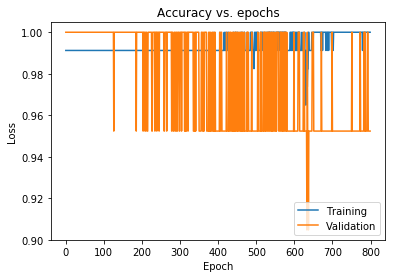
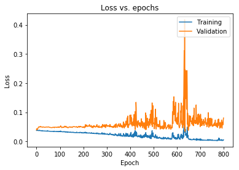
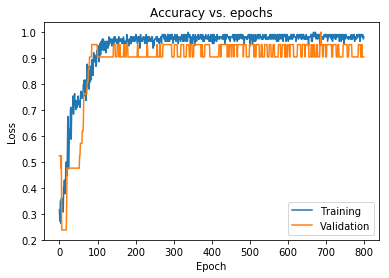
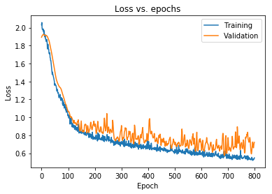
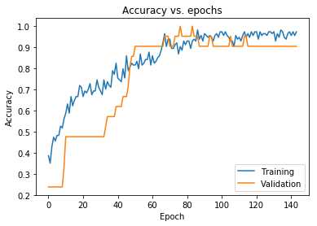
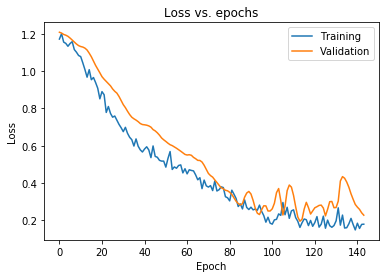

# Programming Assignment

## Model validation on the Iris dataset

### Instructions

In this notebook, you will build, compile and fit a neural network model to the Iris dataset. You will also implement validation, regularisation and callbacks to improve your model.

Some code cells are provided you in the notebook. You should avoid editing provided code, and make sure to execute the cells in order to avoid unexpected errors. Some cells begin with the line: 

`#### GRADED CELL ####`

Don't move or edit this first line - this is what the automatic grader looks for to recognise graded cells. These cells require you to write your own code to complete them, and are automatically graded when you submit the notebook. Don't edit the function name or signature provided in these cells, otherwise the automatic grader might not function properly. Inside these graded cells, you can use any functions or classes that are imported below, but make sure you don't use any variables that are outside the scope of the function.

### How to submit

Complete all the tasks you are asked for in the worksheet. When you have finished and are happy with your code, press the **Submit Assignment** button at the top of this notebook.

### Let's get started!

We'll start running some imports, and loading the dataset. Do not edit the existing imports in the following cell. If you would like to make further Tensorflow imports, you should add them here.


```python
#### PACKAGE IMPORTS ####

# Run this cell first to import all required packages. Do not make any imports elsewhere in the notebook
from numpy.random import seed
seed(8)
import tensorflow as tf
import numpy as np
import matplotlib.pyplot as plt
from sklearn import datasets, model_selection 
%matplotlib inline

# If you would like to make further imports from tensorflow, add them here
from tensorflow.keras import Sequential
from tensorflow.keras.layers import Dense, Dropout,BatchNormalization

```

<tr>
<td></td>
<td></td>
<td></td>
</tr>

#### The Iris dataset

In this assignment, you will use the [Iris dataset](https://scikit-learn.org/stable/auto_examples/datasets/plot_iris_dataset.html). It consists of 50 samples from each of three species of Iris (Iris setosa, Iris virginica and Iris versicolor). Four features were measured from each sample: the length and the width of the sepals and petals, in centimeters. For a reference, see the following papers:

- R. A. Fisher. "The use of multiple measurements in taxonomic problems". Annals of Eugenics. 7 (2): 179–188, 1936.

Your goal is to construct a neural network that classifies each sample into the correct class, as well as applying validation and regularisation techniques.

#### Load and preprocess the data

First read in the Iris dataset using `datasets.load_iris()`, and split the dataset into training and test sets.


```python
#### GRADED CELL ####

# Complete the following function. 
# Make sure to not change the function name or arguments.

def read_in_and_split_data(iris_data):
    """
    This function takes the Iris dataset as loaded by sklearn.datasets.load_iris(), and then 
    splits so that the training set includes 90% of the full dataset, with the test set 
    making up the remaining 10%.
    Your function should return a tuple (train_data, test_data, train_targets, test_targets) 
    of appropriately split training and test data and targets.
    
    If you would like to import any further packages to aid you in this task, please do so in the 
    Package Imports cell above.
    """
    (train_data, test_data, train_targets, test_targets) = model_selection.train_test_split(iris_data['data'], iris_data['target'], test_size=0.1)
    return (train_data, test_data, train_targets, test_targets)
    
    
```


```python
# Run your function to generate the test and training data.

iris_data = datasets.load_iris()
print(iris_data['data'].shape)
print(iris_data['data'][0].shape)

train_data, test_data, train_targets, test_targets = read_in_and_split_data(iris_data)

```

    (150, 4)
    (4,)


We will now convert the training and test targets using a one hot encoder.


```python
# Convert targets to a one-hot encoding
print (test_targets)
train_targets = tf.keras.utils.to_categorical(np.array(train_targets))
test_targets = tf.keras.utils.to_categorical(np.array(test_targets))
print (test_targets)
```

    [1 0 2 2 2 0 2 1 0 2 0 1 2 2 1]
    [[0. 1. 0.]
     [1. 0. 0.]
     [0. 0. 1.]
     [0. 0. 1.]
     [0. 0. 1.]
     [1. 0. 0.]
     [0. 0. 1.]
     [0. 1. 0.]
     [1. 0. 0.]
     [0. 0. 1.]
     [1. 0. 0.]
     [0. 1. 0.]
     [0. 0. 1.]
     [0. 0. 1.]
     [0. 1. 0.]]


#### Build the neural network model


You can now construct a model to fit to the data. Using the Sequential API, build your model according to the following specifications:

* The model should use the `input_shape` in the function argument to set the input size in the first layer.
* The first layer should be a dense layer with 64 units.
* The weights of the first layer should be initialised with the He uniform initializer.
* The biases of the first layer should be all initially equal to one.
* There should then be a further four dense layers, each with 128 units.
* This should be followed with four dense layers, each with 64 units.
* All of these Dense layers should use the ReLU activation function.
* The output Dense layer should have 3 units and the softmax activation function.

In total, the network should have 10 layers.


```python
#### GRADED CELL ####

# Complete the following function. 
# Make sure to not change the function name or arguments.

def get_model(input_shape):
    """
    This function should build a Sequential model according to the above specification. Ensure the 
    weights are initialised by providing the input_shape argument in the first layer, given by the
    function argument.
    Your function should return the model.
    """
  
    model= Sequential([
        Dense(64, activation='relu',  kernel_initializer="he_uniform", 
              bias_initializer='ones', input_shape=(input_shape[0],), ),
        Dense (128, activation='relu'),
        Dense (128, activation='relu'),
        Dense (128, activation='relu'),
        Dense (128, activation='relu'),
        Dense (64, activation='relu'),
        Dense (64, activation='relu'),
        Dense (64, activation='relu'),
        Dense (64, activation='relu'),
        Dense (3, activation='softmax'),
    ])
    return model    
```


```python
# Run your function to get the model
print(train_data[0].shape[0])
model = get_model(train_data[0].shape)
```

    4


#### Compile the model

You should now compile the model using the `compile` method. Remember that you need to specify an optimizer, a loss function and a metric to judge the performance of your model.


```python
#### GRADED CELL ####

# Complete the following function. 
# Make sure to not change the function name or arguments.

def compile_model(model):
    """
    This function takes in the model returned from your get_model function, and compiles it with an optimiser,
    loss function and metric.
    Compile the model using the Adam optimiser (with learning rate set to 0.0001), 
    the categorical crossentropy loss function and accuracy as the only metric. 
    Your function doesn't need to return anything; the model will be compiled in-place.
    """
    model.compile(optimizer= tf.keras.optimizers.Adam(learning_rate=0.0001), loss="categorical_crossentropy", metrics=['accuracy'])
    
```


```python
# Run your function to compile the model

compile_model(model)
```

#### Fit the model to the training data

Now you should train the model on the Iris dataset, using the model's `fit` method. 
* Run the training for a fixed number of epochs, given by the function's `epochs` argument.
* Return the training history to be used for plotting the learning curves.
* Set the batch size to 40.
* Set the validation set to be 15% of the training set.


```python
#### GRADED CELL ####

# Complete the following function. 
# Make sure to not change the function name or arguments.

def train_model(model, train_data, train_targets, epochs):
    """
    This function should train the model for the given number of epochs on the 
    train_data and train_targets. 
    Your function should return the training history, as returned by model.fit.
    """
    history= model.fit(train_data, train_targets, epochs=epochs, batch_size= 40, validation_split=0.15, verbose=2)
    return history
    
```

Run the following cell to run the training for 800 epochs.


```python
# Run your function to train the model

history = train_model(model, train_data, train_targets, epochs=800)
```

    Train on 114 samples, validate on 21 samples
    Epoch 1/800
    114/114 - 0s - loss: 0.0376 - accuracy: 0.9912 - val_loss: 0.0397 - val_accuracy: 1.0000
    Epoch 2/800
    114/114 - 0s - loss: 0.0395 - accuracy: 0.9912 - val_loss: 0.0439 - val_accuracy: 1.0000
    Epoch 3/800
    114/114 - 0s - loss: 0.0400 - accuracy: 0.9912 - val_loss: 0.0414 - val_accuracy: 1.0000
    Epoch 4/800
    114/114 - 0s - loss: 0.0382 - accuracy: 0.9912 - val_loss: 0.0403 - val_accuracy: 1.0000
    Epoch 5/800
    114/114 - 0s - loss: 0.0372 - accuracy: 0.9912 - val_loss: 0.0422 - val_accuracy: 1.0000
    Epoch 6/800
    114/114 - 0s - loss: 0.0379 - accuracy: 0.9912 - val_loss: 0.0434 - val_accuracy: 1.0000
    Epoch 7/800
    114/114 - 0s - loss: 0.0375 - accuracy: 0.9912 - val_loss: 0.0451 - val_accuracy: 1.0000
    Epoch 8/800
    114/114 - 0s - loss: 0.0379 - accuracy: 0.9912 - val_loss: 0.0474 - val_accuracy: 1.0000
    Epoch 9/800
    114/114 - 0s - loss: 0.0375 - accuracy: 0.9912 - val_loss: 0.0483 - val_accuracy: 1.0000
    Epoch 10/800
    114/114 - 0s - loss: 0.0369 - accuracy: 0.9912 - val_loss: 0.0495 - val_accuracy: 1.0000
    Epoch 11/800
    114/114 - 0s - loss: 0.0369 - accuracy: 0.9912 - val_loss: 0.0500 - val_accuracy: 1.0000
    Epoch 12/800
    114/114 - 0s - loss: 0.0377 - accuracy: 0.9912 - val_loss: 0.0503 - val_accuracy: 1.0000
    Epoch 13/800
    114/114 - 0s - loss: 0.0372 - accuracy: 0.9912 - val_loss: 0.0492 - val_accuracy: 1.0000
    Epoch 14/800
    114/114 - 0s - loss: 0.0383 - accuracy: 0.9912 - val_loss: 0.0497 - val_accuracy: 1.0000
    Epoch 15/800
    114/114 - 0s - loss: 0.0376 - accuracy: 0.9912 - val_loss: 0.0500 - val_accuracy: 1.0000
    Epoch 16/800
    114/114 - 0s - loss: 0.0377 - accuracy: 0.9912 - val_loss: 0.0493 - val_accuracy: 1.0000
    Epoch 17/800
    114/114 - 0s - loss: 0.0369 - accuracy: 0.9912 - val_loss: 0.0515 - val_accuracy: 1.0000
    Epoch 18/800
    114/114 - 0s - loss: 0.0367 - accuracy: 0.9912 - val_loss: 0.0516 - val_accuracy: 1.0000
    Epoch 19/800
    114/114 - 0s - loss: 0.0366 - accuracy: 0.9912 - val_loss: 0.0502 - val_accuracy: 1.0000
    Epoch 20/800
    114/114 - 0s - loss: 0.0371 - accuracy: 0.9912 - val_loss: 0.0501 - val_accuracy: 1.0000
    Epoch 21/800
    114/114 - 0s - loss: 0.0369 - accuracy: 0.9912 - val_loss: 0.0494 - val_accuracy: 1.0000
    Epoch 22/800
    114/114 - 0s - loss: 0.0363 - accuracy: 0.9912 - val_loss: 0.0496 - val_accuracy: 1.0000
    Epoch 23/800
    114/114 - 0s - loss: 0.0363 - accuracy: 0.9912 - val_loss: 0.0498 - val_accuracy: 1.0000
    Epoch 24/800
    114/114 - 0s - loss: 0.0364 - accuracy: 0.9912 - val_loss: 0.0497 - val_accuracy: 1.0000
    Epoch 25/800
    114/114 - 0s - loss: 0.0374 - accuracy: 0.9912 - val_loss: 0.0496 - val_accuracy: 1.0000
    Epoch 26/800
    114/114 - 0s - loss: 0.0361 - accuracy: 0.9912 - val_loss: 0.0486 - val_accuracy: 1.0000
    Epoch 27/800
    114/114 - 0s - loss: 0.0364 - accuracy: 0.9912 - val_loss: 0.0493 - val_accuracy: 1.0000
    Epoch 28/800
    114/114 - 0s - loss: 0.0364 - accuracy: 0.9912 - val_loss: 0.0492 - val_accuracy: 1.0000
    Epoch 29/800
    114/114 - 0s - loss: 0.0362 - accuracy: 0.9912 - val_loss: 0.0497 - val_accuracy: 1.0000
    Epoch 30/800
    114/114 - 0s - loss: 0.0360 - accuracy: 0.9912 - val_loss: 0.0499 - val_accuracy: 1.0000
    Epoch 31/800
    114/114 - 0s - loss: 0.0360 - accuracy: 0.9912 - val_loss: 0.0495 - val_accuracy: 1.0000
    Epoch 32/800
    114/114 - 0s - loss: 0.0359 - accuracy: 0.9912 - val_loss: 0.0491 - val_accuracy: 1.0000
    Epoch 33/800
    114/114 - 0s - loss: 0.0361 - accuracy: 0.9912 - val_loss: 0.0492 - val_accuracy: 1.0000
    Epoch 34/800
    114/114 - 0s - loss: 0.0358 - accuracy: 0.9912 - val_loss: 0.0488 - val_accuracy: 1.0000
    Epoch 35/800
    114/114 - 0s - loss: 0.0358 - accuracy: 0.9912 - val_loss: 0.0486 - val_accuracy: 1.0000
    Epoch 36/800
    114/114 - 0s - loss: 0.0358 - accuracy: 0.9912 - val_loss: 0.0485 - val_accuracy: 1.0000
    Epoch 37/800
    114/114 - 0s - loss: 0.0359 - accuracy: 0.9912 - val_loss: 0.0486 - val_accuracy: 1.0000
    Epoch 38/800
    114/114 - 0s - loss: 0.0357 - accuracy: 0.9912 - val_loss: 0.0486 - val_accuracy: 1.0000
    Epoch 39/800
    114/114 - 0s - loss: 0.0356 - accuracy: 0.9912 - val_loss: 0.0490 - val_accuracy: 1.0000
    Epoch 40/800
    114/114 - 0s - loss: 0.0356 - accuracy: 0.9912 - val_loss: 0.0492 - val_accuracy: 1.0000
    Epoch 41/800
    114/114 - 0s - loss: 0.0354 - accuracy: 0.9912 - val_loss: 0.0491 - val_accuracy: 1.0000
    Epoch 42/800
    114/114 - 0s - loss: 0.0354 - accuracy: 0.9912 - val_loss: 0.0492 - val_accuracy: 1.0000
    Epoch 43/800
    114/114 - 0s - loss: 0.0354 - accuracy: 0.9912 - val_loss: 0.0494 - val_accuracy: 1.0000
    Epoch 44/800
    114/114 - 0s - loss: 0.0353 - accuracy: 0.9912 - val_loss: 0.0494 - val_accuracy: 1.0000
    Epoch 45/800
    114/114 - 0s - loss: 0.0353 - accuracy: 0.9912 - val_loss: 0.0498 - val_accuracy: 1.0000
    Epoch 46/800
    114/114 - 0s - loss: 0.0352 - accuracy: 0.9912 - val_loss: 0.0496 - val_accuracy: 1.0000
    Epoch 47/800
    114/114 - 0s - loss: 0.0367 - accuracy: 0.9912 - val_loss: 0.0492 - val_accuracy: 1.0000
    Epoch 48/800
    114/114 - 0s - loss: 0.0350 - accuracy: 0.9912 - val_loss: 0.0489 - val_accuracy: 1.0000
    Epoch 49/800
    114/114 - 0s - loss: 0.0356 - accuracy: 0.9912 - val_loss: 0.0492 - val_accuracy: 1.0000
    Epoch 50/800
    114/114 - 0s - loss: 0.0359 - accuracy: 0.9912 - val_loss: 0.0493 - val_accuracy: 1.0000
    Epoch 51/800
    114/114 - 0s - loss: 0.0352 - accuracy: 0.9912 - val_loss: 0.0496 - val_accuracy: 1.0000
    Epoch 52/800
    114/114 - 0s - loss: 0.0354 - accuracy: 0.9912 - val_loss: 0.0500 - val_accuracy: 1.0000
    Epoch 53/800
    114/114 - 0s - loss: 0.0352 - accuracy: 0.9912 - val_loss: 0.0498 - val_accuracy: 1.0000
    Epoch 54/800
    114/114 - 0s - loss: 0.0350 - accuracy: 0.9912 - val_loss: 0.0492 - val_accuracy: 1.0000
    Epoch 55/800
    114/114 - 0s - loss: 0.0350 - accuracy: 0.9912 - val_loss: 0.0487 - val_accuracy: 1.0000
    Epoch 56/800
    114/114 - 0s - loss: 0.0350 - accuracy: 0.9912 - val_loss: 0.0483 - val_accuracy: 1.0000
    Epoch 57/800
    114/114 - 0s - loss: 0.0349 - accuracy: 0.9912 - val_loss: 0.0479 - val_accuracy: 1.0000
    Epoch 58/800
    114/114 - 0s - loss: 0.0347 - accuracy: 0.9912 - val_loss: 0.0483 - val_accuracy: 1.0000
    Epoch 59/800
    114/114 - 0s - loss: 0.0350 - accuracy: 0.9912 - val_loss: 0.0484 - val_accuracy: 1.0000
    Epoch 60/800
    114/114 - 0s - loss: 0.0346 - accuracy: 0.9912 - val_loss: 0.0481 - val_accuracy: 1.0000
    Epoch 61/800
    114/114 - 0s - loss: 0.0346 - accuracy: 0.9912 - val_loss: 0.0478 - val_accuracy: 1.0000
    Epoch 62/800
    114/114 - 0s - loss: 0.0346 - accuracy: 0.9912 - val_loss: 0.0475 - val_accuracy: 1.0000
    Epoch 63/800
    114/114 - 0s - loss: 0.0345 - accuracy: 0.9912 - val_loss: 0.0476 - val_accuracy: 1.0000
    Epoch 64/800
    114/114 - 0s - loss: 0.0346 - accuracy: 0.9912 - val_loss: 0.0473 - val_accuracy: 1.0000
    Epoch 65/800
    114/114 - 0s - loss: 0.0345 - accuracy: 0.9912 - val_loss: 0.0473 - val_accuracy: 1.0000
    Epoch 66/800
    114/114 - 0s - loss: 0.0343 - accuracy: 0.9912 - val_loss: 0.0475 - val_accuracy: 1.0000
    Epoch 67/800
    114/114 - 0s - loss: 0.0347 - accuracy: 0.9912 - val_loss: 0.0475 - val_accuracy: 1.0000
    Epoch 68/800
    114/114 - 0s - loss: 0.0345 - accuracy: 0.9912 - val_loss: 0.0480 - val_accuracy: 1.0000
    Epoch 69/800
    114/114 - 0s - loss: 0.0345 - accuracy: 0.9912 - val_loss: 0.0477 - val_accuracy: 1.0000
    Epoch 70/800
    114/114 - 0s - loss: 0.0346 - accuracy: 0.9912 - val_loss: 0.0476 - val_accuracy: 1.0000
    Epoch 71/800
    114/114 - 0s - loss: 0.0342 - accuracy: 0.9912 - val_loss: 0.0481 - val_accuracy: 1.0000
    Epoch 72/800
    114/114 - 0s - loss: 0.0347 - accuracy: 0.9912 - val_loss: 0.0488 - val_accuracy: 1.0000
    Epoch 73/800
    114/114 - 0s - loss: 0.0343 - accuracy: 0.9912 - val_loss: 0.0484 - val_accuracy: 1.0000
    Epoch 74/800
    114/114 - 0s - loss: 0.0340 - accuracy: 0.9912 - val_loss: 0.0485 - val_accuracy: 1.0000
    Epoch 75/800
    114/114 - 0s - loss: 0.0340 - accuracy: 0.9912 - val_loss: 0.0483 - val_accuracy: 1.0000
    Epoch 76/800
    114/114 - 0s - loss: 0.0355 - accuracy: 0.9912 - val_loss: 0.0484 - val_accuracy: 1.0000
    Epoch 77/800
    114/114 - 0s - loss: 0.0344 - accuracy: 0.9912 - val_loss: 0.0469 - val_accuracy: 1.0000
    Epoch 78/800
    114/114 - 0s - loss: 0.0347 - accuracy: 0.9912 - val_loss: 0.0487 - val_accuracy: 1.0000
    Epoch 79/800
    114/114 - 0s - loss: 0.0346 - accuracy: 0.9912 - val_loss: 0.0487 - val_accuracy: 1.0000
    Epoch 80/800
    114/114 - 0s - loss: 0.0342 - accuracy: 0.9912 - val_loss: 0.0489 - val_accuracy: 1.0000
    Epoch 81/800
    114/114 - 0s - loss: 0.0342 - accuracy: 0.9912 - val_loss: 0.0490 - val_accuracy: 1.0000
    Epoch 82/800
    114/114 - 0s - loss: 0.0342 - accuracy: 0.9912 - val_loss: 0.0489 - val_accuracy: 1.0000
    Epoch 83/800
    114/114 - 0s - loss: 0.0338 - accuracy: 0.9912 - val_loss: 0.0487 - val_accuracy: 1.0000
    Epoch 84/800
    114/114 - 0s - loss: 0.0343 - accuracy: 0.9912 - val_loss: 0.0486 - val_accuracy: 1.0000
    Epoch 85/800
    114/114 - 0s - loss: 0.0340 - accuracy: 0.9912 - val_loss: 0.0485 - val_accuracy: 1.0000
    Epoch 86/800
    114/114 - 0s - loss: 0.0341 - accuracy: 0.9912 - val_loss: 0.0482 - val_accuracy: 1.0000
    Epoch 87/800
    114/114 - 0s - loss: 0.0341 - accuracy: 0.9912 - val_loss: 0.0481 - val_accuracy: 1.0000
    Epoch 88/800
    114/114 - 0s - loss: 0.0346 - accuracy: 0.9912 - val_loss: 0.0479 - val_accuracy: 1.0000
    Epoch 89/800
    114/114 - 0s - loss: 0.0335 - accuracy: 0.9912 - val_loss: 0.0492 - val_accuracy: 1.0000
    Epoch 90/800
    114/114 - 0s - loss: 0.0339 - accuracy: 0.9912 - val_loss: 0.0492 - val_accuracy: 1.0000
    Epoch 91/800
    114/114 - 0s - loss: 0.0339 - accuracy: 0.9912 - val_loss: 0.0490 - val_accuracy: 1.0000
    Epoch 92/800
    114/114 - 0s - loss: 0.0338 - accuracy: 0.9912 - val_loss: 0.0485 - val_accuracy: 1.0000
    Epoch 93/800
    114/114 - 0s - loss: 0.0335 - accuracy: 0.9912 - val_loss: 0.0487 - val_accuracy: 1.0000
    Epoch 94/800
    114/114 - 0s - loss: 0.0344 - accuracy: 0.9912 - val_loss: 0.0497 - val_accuracy: 1.0000
    Epoch 95/800
    114/114 - 0s - loss: 0.0333 - accuracy: 0.9912 - val_loss: 0.0493 - val_accuracy: 1.0000
    Epoch 96/800
    114/114 - 0s - loss: 0.0336 - accuracy: 0.9912 - val_loss: 0.0501 - val_accuracy: 1.0000
    Epoch 97/800
    114/114 - 0s - loss: 0.0337 - accuracy: 0.9912 - val_loss: 0.0489 - val_accuracy: 1.0000
    Epoch 98/800
    114/114 - 0s - loss: 0.0342 - accuracy: 0.9912 - val_loss: 0.0480 - val_accuracy: 1.0000
    Epoch 99/800
    114/114 - 0s - loss: 0.0348 - accuracy: 0.9912 - val_loss: 0.0490 - val_accuracy: 1.0000
    Epoch 100/800
    114/114 - 0s - loss: 0.0337 - accuracy: 0.9912 - val_loss: 0.0489 - val_accuracy: 1.0000
    Epoch 101/800
    114/114 - 0s - loss: 0.0345 - accuracy: 0.9912 - val_loss: 0.0497 - val_accuracy: 1.0000
    Epoch 102/800
    114/114 - 0s - loss: 0.0343 - accuracy: 0.9912 - val_loss: 0.0504 - val_accuracy: 1.0000
    Epoch 103/800
    114/114 - 0s - loss: 0.0333 - accuracy: 0.9912 - val_loss: 0.0510 - val_accuracy: 1.0000
    Epoch 104/800
    114/114 - 0s - loss: 0.0360 - accuracy: 0.9912 - val_loss: 0.0536 - val_accuracy: 1.0000
    Epoch 105/800
    114/114 - 0s - loss: 0.0334 - accuracy: 0.9912 - val_loss: 0.0504 - val_accuracy: 1.0000
    Epoch 106/800
    114/114 - 0s - loss: 0.0338 - accuracy: 0.9912 - val_loss: 0.0518 - val_accuracy: 1.0000
    Epoch 107/800
    114/114 - 0s - loss: 0.0339 - accuracy: 0.9912 - val_loss: 0.0498 - val_accuracy: 1.0000
    Epoch 108/800
    114/114 - 0s - loss: 0.0334 - accuracy: 0.9912 - val_loss: 0.0476 - val_accuracy: 1.0000
    Epoch 109/800
    114/114 - 0s - loss: 0.0334 - accuracy: 0.9912 - val_loss: 0.0473 - val_accuracy: 1.0000
    Epoch 110/800
    114/114 - 0s - loss: 0.0332 - accuracy: 0.9912 - val_loss: 0.0475 - val_accuracy: 1.0000
    Epoch 111/800
    114/114 - 0s - loss: 0.0334 - accuracy: 0.9912 - val_loss: 0.0477 - val_accuracy: 1.0000
    Epoch 112/800
    114/114 - 0s - loss: 0.0329 - accuracy: 0.9912 - val_loss: 0.0487 - val_accuracy: 1.0000
    Epoch 113/800
    114/114 - 0s - loss: 0.0330 - accuracy: 0.9912 - val_loss: 0.0490 - val_accuracy: 1.0000
    Epoch 114/800
    114/114 - 0s - loss: 0.0334 - accuracy: 0.9912 - val_loss: 0.0496 - val_accuracy: 1.0000
    Epoch 115/800
    114/114 - 0s - loss: 0.0331 - accuracy: 0.9912 - val_loss: 0.0486 - val_accuracy: 1.0000
    Epoch 116/800
    114/114 - 0s - loss: 0.0332 - accuracy: 0.9912 - val_loss: 0.0482 - val_accuracy: 1.0000
    Epoch 117/800
    114/114 - 0s - loss: 0.0339 - accuracy: 0.9912 - val_loss: 0.0483 - val_accuracy: 1.0000
    Epoch 118/800
    114/114 - 0s - loss: 0.0329 - accuracy: 0.9912 - val_loss: 0.0479 - val_accuracy: 1.0000
    Epoch 119/800
    114/114 - 0s - loss: 0.0328 - accuracy: 0.9912 - val_loss: 0.0496 - val_accuracy: 1.0000
    Epoch 120/800
    114/114 - 0s - loss: 0.0335 - accuracy: 0.9912 - val_loss: 0.0508 - val_accuracy: 1.0000
    Epoch 121/800
    114/114 - 0s - loss: 0.0331 - accuracy: 0.9912 - val_loss: 0.0522 - val_accuracy: 1.0000
    Epoch 122/800
    114/114 - 0s - loss: 0.0335 - accuracy: 0.9912 - val_loss: 0.0523 - val_accuracy: 1.0000
    Epoch 123/800
    114/114 - 0s - loss: 0.0328 - accuracy: 0.9912 - val_loss: 0.0501 - val_accuracy: 1.0000
    Epoch 124/800
    114/114 - 0s - loss: 0.0322 - accuracy: 0.9912 - val_loss: 0.0495 - val_accuracy: 1.0000
    Epoch 125/800
    114/114 - 0s - loss: 0.0334 - accuracy: 0.9912 - val_loss: 0.0501 - val_accuracy: 1.0000
    Epoch 126/800
    114/114 - 0s - loss: 0.0321 - accuracy: 0.9912 - val_loss: 0.0494 - val_accuracy: 1.0000
    Epoch 127/800
    114/114 - 0s - loss: 0.0328 - accuracy: 0.9912 - val_loss: 0.0521 - val_accuracy: 0.9524
    Epoch 128/800
    114/114 - 0s - loss: 0.0332 - accuracy: 0.9912 - val_loss: 0.0507 - val_accuracy: 1.0000
    Epoch 129/800
    114/114 - 0s - loss: 0.0325 - accuracy: 0.9912 - val_loss: 0.0495 - val_accuracy: 1.0000
    Epoch 130/800
    114/114 - 0s - loss: 0.0320 - accuracy: 0.9912 - val_loss: 0.0483 - val_accuracy: 1.0000
    Epoch 131/800
    114/114 - 0s - loss: 0.0332 - accuracy: 0.9912 - val_loss: 0.0495 - val_accuracy: 1.0000
    Epoch 132/800
    114/114 - 0s - loss: 0.0319 - accuracy: 0.9912 - val_loss: 0.0481 - val_accuracy: 1.0000
    Epoch 133/800
    114/114 - 0s - loss: 0.0317 - accuracy: 0.9912 - val_loss: 0.0480 - val_accuracy: 1.0000
    Epoch 134/800
    114/114 - 0s - loss: 0.0330 - accuracy: 0.9912 - val_loss: 0.0485 - val_accuracy: 1.0000
    Epoch 135/800
    114/114 - 0s - loss: 0.0325 - accuracy: 0.9912 - val_loss: 0.0467 - val_accuracy: 1.0000
    Epoch 136/800
    114/114 - 0s - loss: 0.0318 - accuracy: 0.9912 - val_loss: 0.0467 - val_accuracy: 1.0000
    Epoch 137/800
    114/114 - 0s - loss: 0.0323 - accuracy: 0.9912 - val_loss: 0.0473 - val_accuracy: 1.0000
    Epoch 138/800
    114/114 - 0s - loss: 0.0322 - accuracy: 0.9912 - val_loss: 0.0480 - val_accuracy: 1.0000
    Epoch 139/800
    114/114 - 0s - loss: 0.0319 - accuracy: 0.9912 - val_loss: 0.0489 - val_accuracy: 1.0000
    Epoch 140/800
    114/114 - 0s - loss: 0.0316 - accuracy: 0.9912 - val_loss: 0.0495 - val_accuracy: 1.0000
    Epoch 141/800
    114/114 - 0s - loss: 0.0319 - accuracy: 0.9912 - val_loss: 0.0503 - val_accuracy: 1.0000
    Epoch 142/800
    114/114 - 0s - loss: 0.0312 - accuracy: 0.9912 - val_loss: 0.0499 - val_accuracy: 1.0000
    Epoch 143/800
    114/114 - 0s - loss: 0.0317 - accuracy: 0.9912 - val_loss: 0.0498 - val_accuracy: 1.0000
    Epoch 144/800
    114/114 - 0s - loss: 0.0314 - accuracy: 0.9912 - val_loss: 0.0487 - val_accuracy: 1.0000
    Epoch 145/800
    114/114 - 0s - loss: 0.0316 - accuracy: 0.9912 - val_loss: 0.0489 - val_accuracy: 1.0000
    Epoch 146/800
    114/114 - 0s - loss: 0.0311 - accuracy: 0.9912 - val_loss: 0.0491 - val_accuracy: 1.0000
    Epoch 147/800
    114/114 - 0s - loss: 0.0322 - accuracy: 0.9912 - val_loss: 0.0500 - val_accuracy: 1.0000
    Epoch 148/800
    114/114 - 0s - loss: 0.0312 - accuracy: 0.9912 - val_loss: 0.0492 - val_accuracy: 1.0000
    Epoch 149/800
    114/114 - 0s - loss: 0.0311 - accuracy: 0.9912 - val_loss: 0.0499 - val_accuracy: 1.0000
    Epoch 150/800
    114/114 - 0s - loss: 0.0315 - accuracy: 0.9912 - val_loss: 0.0495 - val_accuracy: 1.0000
    Epoch 151/800
    114/114 - 0s - loss: 0.0311 - accuracy: 0.9912 - val_loss: 0.0491 - val_accuracy: 1.0000
    Epoch 152/800
    114/114 - 0s - loss: 0.0310 - accuracy: 0.9912 - val_loss: 0.0485 - val_accuracy: 1.0000
    Epoch 153/800
    114/114 - 0s - loss: 0.0312 - accuracy: 0.9912 - val_loss: 0.0478 - val_accuracy: 1.0000
    Epoch 154/800
    114/114 - 0s - loss: 0.0308 - accuracy: 0.9912 - val_loss: 0.0481 - val_accuracy: 1.0000
    Epoch 155/800
    114/114 - 0s - loss: 0.0309 - accuracy: 0.9912 - val_loss: 0.0486 - val_accuracy: 1.0000
    Epoch 156/800
    114/114 - 0s - loss: 0.0318 - accuracy: 0.9912 - val_loss: 0.0505 - val_accuracy: 1.0000
    Epoch 157/800
    114/114 - 0s - loss: 0.0320 - accuracy: 0.9912 - val_loss: 0.0507 - val_accuracy: 1.0000
    Epoch 158/800
    114/114 - 0s - loss: 0.0314 - accuracy: 0.9912 - val_loss: 0.0509 - val_accuracy: 1.0000
    Epoch 159/800
    114/114 - 0s - loss: 0.0308 - accuracy: 0.9912 - val_loss: 0.0506 - val_accuracy: 1.0000
    Epoch 160/800
    114/114 - 0s - loss: 0.0305 - accuracy: 0.9912 - val_loss: 0.0508 - val_accuracy: 1.0000
    Epoch 161/800
    114/114 - 0s - loss: 0.0306 - accuracy: 0.9912 - val_loss: 0.0509 - val_accuracy: 1.0000
    Epoch 162/800
    114/114 - 0s - loss: 0.0312 - accuracy: 0.9912 - val_loss: 0.0503 - val_accuracy: 1.0000
    Epoch 163/800
    114/114 - 0s - loss: 0.0305 - accuracy: 0.9912 - val_loss: 0.0503 - val_accuracy: 1.0000
    Epoch 164/800
    114/114 - 0s - loss: 0.0305 - accuracy: 0.9912 - val_loss: 0.0505 - val_accuracy: 1.0000
    Epoch 165/800
    114/114 - 0s - loss: 0.0306 - accuracy: 0.9912 - val_loss: 0.0500 - val_accuracy: 1.0000
    Epoch 166/800
    114/114 - 0s - loss: 0.0305 - accuracy: 0.9912 - val_loss: 0.0496 - val_accuracy: 1.0000
    Epoch 167/800
    114/114 - 0s - loss: 0.0306 - accuracy: 0.9912 - val_loss: 0.0498 - val_accuracy: 1.0000
    Epoch 168/800
    114/114 - 0s - loss: 0.0304 - accuracy: 0.9912 - val_loss: 0.0500 - val_accuracy: 1.0000
    Epoch 169/800
    114/114 - 0s - loss: 0.0308 - accuracy: 0.9912 - val_loss: 0.0502 - val_accuracy: 1.0000
    Epoch 170/800
    114/114 - 0s - loss: 0.0299 - accuracy: 0.9912 - val_loss: 0.0494 - val_accuracy: 1.0000
    Epoch 171/800
    114/114 - 0s - loss: 0.0302 - accuracy: 0.9912 - val_loss: 0.0500 - val_accuracy: 1.0000
    Epoch 172/800
    114/114 - 0s - loss: 0.0312 - accuracy: 0.9912 - val_loss: 0.0504 - val_accuracy: 1.0000
    Epoch 173/800
    114/114 - 0s - loss: 0.0323 - accuracy: 0.9912 - val_loss: 0.0510 - val_accuracy: 1.0000
    Epoch 174/800
    114/114 - 0s - loss: 0.0305 - accuracy: 0.9912 - val_loss: 0.0492 - val_accuracy: 1.0000
    Epoch 175/800
    114/114 - 0s - loss: 0.0302 - accuracy: 0.9912 - val_loss: 0.0480 - val_accuracy: 1.0000
    Epoch 176/800
    114/114 - 0s - loss: 0.0300 - accuracy: 0.9912 - val_loss: 0.0478 - val_accuracy: 1.0000
    Epoch 177/800
    114/114 - 0s - loss: 0.0300 - accuracy: 0.9912 - val_loss: 0.0489 - val_accuracy: 1.0000
    Epoch 178/800
    114/114 - 0s - loss: 0.0302 - accuracy: 0.9912 - val_loss: 0.0489 - val_accuracy: 1.0000
    Epoch 179/800
    114/114 - 0s - loss: 0.0301 - accuracy: 0.9912 - val_loss: 0.0492 - val_accuracy: 1.0000
    Epoch 180/800
    114/114 - 0s - loss: 0.0304 - accuracy: 0.9912 - val_loss: 0.0495 - val_accuracy: 1.0000
    Epoch 181/800
    114/114 - 0s - loss: 0.0307 - accuracy: 0.9912 - val_loss: 0.0519 - val_accuracy: 1.0000
    Epoch 182/800
    114/114 - 0s - loss: 0.0304 - accuracy: 0.9912 - val_loss: 0.0507 - val_accuracy: 1.0000
    Epoch 183/800
    114/114 - 0s - loss: 0.0304 - accuracy: 0.9912 - val_loss: 0.0501 - val_accuracy: 1.0000
    Epoch 184/800
    114/114 - 0s - loss: 0.0308 - accuracy: 0.9912 - val_loss: 0.0504 - val_accuracy: 1.0000
    Epoch 185/800
    114/114 - 0s - loss: 0.0298 - accuracy: 0.9912 - val_loss: 0.0487 - val_accuracy: 1.0000
    Epoch 186/800
    114/114 - 0s - loss: 0.0309 - accuracy: 0.9912 - val_loss: 0.0510 - val_accuracy: 0.9524
    Epoch 187/800
    114/114 - 0s - loss: 0.0306 - accuracy: 0.9912 - val_loss: 0.0499 - val_accuracy: 1.0000
    Epoch 188/800
    114/114 - 0s - loss: 0.0317 - accuracy: 0.9912 - val_loss: 0.0519 - val_accuracy: 1.0000
    Epoch 189/800
    114/114 - 0s - loss: 0.0308 - accuracy: 0.9912 - val_loss: 0.0505 - val_accuracy: 1.0000
    Epoch 190/800
    114/114 - 0s - loss: 0.0304 - accuracy: 0.9912 - val_loss: 0.0509 - val_accuracy: 1.0000
    Epoch 191/800
    114/114 - 0s - loss: 0.0304 - accuracy: 0.9912 - val_loss: 0.0503 - val_accuracy: 1.0000
    Epoch 192/800
    114/114 - 0s - loss: 0.0300 - accuracy: 0.9912 - val_loss: 0.0502 - val_accuracy: 1.0000
    Epoch 193/800
    114/114 - 0s - loss: 0.0291 - accuracy: 0.9912 - val_loss: 0.0500 - val_accuracy: 1.0000
    Epoch 194/800
    114/114 - 0s - loss: 0.0294 - accuracy: 0.9912 - val_loss: 0.0499 - val_accuracy: 1.0000
    Epoch 195/800
    114/114 - 0s - loss: 0.0306 - accuracy: 0.9912 - val_loss: 0.0498 - val_accuracy: 1.0000
    Epoch 196/800
    114/114 - 0s - loss: 0.0311 - accuracy: 0.9912 - val_loss: 0.0492 - val_accuracy: 1.0000
    Epoch 197/800
    114/114 - 0s - loss: 0.0292 - accuracy: 0.9912 - val_loss: 0.0481 - val_accuracy: 1.0000
    Epoch 198/800
    114/114 - 0s - loss: 0.0291 - accuracy: 0.9912 - val_loss: 0.0492 - val_accuracy: 1.0000
    Epoch 199/800
    114/114 - 0s - loss: 0.0290 - accuracy: 0.9912 - val_loss: 0.0501 - val_accuracy: 1.0000
    Epoch 200/800
    114/114 - 0s - loss: 0.0294 - accuracy: 0.9912 - val_loss: 0.0487 - val_accuracy: 1.0000
    Epoch 201/800
    114/114 - 0s - loss: 0.0293 - accuracy: 0.9912 - val_loss: 0.0482 - val_accuracy: 1.0000
    Epoch 202/800
    114/114 - 0s - loss: 0.0288 - accuracy: 0.9912 - val_loss: 0.0484 - val_accuracy: 1.0000
    Epoch 203/800
    114/114 - 0s - loss: 0.0295 - accuracy: 0.9912 - val_loss: 0.0491 - val_accuracy: 1.0000
    Epoch 204/800
    114/114 - 0s - loss: 0.0314 - accuracy: 0.9912 - val_loss: 0.0512 - val_accuracy: 0.9524
    Epoch 205/800
    114/114 - 0s - loss: 0.0304 - accuracy: 0.9912 - val_loss: 0.0478 - val_accuracy: 1.0000
    Epoch 206/800
    114/114 - 0s - loss: 0.0302 - accuracy: 0.9912 - val_loss: 0.0466 - val_accuracy: 1.0000
    Epoch 207/800
    114/114 - 0s - loss: 0.0309 - accuracy: 0.9912 - val_loss: 0.0493 - val_accuracy: 1.0000
    Epoch 208/800
    114/114 - 0s - loss: 0.0295 - accuracy: 0.9912 - val_loss: 0.0496 - val_accuracy: 1.0000
    Epoch 209/800
    114/114 - 0s - loss: 0.0291 - accuracy: 0.9912 - val_loss: 0.0542 - val_accuracy: 0.9524
    Epoch 210/800
    114/114 - 0s - loss: 0.0320 - accuracy: 0.9912 - val_loss: 0.0578 - val_accuracy: 0.9524
    Epoch 211/800
    114/114 - 0s - loss: 0.0292 - accuracy: 0.9912 - val_loss: 0.0494 - val_accuracy: 1.0000
    Epoch 212/800
    114/114 - 0s - loss: 0.0306 - accuracy: 0.9912 - val_loss: 0.0533 - val_accuracy: 1.0000
    Epoch 213/800
    114/114 - 0s - loss: 0.0308 - accuracy: 0.9912 - val_loss: 0.0526 - val_accuracy: 1.0000
    Epoch 214/800
    114/114 - 0s - loss: 0.0283 - accuracy: 0.9912 - val_loss: 0.0555 - val_accuracy: 0.9524
    Epoch 215/800
    114/114 - 0s - loss: 0.0292 - accuracy: 0.9912 - val_loss: 0.0566 - val_accuracy: 0.9524
    Epoch 216/800
    114/114 - 0s - loss: 0.0301 - accuracy: 0.9912 - val_loss: 0.0546 - val_accuracy: 0.9524
    Epoch 217/800
    114/114 - 0s - loss: 0.0288 - accuracy: 0.9912 - val_loss: 0.0521 - val_accuracy: 1.0000
    Epoch 218/800
    114/114 - 0s - loss: 0.0293 - accuracy: 0.9912 - val_loss: 0.0511 - val_accuracy: 1.0000
    Epoch 219/800
    114/114 - 0s - loss: 0.0288 - accuracy: 0.9912 - val_loss: 0.0511 - val_accuracy: 1.0000
    Epoch 220/800
    114/114 - 0s - loss: 0.0290 - accuracy: 0.9912 - val_loss: 0.0529 - val_accuracy: 1.0000
    Epoch 221/800
    114/114 - 0s - loss: 0.0287 - accuracy: 0.9912 - val_loss: 0.0526 - val_accuracy: 1.0000
    Epoch 222/800
    114/114 - 0s - loss: 0.0286 - accuracy: 0.9912 - val_loss: 0.0530 - val_accuracy: 1.0000
    Epoch 223/800
    114/114 - 0s - loss: 0.0292 - accuracy: 0.9912 - val_loss: 0.0533 - val_accuracy: 1.0000
    Epoch 224/800
    114/114 - 0s - loss: 0.0288 - accuracy: 0.9912 - val_loss: 0.0529 - val_accuracy: 1.0000
    Epoch 225/800
    114/114 - 0s - loss: 0.0286 - accuracy: 0.9912 - val_loss: 0.0522 - val_accuracy: 1.0000
    Epoch 226/800
    114/114 - 0s - loss: 0.0292 - accuracy: 0.9912 - val_loss: 0.0527 - val_accuracy: 1.0000
    Epoch 227/800
    114/114 - 0s - loss: 0.0298 - accuracy: 0.9912 - val_loss: 0.0581 - val_accuracy: 0.9524
    Epoch 228/800
    114/114 - 0s - loss: 0.0290 - accuracy: 0.9912 - val_loss: 0.0548 - val_accuracy: 0.9524
    Epoch 229/800
    114/114 - 0s - loss: 0.0285 - accuracy: 0.9912 - val_loss: 0.0533 - val_accuracy: 1.0000
    Epoch 230/800
    114/114 - 0s - loss: 0.0283 - accuracy: 0.9912 - val_loss: 0.0518 - val_accuracy: 1.0000
    Epoch 231/800
    114/114 - 0s - loss: 0.0286 - accuracy: 0.9912 - val_loss: 0.0512 - val_accuracy: 1.0000
    Epoch 232/800
    114/114 - 0s - loss: 0.0281 - accuracy: 0.9912 - val_loss: 0.0522 - val_accuracy: 1.0000
    Epoch 233/800
    114/114 - 0s - loss: 0.0282 - accuracy: 0.9912 - val_loss: 0.0515 - val_accuracy: 1.0000
    Epoch 234/800
    114/114 - 0s - loss: 0.0277 - accuracy: 0.9912 - val_loss: 0.0523 - val_accuracy: 1.0000
    Epoch 235/800
    114/114 - 0s - loss: 0.0305 - accuracy: 0.9912 - val_loss: 0.0549 - val_accuracy: 0.9524
    Epoch 236/800
    114/114 - 0s - loss: 0.0296 - accuracy: 0.9912 - val_loss: 0.0492 - val_accuracy: 1.0000
    Epoch 237/800
    114/114 - 0s - loss: 0.0283 - accuracy: 0.9912 - val_loss: 0.0496 - val_accuracy: 1.0000
    Epoch 238/800
    114/114 - 0s - loss: 0.0278 - accuracy: 0.9912 - val_loss: 0.0478 - val_accuracy: 1.0000
    Epoch 239/800
    114/114 - 0s - loss: 0.0273 - accuracy: 0.9912 - val_loss: 0.0499 - val_accuracy: 1.0000
    Epoch 240/800
    114/114 - 0s - loss: 0.0277 - accuracy: 0.9912 - val_loss: 0.0512 - val_accuracy: 0.9524
    Epoch 241/800
    114/114 - 0s - loss: 0.0282 - accuracy: 0.9912 - val_loss: 0.0485 - val_accuracy: 1.0000
    Epoch 242/800
    114/114 - 0s - loss: 0.0277 - accuracy: 0.9912 - val_loss: 0.0467 - val_accuracy: 1.0000
    Epoch 243/800
    114/114 - 0s - loss: 0.0289 - accuracy: 0.9912 - val_loss: 0.0526 - val_accuracy: 1.0000
    Epoch 244/800
    114/114 - 0s - loss: 0.0283 - accuracy: 0.9912 - val_loss: 0.0490 - val_accuracy: 1.0000
    Epoch 245/800
    114/114 - 0s - loss: 0.0274 - accuracy: 0.9912 - val_loss: 0.0510 - val_accuracy: 1.0000
    Epoch 246/800
    114/114 - 0s - loss: 0.0286 - accuracy: 0.9912 - val_loss: 0.0543 - val_accuracy: 0.9524
    Epoch 247/800
    114/114 - 0s - loss: 0.0282 - accuracy: 0.9912 - val_loss: 0.0510 - val_accuracy: 1.0000
    Epoch 248/800
    114/114 - 0s - loss: 0.0270 - accuracy: 0.9912 - val_loss: 0.0510 - val_accuracy: 1.0000
    Epoch 249/800
    114/114 - 0s - loss: 0.0269 - accuracy: 0.9912 - val_loss: 0.0525 - val_accuracy: 1.0000
    Epoch 250/800
    114/114 - 0s - loss: 0.0275 - accuracy: 0.9912 - val_loss: 0.0516 - val_accuracy: 1.0000
    Epoch 251/800
    114/114 - 0s - loss: 0.0270 - accuracy: 0.9912 - val_loss: 0.0501 - val_accuracy: 1.0000
    Epoch 252/800
    114/114 - 0s - loss: 0.0272 - accuracy: 0.9912 - val_loss: 0.0493 - val_accuracy: 1.0000
    Epoch 253/800
    114/114 - 0s - loss: 0.0274 - accuracy: 0.9912 - val_loss: 0.0486 - val_accuracy: 1.0000
    Epoch 254/800
    114/114 - 0s - loss: 0.0270 - accuracy: 0.9912 - val_loss: 0.0509 - val_accuracy: 1.0000
    Epoch 255/800
    114/114 - 0s - loss: 0.0279 - accuracy: 0.9912 - val_loss: 0.0515 - val_accuracy: 1.0000
    Epoch 256/800
    114/114 - 0s - loss: 0.0265 - accuracy: 0.9912 - val_loss: 0.0520 - val_accuracy: 1.0000
    Epoch 257/800
    114/114 - 0s - loss: 0.0287 - accuracy: 0.9912 - val_loss: 0.0538 - val_accuracy: 1.0000
    Epoch 258/800
    114/114 - 0s - loss: 0.0264 - accuracy: 0.9912 - val_loss: 0.0509 - val_accuracy: 1.0000
    Epoch 259/800
    114/114 - 0s - loss: 0.0282 - accuracy: 0.9912 - val_loss: 0.0578 - val_accuracy: 0.9524
    Epoch 260/800
    114/114 - 0s - loss: 0.0293 - accuracy: 0.9912 - val_loss: 0.0510 - val_accuracy: 0.9524
    Epoch 261/800
    114/114 - 0s - loss: 0.0287 - accuracy: 0.9912 - val_loss: 0.0512 - val_accuracy: 1.0000
    Epoch 262/800
    114/114 - 0s - loss: 0.0269 - accuracy: 0.9912 - val_loss: 0.0505 - val_accuracy: 1.0000
    Epoch 263/800
    114/114 - 0s - loss: 0.0261 - accuracy: 0.9912 - val_loss: 0.0491 - val_accuracy: 1.0000
    Epoch 264/800
    114/114 - 0s - loss: 0.0262 - accuracy: 0.9912 - val_loss: 0.0489 - val_accuracy: 1.0000
    Epoch 265/800
    114/114 - 0s - loss: 0.0262 - accuracy: 0.9912 - val_loss: 0.0502 - val_accuracy: 1.0000
    Epoch 266/800
    114/114 - 0s - loss: 0.0278 - accuracy: 0.9912 - val_loss: 0.0517 - val_accuracy: 0.9524
    Epoch 267/800
    114/114 - 0s - loss: 0.0261 - accuracy: 0.9912 - val_loss: 0.0480 - val_accuracy: 1.0000
    Epoch 268/800
    114/114 - 0s - loss: 0.0269 - accuracy: 0.9912 - val_loss: 0.0539 - val_accuracy: 1.0000
    Epoch 269/800
    114/114 - 0s - loss: 0.0271 - accuracy: 0.9912 - val_loss: 0.0496 - val_accuracy: 1.0000
    Epoch 270/800
    114/114 - 0s - loss: 0.0257 - accuracy: 0.9912 - val_loss: 0.0483 - val_accuracy: 1.0000
    Epoch 271/800
    114/114 - 0s - loss: 0.0262 - accuracy: 0.9912 - val_loss: 0.0484 - val_accuracy: 1.0000
    Epoch 272/800
    114/114 - 0s - loss: 0.0263 - accuracy: 0.9912 - val_loss: 0.0489 - val_accuracy: 1.0000
    Epoch 273/800
    114/114 - 0s - loss: 0.0262 - accuracy: 0.9912 - val_loss: 0.0490 - val_accuracy: 1.0000
    Epoch 274/800
    114/114 - 0s - loss: 0.0261 - accuracy: 0.9912 - val_loss: 0.0486 - val_accuracy: 1.0000
    Epoch 275/800
    114/114 - 0s - loss: 0.0256 - accuracy: 0.9912 - val_loss: 0.0482 - val_accuracy: 1.0000
    Epoch 276/800
    114/114 - 0s - loss: 0.0255 - accuracy: 0.9912 - val_loss: 0.0496 - val_accuracy: 1.0000
    Epoch 277/800
    114/114 - 0s - loss: 0.0261 - accuracy: 0.9912 - val_loss: 0.0512 - val_accuracy: 1.0000
    Epoch 278/800
    114/114 - 0s - loss: 0.0264 - accuracy: 0.9912 - val_loss: 0.0506 - val_accuracy: 1.0000
    Epoch 279/800
    114/114 - 0s - loss: 0.0286 - accuracy: 0.9912 - val_loss: 0.0522 - val_accuracy: 0.9524
    Epoch 280/800
    114/114 - 0s - loss: 0.0261 - accuracy: 0.9912 - val_loss: 0.0467 - val_accuracy: 1.0000
    Epoch 281/800
    114/114 - 0s - loss: 0.0302 - accuracy: 0.9912 - val_loss: 0.0527 - val_accuracy: 1.0000
    Epoch 282/800
    114/114 - 0s - loss: 0.0262 - accuracy: 0.9912 - val_loss: 0.0501 - val_accuracy: 1.0000
    Epoch 283/800
    114/114 - 0s - loss: 0.0253 - accuracy: 0.9912 - val_loss: 0.0579 - val_accuracy: 0.9524
    Epoch 284/800
    114/114 - 0s - loss: 0.0275 - accuracy: 0.9912 - val_loss: 0.0585 - val_accuracy: 0.9524
    Epoch 285/800
    114/114 - 0s - loss: 0.0262 - accuracy: 0.9912 - val_loss: 0.0530 - val_accuracy: 0.9524
    Epoch 286/800
    114/114 - 0s - loss: 0.0251 - accuracy: 0.9912 - val_loss: 0.0509 - val_accuracy: 1.0000
    Epoch 287/800
    114/114 - 0s - loss: 0.0261 - accuracy: 0.9912 - val_loss: 0.0513 - val_accuracy: 1.0000
    Epoch 288/800
    114/114 - 0s - loss: 0.0282 - accuracy: 0.9912 - val_loss: 0.0545 - val_accuracy: 1.0000
    Epoch 289/800
    114/114 - 0s - loss: 0.0250 - accuracy: 0.9912 - val_loss: 0.0540 - val_accuracy: 0.9524
    Epoch 290/800
    114/114 - 0s - loss: 0.0265 - accuracy: 0.9912 - val_loss: 0.0569 - val_accuracy: 0.9524
    Epoch 291/800
    114/114 - 0s - loss: 0.0266 - accuracy: 0.9912 - val_loss: 0.0501 - val_accuracy: 1.0000
    Epoch 292/800
    114/114 - 0s - loss: 0.0278 - accuracy: 0.9912 - val_loss: 0.0520 - val_accuracy: 1.0000
    Epoch 293/800
    114/114 - 0s - loss: 0.0243 - accuracy: 0.9912 - val_loss: 0.0569 - val_accuracy: 0.9524
    Epoch 294/800
    114/114 - 0s - loss: 0.0269 - accuracy: 0.9912 - val_loss: 0.0574 - val_accuracy: 0.9524
    Epoch 295/800
    114/114 - 0s - loss: 0.0252 - accuracy: 0.9912 - val_loss: 0.0488 - val_accuracy: 1.0000
    Epoch 296/800
    114/114 - 0s - loss: 0.0249 - accuracy: 0.9912 - val_loss: 0.0473 - val_accuracy: 1.0000
    Epoch 297/800
    114/114 - 0s - loss: 0.0248 - accuracy: 0.9912 - val_loss: 0.0508 - val_accuracy: 1.0000
    Epoch 298/800
    114/114 - 0s - loss: 0.0253 - accuracy: 0.9912 - val_loss: 0.0547 - val_accuracy: 1.0000
    Epoch 299/800
    114/114 - 0s - loss: 0.0251 - accuracy: 0.9912 - val_loss: 0.0572 - val_accuracy: 0.9524
    Epoch 300/800
    114/114 - 0s - loss: 0.0246 - accuracy: 0.9912 - val_loss: 0.0584 - val_accuracy: 0.9524
    Epoch 301/800
    114/114 - 0s - loss: 0.0254 - accuracy: 0.9912 - val_loss: 0.0550 - val_accuracy: 1.0000
    Epoch 302/800
    114/114 - 0s - loss: 0.0253 - accuracy: 0.9912 - val_loss: 0.0533 - val_accuracy: 1.0000
    Epoch 303/800
    114/114 - 0s - loss: 0.0242 - accuracy: 0.9912 - val_loss: 0.0512 - val_accuracy: 1.0000
    Epoch 304/800
    114/114 - 0s - loss: 0.0243 - accuracy: 0.9912 - val_loss: 0.0531 - val_accuracy: 1.0000
    Epoch 305/800
    114/114 - 0s - loss: 0.0260 - accuracy: 0.9912 - val_loss: 0.0546 - val_accuracy: 0.9524
    Epoch 306/800
    114/114 - 0s - loss: 0.0252 - accuracy: 0.9912 - val_loss: 0.0532 - val_accuracy: 1.0000
    Epoch 307/800
    114/114 - 0s - loss: 0.0241 - accuracy: 0.9912 - val_loss: 0.0526 - val_accuracy: 1.0000
    Epoch 308/800
    114/114 - 0s - loss: 0.0236 - accuracy: 0.9912 - val_loss: 0.0540 - val_accuracy: 1.0000
    Epoch 309/800
    114/114 - 0s - loss: 0.0231 - accuracy: 0.9912 - val_loss: 0.0547 - val_accuracy: 1.0000
    Epoch 310/800
    114/114 - 0s - loss: 0.0243 - accuracy: 0.9912 - val_loss: 0.0533 - val_accuracy: 1.0000
    Epoch 311/800
    114/114 - 0s - loss: 0.0234 - accuracy: 0.9912 - val_loss: 0.0512 - val_accuracy: 1.0000
    Epoch 312/800
    114/114 - 0s - loss: 0.0239 - accuracy: 0.9912 - val_loss: 0.0509 - val_accuracy: 1.0000
    Epoch 313/800
    114/114 - 0s - loss: 0.0258 - accuracy: 0.9912 - val_loss: 0.0542 - val_accuracy: 0.9524
    Epoch 314/800
    114/114 - 0s - loss: 0.0249 - accuracy: 0.9912 - val_loss: 0.0503 - val_accuracy: 1.0000
    Epoch 315/800
    114/114 - 0s - loss: 0.0285 - accuracy: 0.9912 - val_loss: 0.0585 - val_accuracy: 0.9524
    Epoch 316/800
    114/114 - 0s - loss: 0.0261 - accuracy: 0.9912 - val_loss: 0.0510 - val_accuracy: 1.0000
    Epoch 317/800
    114/114 - 0s - loss: 0.0245 - accuracy: 0.9912 - val_loss: 0.0540 - val_accuracy: 0.9524
    Epoch 318/800
    114/114 - 0s - loss: 0.0245 - accuracy: 0.9912 - val_loss: 0.0518 - val_accuracy: 0.9524
    Epoch 319/800
    114/114 - 0s - loss: 0.0238 - accuracy: 0.9912 - val_loss: 0.0512 - val_accuracy: 1.0000
    Epoch 320/800
    114/114 - 0s - loss: 0.0233 - accuracy: 0.9912 - val_loss: 0.0504 - val_accuracy: 1.0000
    Epoch 321/800
    114/114 - 0s - loss: 0.0233 - accuracy: 0.9912 - val_loss: 0.0513 - val_accuracy: 1.0000
    Epoch 322/800
    114/114 - 0s - loss: 0.0251 - accuracy: 0.9912 - val_loss: 0.0516 - val_accuracy: 0.9524
    Epoch 323/800
    114/114 - 0s - loss: 0.0228 - accuracy: 0.9912 - val_loss: 0.0489 - val_accuracy: 1.0000
    Epoch 324/800
    114/114 - 0s - loss: 0.0226 - accuracy: 0.9912 - val_loss: 0.0510 - val_accuracy: 1.0000
    Epoch 325/800
    114/114 - 0s - loss: 0.0227 - accuracy: 0.9912 - val_loss: 0.0516 - val_accuracy: 1.0000
    Epoch 326/800
    114/114 - 0s - loss: 0.0237 - accuracy: 0.9912 - val_loss: 0.0503 - val_accuracy: 1.0000
    Epoch 327/800
    114/114 - 0s - loss: 0.0229 - accuracy: 0.9912 - val_loss: 0.0477 - val_accuracy: 1.0000
    Epoch 328/800
    114/114 - 0s - loss: 0.0218 - accuracy: 0.9912 - val_loss: 0.0478 - val_accuracy: 1.0000
    Epoch 329/800
    114/114 - 0s - loss: 0.0243 - accuracy: 0.9912 - val_loss: 0.0510 - val_accuracy: 1.0000
    Epoch 330/800
    114/114 - 0s - loss: 0.0215 - accuracy: 0.9912 - val_loss: 0.0494 - val_accuracy: 1.0000
    Epoch 331/800
    114/114 - 0s - loss: 0.0224 - accuracy: 0.9912 - val_loss: 0.0487 - val_accuracy: 1.0000
    Epoch 332/800
    114/114 - 0s - loss: 0.0221 - accuracy: 0.9912 - val_loss: 0.0541 - val_accuracy: 1.0000
    Epoch 333/800
    114/114 - 0s - loss: 0.0222 - accuracy: 0.9912 - val_loss: 0.0491 - val_accuracy: 1.0000
    Epoch 334/800
    114/114 - 0s - loss: 0.0213 - accuracy: 0.9912 - val_loss: 0.0507 - val_accuracy: 1.0000
    Epoch 335/800
    114/114 - 0s - loss: 0.0204 - accuracy: 0.9912 - val_loss: 0.0518 - val_accuracy: 1.0000
    Epoch 336/800
    114/114 - 0s - loss: 0.0242 - accuracy: 0.9912 - val_loss: 0.0529 - val_accuracy: 0.9524
    Epoch 337/800
    114/114 - 0s - loss: 0.0267 - accuracy: 0.9912 - val_loss: 0.0584 - val_accuracy: 0.9524
    Epoch 338/800
    114/114 - 0s - loss: 0.0253 - accuracy: 0.9912 - val_loss: 0.0475 - val_accuracy: 1.0000
    Epoch 339/800
    114/114 - 0s - loss: 0.0223 - accuracy: 0.9912 - val_loss: 0.0534 - val_accuracy: 0.9524
    Epoch 340/800
    114/114 - 0s - loss: 0.0234 - accuracy: 0.9912 - val_loss: 0.0568 - val_accuracy: 0.9524
    Epoch 341/800
    114/114 - 0s - loss: 0.0223 - accuracy: 0.9912 - val_loss: 0.0585 - val_accuracy: 1.0000
    Epoch 342/800
    114/114 - 0s - loss: 0.0236 - accuracy: 0.9912 - val_loss: 0.0606 - val_accuracy: 0.9524
    Epoch 343/800
    114/114 - 0s - loss: 0.0209 - accuracy: 0.9912 - val_loss: 0.0555 - val_accuracy: 1.0000
    Epoch 344/800
    114/114 - 0s - loss: 0.0197 - accuracy: 0.9912 - val_loss: 0.0503 - val_accuracy: 1.0000
    Epoch 345/800
    114/114 - 0s - loss: 0.0202 - accuracy: 0.9912 - val_loss: 0.0480 - val_accuracy: 1.0000
    Epoch 346/800
    114/114 - 0s - loss: 0.0214 - accuracy: 0.9912 - val_loss: 0.0484 - val_accuracy: 1.0000
    Epoch 347/800
    114/114 - 0s - loss: 0.0198 - accuracy: 0.9912 - val_loss: 0.0524 - val_accuracy: 1.0000
    Epoch 348/800
    114/114 - 0s - loss: 0.0229 - accuracy: 0.9912 - val_loss: 0.0527 - val_accuracy: 1.0000
    Epoch 349/800
    114/114 - 0s - loss: 0.0197 - accuracy: 0.9912 - val_loss: 0.0572 - val_accuracy: 1.0000
    Epoch 350/800
    114/114 - 0s - loss: 0.0217 - accuracy: 0.9912 - val_loss: 0.0561 - val_accuracy: 1.0000
    Epoch 351/800
    114/114 - 0s - loss: 0.0201 - accuracy: 0.9912 - val_loss: 0.0549 - val_accuracy: 0.9524
    Epoch 352/800
    114/114 - 0s - loss: 0.0241 - accuracy: 0.9912 - val_loss: 0.0551 - val_accuracy: 0.9524
    Epoch 353/800
    114/114 - 0s - loss: 0.0273 - accuracy: 0.9912 - val_loss: 0.0612 - val_accuracy: 0.9524
    Epoch 354/800
    114/114 - 0s - loss: 0.0227 - accuracy: 0.9912 - val_loss: 0.0505 - val_accuracy: 0.9524
    Epoch 355/800
    114/114 - 0s - loss: 0.0206 - accuracy: 0.9912 - val_loss: 0.0537 - val_accuracy: 0.9524
    Epoch 356/800
    114/114 - 0s - loss: 0.0221 - accuracy: 0.9912 - val_loss: 0.0509 - val_accuracy: 0.9524
    Epoch 357/800
    114/114 - 0s - loss: 0.0192 - accuracy: 0.9912 - val_loss: 0.0549 - val_accuracy: 1.0000
    Epoch 358/800
    114/114 - 0s - loss: 0.0196 - accuracy: 0.9912 - val_loss: 0.0546 - val_accuracy: 1.0000
    Epoch 359/800
    114/114 - 0s - loss: 0.0198 - accuracy: 0.9912 - val_loss: 0.0524 - val_accuracy: 1.0000
    Epoch 360/800
    114/114 - 0s - loss: 0.0273 - accuracy: 0.9912 - val_loss: 0.0612 - val_accuracy: 0.9524
    Epoch 361/800
    114/114 - 0s - loss: 0.0267 - accuracy: 0.9912 - val_loss: 0.0556 - val_accuracy: 0.9524
    Epoch 362/800
    114/114 - 0s - loss: 0.0198 - accuracy: 0.9912 - val_loss: 0.0494 - val_accuracy: 1.0000
    Epoch 363/800
    114/114 - 0s - loss: 0.0181 - accuracy: 0.9912 - val_loss: 0.0550 - val_accuracy: 0.9524
    Epoch 364/800
    114/114 - 0s - loss: 0.0198 - accuracy: 0.9912 - val_loss: 0.0537 - val_accuracy: 0.9524
    Epoch 365/800
    114/114 - 0s - loss: 0.0197 - accuracy: 0.9912 - val_loss: 0.0549 - val_accuracy: 1.0000
    Epoch 366/800
    114/114 - 0s - loss: 0.0186 - accuracy: 0.9912 - val_loss: 0.0528 - val_accuracy: 1.0000
    Epoch 367/800
    114/114 - 0s - loss: 0.0193 - accuracy: 0.9912 - val_loss: 0.0494 - val_accuracy: 1.0000
    Epoch 368/800
    114/114 - 0s - loss: 0.0190 - accuracy: 0.9912 - val_loss: 0.0467 - val_accuracy: 1.0000
    Epoch 369/800
    114/114 - 0s - loss: 0.0185 - accuracy: 0.9912 - val_loss: 0.0488 - val_accuracy: 1.0000
    Epoch 370/800
    114/114 - 0s - loss: 0.0191 - accuracy: 0.9912 - val_loss: 0.0534 - val_accuracy: 1.0000
    Epoch 371/800
    114/114 - 0s - loss: 0.0169 - accuracy: 0.9912 - val_loss: 0.0565 - val_accuracy: 0.9524
    Epoch 372/800
    114/114 - 0s - loss: 0.0257 - accuracy: 0.9912 - val_loss: 0.0671 - val_accuracy: 0.9524
    Epoch 373/800
    114/114 - 0s - loss: 0.0271 - accuracy: 0.9912 - val_loss: 0.0627 - val_accuracy: 0.9524
    Epoch 374/800
    114/114 - 0s - loss: 0.0211 - accuracy: 0.9912 - val_loss: 0.0485 - val_accuracy: 0.9524
    Epoch 375/800
    114/114 - 0s - loss: 0.0225 - accuracy: 0.9912 - val_loss: 0.0613 - val_accuracy: 0.9524
    Epoch 376/800
    114/114 - 0s - loss: 0.0216 - accuracy: 0.9912 - val_loss: 0.0459 - val_accuracy: 1.0000
    Epoch 377/800
    114/114 - 0s - loss: 0.0187 - accuracy: 0.9912 - val_loss: 0.0583 - val_accuracy: 0.9524
    Epoch 378/800
    114/114 - 0s - loss: 0.0200 - accuracy: 0.9912 - val_loss: 0.0498 - val_accuracy: 1.0000
    Epoch 379/800
    114/114 - 0s - loss: 0.0163 - accuracy: 0.9912 - val_loss: 0.0557 - val_accuracy: 0.9524
    Epoch 380/800
    114/114 - 0s - loss: 0.0217 - accuracy: 0.9912 - val_loss: 0.0584 - val_accuracy: 0.9524
    Epoch 381/800
    114/114 - 0s - loss: 0.0192 - accuracy: 0.9912 - val_loss: 0.0516 - val_accuracy: 1.0000
    Epoch 382/800
    114/114 - 0s - loss: 0.0243 - accuracy: 0.9912 - val_loss: 0.0676 - val_accuracy: 0.9524
    Epoch 383/800
    114/114 - 0s - loss: 0.0283 - accuracy: 0.9912 - val_loss: 0.0698 - val_accuracy: 0.9524
    Epoch 384/800
    114/114 - 0s - loss: 0.0246 - accuracy: 0.9912 - val_loss: 0.0580 - val_accuracy: 0.9524
    Epoch 385/800
    114/114 - 0s - loss: 0.0177 - accuracy: 0.9912 - val_loss: 0.0560 - val_accuracy: 1.0000
    Epoch 386/800
    114/114 - 0s - loss: 0.0210 - accuracy: 0.9912 - val_loss: 0.0657 - val_accuracy: 1.0000
    Epoch 387/800
    114/114 - 0s - loss: 0.0176 - accuracy: 0.9912 - val_loss: 0.0713 - val_accuracy: 0.9524
    Epoch 388/800
    114/114 - 0s - loss: 0.0269 - accuracy: 0.9912 - val_loss: 0.0806 - val_accuracy: 0.9524
    Epoch 389/800
    114/114 - 0s - loss: 0.0183 - accuracy: 0.9912 - val_loss: 0.0701 - val_accuracy: 0.9524
    Epoch 390/800
    114/114 - 0s - loss: 0.0233 - accuracy: 1.0000 - val_loss: 0.0486 - val_accuracy: 1.0000
    Epoch 391/800
    114/114 - 0s - loss: 0.0237 - accuracy: 0.9912 - val_loss: 0.0871 - val_accuracy: 0.9524
    Epoch 392/800
    114/114 - 0s - loss: 0.0257 - accuracy: 0.9912 - val_loss: 0.0522 - val_accuracy: 0.9524
    Epoch 393/800
    114/114 - 0s - loss: 0.0169 - accuracy: 0.9912 - val_loss: 0.0472 - val_accuracy: 1.0000
    Epoch 394/800
    114/114 - 0s - loss: 0.0174 - accuracy: 0.9912 - val_loss: 0.0589 - val_accuracy: 0.9524
    Epoch 395/800
    114/114 - 0s - loss: 0.0173 - accuracy: 0.9912 - val_loss: 0.0585 - val_accuracy: 0.9524
    Epoch 396/800
    114/114 - 0s - loss: 0.0189 - accuracy: 0.9912 - val_loss: 0.0585 - val_accuracy: 0.9524
    Epoch 397/800
    114/114 - 0s - loss: 0.0201 - accuracy: 0.9912 - val_loss: 0.0558 - val_accuracy: 0.9524
    Epoch 398/800
    114/114 - 0s - loss: 0.0167 - accuracy: 0.9912 - val_loss: 0.0602 - val_accuracy: 0.9524
    Epoch 399/800
    114/114 - 0s - loss: 0.0213 - accuracy: 0.9912 - val_loss: 0.0602 - val_accuracy: 0.9524
    Epoch 400/800
    114/114 - 0s - loss: 0.0198 - accuracy: 0.9912 - val_loss: 0.0901 - val_accuracy: 0.9524
    Epoch 401/800
    114/114 - 0s - loss: 0.0252 - accuracy: 0.9912 - val_loss: 0.0713 - val_accuracy: 0.9524
    Epoch 402/800
    114/114 - 0s - loss: 0.0177 - accuracy: 0.9912 - val_loss: 0.0868 - val_accuracy: 0.9524
    Epoch 403/800
    114/114 - 0s - loss: 0.0270 - accuracy: 0.9912 - val_loss: 0.0693 - val_accuracy: 0.9524
    Epoch 404/800
    114/114 - 0s - loss: 0.0291 - accuracy: 0.9912 - val_loss: 0.0909 - val_accuracy: 0.9524
    Epoch 405/800
    114/114 - 0s - loss: 0.0313 - accuracy: 0.9912 - val_loss: 0.0584 - val_accuracy: 1.0000
    Epoch 406/800
    114/114 - 0s - loss: 0.0165 - accuracy: 1.0000 - val_loss: 0.0765 - val_accuracy: 0.9524
    Epoch 407/800
    114/114 - 0s - loss: 0.0185 - accuracy: 0.9912 - val_loss: 0.0824 - val_accuracy: 0.9524
    Epoch 408/800
    114/114 - 0s - loss: 0.0190 - accuracy: 0.9912 - val_loss: 0.0647 - val_accuracy: 0.9524
    Epoch 409/800
    114/114 - 0s - loss: 0.0156 - accuracy: 0.9912 - val_loss: 0.0559 - val_accuracy: 1.0000
    Epoch 410/800
    114/114 - 0s - loss: 0.0168 - accuracy: 0.9912 - val_loss: 0.0526 - val_accuracy: 1.0000
    Epoch 411/800
    114/114 - 0s - loss: 0.0234 - accuracy: 0.9912 - val_loss: 0.0656 - val_accuracy: 0.9524
    Epoch 412/800
    114/114 - 0s - loss: 0.0210 - accuracy: 0.9912 - val_loss: 0.0591 - val_accuracy: 0.9524
    Epoch 413/800
    114/114 - 0s - loss: 0.0173 - accuracy: 0.9912 - val_loss: 0.0556 - val_accuracy: 0.9524
    Epoch 414/800
    114/114 - 0s - loss: 0.0142 - accuracy: 0.9912 - val_loss: 0.0685 - val_accuracy: 0.9524
    Epoch 415/800
    114/114 - 0s - loss: 0.0260 - accuracy: 0.9912 - val_loss: 0.0694 - val_accuracy: 0.9524
    Epoch 416/800
    114/114 - 0s - loss: 0.0167 - accuracy: 0.9912 - val_loss: 0.0794 - val_accuracy: 0.9524
    Epoch 417/800
    114/114 - 0s - loss: 0.0252 - accuracy: 1.0000 - val_loss: 0.0536 - val_accuracy: 0.9524
    Epoch 418/800
    114/114 - 0s - loss: 0.0169 - accuracy: 0.9912 - val_loss: 0.0927 - val_accuracy: 0.9524
    Epoch 419/800
    114/114 - 0s - loss: 0.0304 - accuracy: 0.9912 - val_loss: 0.0631 - val_accuracy: 0.9524
    Epoch 420/800
    114/114 - 0s - loss: 0.0319 - accuracy: 0.9912 - val_loss: 0.0804 - val_accuracy: 0.9524
    Epoch 421/800
    114/114 - 0s - loss: 0.0188 - accuracy: 1.0000 - val_loss: 0.0532 - val_accuracy: 0.9524
    Epoch 422/800
    114/114 - 0s - loss: 0.0372 - accuracy: 0.9912 - val_loss: 0.1025 - val_accuracy: 0.9524
    Epoch 423/800
    114/114 - 0s - loss: 0.0200 - accuracy: 0.9912 - val_loss: 0.0405 - val_accuracy: 1.0000
    Epoch 424/800
    114/114 - 0s - loss: 0.0215 - accuracy: 0.9912 - val_loss: 0.0786 - val_accuracy: 0.9524
    Epoch 425/800
    114/114 - 0s - loss: 0.0245 - accuracy: 1.0000 - val_loss: 0.0581 - val_accuracy: 0.9524
    Epoch 426/800
    114/114 - 0s - loss: 0.0180 - accuracy: 0.9912 - val_loss: 0.1344 - val_accuracy: 0.9524
    Epoch 427/800
    114/114 - 0s - loss: 0.0329 - accuracy: 0.9912 - val_loss: 0.1163 - val_accuracy: 0.9524
    Epoch 428/800
    114/114 - 0s - loss: 0.0205 - accuracy: 0.9912 - val_loss: 0.0696 - val_accuracy: 0.9524
    Epoch 429/800
    114/114 - 0s - loss: 0.0291 - accuracy: 1.0000 - val_loss: 0.0528 - val_accuracy: 1.0000
    Epoch 430/800
    114/114 - 0s - loss: 0.0179 - accuracy: 0.9912 - val_loss: 0.0686 - val_accuracy: 0.9524
    Epoch 431/800
    114/114 - 0s - loss: 0.0202 - accuracy: 0.9912 - val_loss: 0.0504 - val_accuracy: 0.9524
    Epoch 432/800
    114/114 - 0s - loss: 0.0183 - accuracy: 0.9912 - val_loss: 0.0480 - val_accuracy: 0.9524
    Epoch 433/800
    114/114 - 0s - loss: 0.0156 - accuracy: 0.9912 - val_loss: 0.0508 - val_accuracy: 1.0000
    Epoch 434/800
    114/114 - 0s - loss: 0.0164 - accuracy: 0.9912 - val_loss: 0.0570 - val_accuracy: 1.0000
    Epoch 435/800
    114/114 - 0s - loss: 0.0169 - accuracy: 0.9912 - val_loss: 0.0718 - val_accuracy: 0.9524
    Epoch 436/800
    114/114 - 0s - loss: 0.0166 - accuracy: 0.9912 - val_loss: 0.0696 - val_accuracy: 0.9524
    Epoch 437/800
    114/114 - 0s - loss: 0.0164 - accuracy: 0.9912 - val_loss: 0.0654 - val_accuracy: 0.9524
    Epoch 438/800
    114/114 - 0s - loss: 0.0210 - accuracy: 0.9912 - val_loss: 0.0586 - val_accuracy: 1.0000
    Epoch 439/800
    114/114 - 0s - loss: 0.0215 - accuracy: 0.9912 - val_loss: 0.0616 - val_accuracy: 0.9524
    Epoch 440/800
    114/114 - 0s - loss: 0.0178 - accuracy: 0.9912 - val_loss: 0.0557 - val_accuracy: 0.9524
    Epoch 441/800
    114/114 - 0s - loss: 0.0166 - accuracy: 1.0000 - val_loss: 0.0536 - val_accuracy: 1.0000
    Epoch 442/800
    114/114 - 0s - loss: 0.0167 - accuracy: 0.9912 - val_loss: 0.0648 - val_accuracy: 0.9524
    Epoch 443/800
    114/114 - 0s - loss: 0.0189 - accuracy: 0.9912 - val_loss: 0.0638 - val_accuracy: 0.9524
    Epoch 444/800
    114/114 - 0s - loss: 0.0138 - accuracy: 0.9912 - val_loss: 0.0602 - val_accuracy: 0.9524
    Epoch 445/800
    114/114 - 0s - loss: 0.0173 - accuracy: 1.0000 - val_loss: 0.0493 - val_accuracy: 1.0000
    Epoch 446/800
    114/114 - 0s - loss: 0.0227 - accuracy: 0.9912 - val_loss: 0.0630 - val_accuracy: 0.9524
    Epoch 447/800
    114/114 - 0s - loss: 0.0170 - accuracy: 0.9912 - val_loss: 0.0541 - val_accuracy: 1.0000
    Epoch 448/800
    114/114 - 0s - loss: 0.0170 - accuracy: 1.0000 - val_loss: 0.0543 - val_accuracy: 1.0000
    Epoch 449/800
    114/114 - 0s - loss: 0.0122 - accuracy: 0.9912 - val_loss: 0.0782 - val_accuracy: 0.9524
    Epoch 450/800
    114/114 - 0s - loss: 0.0194 - accuracy: 0.9912 - val_loss: 0.0632 - val_accuracy: 0.9524
    Epoch 451/800
    114/114 - 0s - loss: 0.0143 - accuracy: 0.9912 - val_loss: 0.0547 - val_accuracy: 1.0000
    Epoch 452/800
    114/114 - 0s - loss: 0.0160 - accuracy: 1.0000 - val_loss: 0.0550 - val_accuracy: 0.9524
    Epoch 453/800
    114/114 - 0s - loss: 0.0125 - accuracy: 0.9912 - val_loss: 0.0688 - val_accuracy: 0.9524
    Epoch 454/800
    114/114 - 0s - loss: 0.0186 - accuracy: 0.9912 - val_loss: 0.0524 - val_accuracy: 0.9524
    Epoch 455/800
    114/114 - 0s - loss: 0.0124 - accuracy: 0.9912 - val_loss: 0.0469 - val_accuracy: 1.0000
    Epoch 456/800
    114/114 - 0s - loss: 0.0152 - accuracy: 0.9912 - val_loss: 0.0529 - val_accuracy: 1.0000
    Epoch 457/800
    114/114 - 0s - loss: 0.0196 - accuracy: 0.9912 - val_loss: 0.0598 - val_accuracy: 0.9524
    Epoch 458/800
    114/114 - 0s - loss: 0.0206 - accuracy: 0.9912 - val_loss: 0.0644 - val_accuracy: 0.9524
    Epoch 459/800
    114/114 - 0s - loss: 0.0148 - accuracy: 1.0000 - val_loss: 0.0532 - val_accuracy: 0.9524
    Epoch 460/800
    114/114 - 0s - loss: 0.0219 - accuracy: 0.9912 - val_loss: 0.0622 - val_accuracy: 0.9524
    Epoch 461/800
    114/114 - 0s - loss: 0.0172 - accuracy: 0.9912 - val_loss: 0.0448 - val_accuracy: 1.0000
    Epoch 462/800
    114/114 - 0s - loss: 0.0159 - accuracy: 0.9912 - val_loss: 0.0622 - val_accuracy: 0.9524
    Epoch 463/800
    114/114 - 0s - loss: 0.0144 - accuracy: 1.0000 - val_loss: 0.0481 - val_accuracy: 1.0000
    Epoch 464/800
    114/114 - 0s - loss: 0.0245 - accuracy: 0.9912 - val_loss: 0.0652 - val_accuracy: 0.9524
    Epoch 465/800
    114/114 - 0s - loss: 0.0169 - accuracy: 0.9912 - val_loss: 0.0608 - val_accuracy: 0.9524
    Epoch 466/800
    114/114 - 0s - loss: 0.0249 - accuracy: 1.0000 - val_loss: 0.0406 - val_accuracy: 1.0000
    Epoch 467/800
    114/114 - 0s - loss: 0.0166 - accuracy: 0.9912 - val_loss: 0.0978 - val_accuracy: 0.9524
    Epoch 468/800
    114/114 - 0s - loss: 0.0308 - accuracy: 0.9912 - val_loss: 0.0677 - val_accuracy: 0.9524
    Epoch 469/800
    114/114 - 0s - loss: 0.0170 - accuracy: 0.9912 - val_loss: 0.0900 - val_accuracy: 0.9524
    Epoch 470/800
    114/114 - 0s - loss: 0.0235 - accuracy: 1.0000 - val_loss: 0.0409 - val_accuracy: 1.0000
    Epoch 471/800
    114/114 - 0s - loss: 0.0179 - accuracy: 0.9912 - val_loss: 0.0775 - val_accuracy: 0.9524
    Epoch 472/800
    114/114 - 0s - loss: 0.0177 - accuracy: 0.9912 - val_loss: 0.0532 - val_accuracy: 0.9524
    Epoch 473/800
    114/114 - 0s - loss: 0.0142 - accuracy: 0.9912 - val_loss: 0.0580 - val_accuracy: 0.9524
    Epoch 474/800
    114/114 - 0s - loss: 0.0201 - accuracy: 0.9912 - val_loss: 0.0660 - val_accuracy: 0.9524
    Epoch 475/800
    114/114 - 0s - loss: 0.0180 - accuracy: 0.9912 - val_loss: 0.0801 - val_accuracy: 0.9524
    Epoch 476/800
    114/114 - 0s - loss: 0.0134 - accuracy: 0.9912 - val_loss: 0.0641 - val_accuracy: 0.9524
    Epoch 477/800
    114/114 - 0s - loss: 0.0168 - accuracy: 1.0000 - val_loss: 0.0555 - val_accuracy: 1.0000
    Epoch 478/800
    114/114 - 0s - loss: 0.0209 - accuracy: 0.9912 - val_loss: 0.0682 - val_accuracy: 0.9524
    Epoch 479/800
    114/114 - 0s - loss: 0.0144 - accuracy: 0.9912 - val_loss: 0.0472 - val_accuracy: 1.0000
    Epoch 480/800
    114/114 - 0s - loss: 0.0170 - accuracy: 0.9912 - val_loss: 0.0503 - val_accuracy: 1.0000
    Epoch 481/800
    114/114 - 0s - loss: 0.0145 - accuracy: 0.9912 - val_loss: 0.0654 - val_accuracy: 0.9524
    Epoch 482/800
    114/114 - 0s - loss: 0.0167 - accuracy: 0.9912 - val_loss: 0.0635 - val_accuracy: 0.9524
    Epoch 483/800
    114/114 - 0s - loss: 0.0129 - accuracy: 0.9912 - val_loss: 0.0771 - val_accuracy: 0.9524
    Epoch 484/800
    114/114 - 0s - loss: 0.0177 - accuracy: 0.9912 - val_loss: 0.0757 - val_accuracy: 0.9524
    Epoch 485/800
    114/114 - 0s - loss: 0.0113 - accuracy: 0.9912 - val_loss: 0.0585 - val_accuracy: 0.9524
    Epoch 486/800
    114/114 - 0s - loss: 0.0218 - accuracy: 1.0000 - val_loss: 0.0549 - val_accuracy: 0.9524
    Epoch 487/800
    114/114 - 0s - loss: 0.0114 - accuracy: 0.9912 - val_loss: 0.0936 - val_accuracy: 0.9524
    Epoch 488/800
    114/114 - 0s - loss: 0.0196 - accuracy: 0.9912 - val_loss: 0.0792 - val_accuracy: 0.9524
    Epoch 489/800
    114/114 - 0s - loss: 0.0097 - accuracy: 1.0000 - val_loss: 0.0632 - val_accuracy: 1.0000
    Epoch 490/800
    114/114 - 0s - loss: 0.0169 - accuracy: 1.0000 - val_loss: 0.0624 - val_accuracy: 0.9524
    Epoch 491/800
    114/114 - 0s - loss: 0.0096 - accuracy: 1.0000 - val_loss: 0.1072 - val_accuracy: 0.9524
    Epoch 492/800
    114/114 - 0s - loss: 0.0252 - accuracy: 0.9912 - val_loss: 0.0802 - val_accuracy: 0.9524
    Epoch 493/800
    114/114 - 0s - loss: 0.0172 - accuracy: 0.9912 - val_loss: 0.0855 - val_accuracy: 0.9524
    Epoch 494/800
    114/114 - 0s - loss: 0.0334 - accuracy: 0.9912 - val_loss: 0.0561 - val_accuracy: 0.9524
    Epoch 495/800
    114/114 - 0s - loss: 0.0373 - accuracy: 0.9825 - val_loss: 0.1324 - val_accuracy: 0.9524
    Epoch 496/800
    114/114 - 0s - loss: 0.0164 - accuracy: 0.9912 - val_loss: 0.0505 - val_accuracy: 0.9524
    Epoch 497/800
    114/114 - 0s - loss: 0.0158 - accuracy: 1.0000 - val_loss: 0.0862 - val_accuracy: 0.9524
    Epoch 498/800
    114/114 - 0s - loss: 0.0189 - accuracy: 1.0000 - val_loss: 0.0808 - val_accuracy: 0.9524
    Epoch 499/800
    114/114 - 0s - loss: 0.0295 - accuracy: 0.9912 - val_loss: 0.1225 - val_accuracy: 0.9524
    Epoch 500/800
    114/114 - 0s - loss: 0.0179 - accuracy: 0.9912 - val_loss: 0.0613 - val_accuracy: 0.9524
    Epoch 501/800
    114/114 - 0s - loss: 0.0164 - accuracy: 1.0000 - val_loss: 0.0604 - val_accuracy: 0.9524
    Epoch 502/800
    114/114 - 0s - loss: 0.0165 - accuracy: 1.0000 - val_loss: 0.0635 - val_accuracy: 0.9524
    Epoch 503/800
    114/114 - 0s - loss: 0.0175 - accuracy: 0.9912 - val_loss: 0.0632 - val_accuracy: 0.9524
    Epoch 504/800
    114/114 - 0s - loss: 0.0157 - accuracy: 0.9912 - val_loss: 0.0435 - val_accuracy: 0.9524
    Epoch 505/800
    114/114 - 0s - loss: 0.0122 - accuracy: 1.0000 - val_loss: 0.0461 - val_accuracy: 1.0000
    Epoch 506/800
    114/114 - 0s - loss: 0.0154 - accuracy: 1.0000 - val_loss: 0.0569 - val_accuracy: 0.9524
    Epoch 507/800
    114/114 - 0s - loss: 0.0154 - accuracy: 0.9912 - val_loss: 0.0802 - val_accuracy: 0.9524
    Epoch 508/800
    114/114 - 0s - loss: 0.0186 - accuracy: 0.9912 - val_loss: 0.0627 - val_accuracy: 0.9524
    Epoch 509/800
    114/114 - 0s - loss: 0.0193 - accuracy: 0.9912 - val_loss: 0.1110 - val_accuracy: 0.9524
    Epoch 510/800
    114/114 - 0s - loss: 0.0236 - accuracy: 0.9912 - val_loss: 0.0577 - val_accuracy: 0.9524
    Epoch 511/800
    114/114 - 0s - loss: 0.0132 - accuracy: 0.9912 - val_loss: 0.0579 - val_accuracy: 0.9524
    Epoch 512/800
    114/114 - 0s - loss: 0.0150 - accuracy: 0.9912 - val_loss: 0.0423 - val_accuracy: 1.0000
    Epoch 513/800
    114/114 - 0s - loss: 0.0108 - accuracy: 1.0000 - val_loss: 0.0525 - val_accuracy: 0.9524
    Epoch 514/800
    114/114 - 0s - loss: 0.0158 - accuracy: 1.0000 - val_loss: 0.0522 - val_accuracy: 1.0000
    Epoch 515/800
    114/114 - 0s - loss: 0.0163 - accuracy: 0.9912 - val_loss: 0.0827 - val_accuracy: 0.9524
    Epoch 516/800
    114/114 - 0s - loss: 0.0184 - accuracy: 0.9912 - val_loss: 0.0556 - val_accuracy: 0.9524
    Epoch 517/800
    114/114 - 0s - loss: 0.0112 - accuracy: 1.0000 - val_loss: 0.0552 - val_accuracy: 0.9524
    Epoch 518/800
    114/114 - 0s - loss: 0.0119 - accuracy: 1.0000 - val_loss: 0.0560 - val_accuracy: 0.9524
    Epoch 519/800
    114/114 - 0s - loss: 0.0107 - accuracy: 0.9912 - val_loss: 0.0589 - val_accuracy: 0.9524
    Epoch 520/800
    114/114 - 0s - loss: 0.0132 - accuracy: 0.9912 - val_loss: 0.0497 - val_accuracy: 1.0000
    Epoch 521/800
    114/114 - 0s - loss: 0.0133 - accuracy: 0.9912 - val_loss: 0.0574 - val_accuracy: 0.9524
    Epoch 522/800
    114/114 - 0s - loss: 0.0109 - accuracy: 0.9912 - val_loss: 0.0525 - val_accuracy: 1.0000
    Epoch 523/800
    114/114 - 0s - loss: 0.0111 - accuracy: 1.0000 - val_loss: 0.0527 - val_accuracy: 1.0000
    Epoch 524/800
    114/114 - 0s - loss: 0.0121 - accuracy: 0.9912 - val_loss: 0.0577 - val_accuracy: 0.9524
    Epoch 525/800
    114/114 - 0s - loss: 0.0125 - accuracy: 0.9912 - val_loss: 0.0496 - val_accuracy: 1.0000
    Epoch 526/800
    114/114 - 0s - loss: 0.0148 - accuracy: 0.9912 - val_loss: 0.0567 - val_accuracy: 0.9524
    Epoch 527/800
    114/114 - 0s - loss: 0.0124 - accuracy: 1.0000 - val_loss: 0.0672 - val_accuracy: 0.9524
    Epoch 528/800
    114/114 - 0s - loss: 0.0119 - accuracy: 0.9912 - val_loss: 0.0719 - val_accuracy: 0.9524
    Epoch 529/800
    114/114 - 0s - loss: 0.0134 - accuracy: 0.9912 - val_loss: 0.0432 - val_accuracy: 1.0000
    Epoch 530/800
    114/114 - 0s - loss: 0.0108 - accuracy: 1.0000 - val_loss: 0.0421 - val_accuracy: 1.0000
    Epoch 531/800
    114/114 - 0s - loss: 0.0114 - accuracy: 0.9912 - val_loss: 0.0520 - val_accuracy: 0.9524
    Epoch 532/800
    114/114 - 0s - loss: 0.0103 - accuracy: 0.9912 - val_loss: 0.0525 - val_accuracy: 0.9524
    Epoch 533/800
    114/114 - 0s - loss: 0.0097 - accuracy: 1.0000 - val_loss: 0.0525 - val_accuracy: 1.0000
    Epoch 534/800
    114/114 - 0s - loss: 0.0095 - accuracy: 1.0000 - val_loss: 0.0483 - val_accuracy: 1.0000
    Epoch 535/800
    114/114 - 0s - loss: 0.0117 - accuracy: 0.9912 - val_loss: 0.0496 - val_accuracy: 0.9524
    Epoch 536/800
    114/114 - 0s - loss: 0.0094 - accuracy: 1.0000 - val_loss: 0.0439 - val_accuracy: 1.0000
    Epoch 537/800
    114/114 - 0s - loss: 0.0115 - accuracy: 1.0000 - val_loss: 0.0441 - val_accuracy: 1.0000
    Epoch 538/800
    114/114 - 0s - loss: 0.0092 - accuracy: 1.0000 - val_loss: 0.0522 - val_accuracy: 0.9524
    Epoch 539/800
    114/114 - 0s - loss: 0.0102 - accuracy: 1.0000 - val_loss: 0.0523 - val_accuracy: 0.9524
    Epoch 540/800
    114/114 - 0s - loss: 0.0090 - accuracy: 1.0000 - val_loss: 0.0533 - val_accuracy: 0.9524
    Epoch 541/800
    114/114 - 0s - loss: 0.0103 - accuracy: 1.0000 - val_loss: 0.0442 - val_accuracy: 1.0000
    Epoch 542/800
    114/114 - 0s - loss: 0.0121 - accuracy: 0.9912 - val_loss: 0.0468 - val_accuracy: 0.9524
    Epoch 543/800
    114/114 - 0s - loss: 0.0097 - accuracy: 0.9912 - val_loss: 0.0423 - val_accuracy: 1.0000
    Epoch 544/800
    114/114 - 0s - loss: 0.0147 - accuracy: 1.0000 - val_loss: 0.0555 - val_accuracy: 0.9524
    Epoch 545/800
    114/114 - 0s - loss: 0.0085 - accuracy: 1.0000 - val_loss: 0.0721 - val_accuracy: 0.9524
    Epoch 546/800
    114/114 - 0s - loss: 0.0122 - accuracy: 0.9912 - val_loss: 0.0527 - val_accuracy: 0.9524
    Epoch 547/800
    114/114 - 0s - loss: 0.0094 - accuracy: 1.0000 - val_loss: 0.0469 - val_accuracy: 1.0000
    Epoch 548/800
    114/114 - 0s - loss: 0.0106 - accuracy: 1.0000 - val_loss: 0.0451 - val_accuracy: 1.0000
    Epoch 549/800
    114/114 - 0s - loss: 0.0126 - accuracy: 0.9912 - val_loss: 0.0490 - val_accuracy: 0.9524
    Epoch 550/800
    114/114 - 0s - loss: 0.0136 - accuracy: 0.9912 - val_loss: 0.0655 - val_accuracy: 0.9524
    Epoch 551/800
    114/114 - 0s - loss: 0.0109 - accuracy: 1.0000 - val_loss: 0.0654 - val_accuracy: 0.9524
    Epoch 552/800
    114/114 - 0s - loss: 0.0121 - accuracy: 0.9912 - val_loss: 0.0642 - val_accuracy: 0.9524
    Epoch 553/800
    114/114 - 0s - loss: 0.0131 - accuracy: 0.9912 - val_loss: 0.0513 - val_accuracy: 1.0000
    Epoch 554/800
    114/114 - 0s - loss: 0.0093 - accuracy: 1.0000 - val_loss: 0.0499 - val_accuracy: 0.9524
    Epoch 555/800
    114/114 - 0s - loss: 0.0095 - accuracy: 1.0000 - val_loss: 0.0427 - val_accuracy: 1.0000
    Epoch 556/800
    114/114 - 0s - loss: 0.0086 - accuracy: 1.0000 - val_loss: 0.0458 - val_accuracy: 1.0000
    Epoch 557/800
    114/114 - 0s - loss: 0.0106 - accuracy: 0.9912 - val_loss: 0.0455 - val_accuracy: 1.0000
    Epoch 558/800
    114/114 - 0s - loss: 0.0083 - accuracy: 1.0000 - val_loss: 0.0482 - val_accuracy: 1.0000
    Epoch 559/800
    114/114 - 0s - loss: 0.0090 - accuracy: 1.0000 - val_loss: 0.0484 - val_accuracy: 1.0000
    Epoch 560/800
    114/114 - 0s - loss: 0.0109 - accuracy: 0.9912 - val_loss: 0.0488 - val_accuracy: 0.9524
    Epoch 561/800
    114/114 - 0s - loss: 0.0112 - accuracy: 1.0000 - val_loss: 0.0511 - val_accuracy: 0.9524
    Epoch 562/800
    114/114 - 0s - loss: 0.0118 - accuracy: 1.0000 - val_loss: 0.0560 - val_accuracy: 0.9524
    Epoch 563/800
    114/114 - 0s - loss: 0.0140 - accuracy: 0.9912 - val_loss: 0.0499 - val_accuracy: 0.9524
    Epoch 564/800
    114/114 - 0s - loss: 0.0084 - accuracy: 1.0000 - val_loss: 0.0501 - val_accuracy: 1.0000
    Epoch 565/800
    114/114 - 0s - loss: 0.0106 - accuracy: 1.0000 - val_loss: 0.0494 - val_accuracy: 1.0000
    Epoch 566/800
    114/114 - 0s - loss: 0.0106 - accuracy: 0.9912 - val_loss: 0.0586 - val_accuracy: 0.9524
    Epoch 567/800
    114/114 - 0s - loss: 0.0103 - accuracy: 0.9912 - val_loss: 0.0429 - val_accuracy: 1.0000
    Epoch 568/800
    114/114 - 0s - loss: 0.0090 - accuracy: 1.0000 - val_loss: 0.0443 - val_accuracy: 1.0000
    Epoch 569/800
    114/114 - 0s - loss: 0.0091 - accuracy: 1.0000 - val_loss: 0.0503 - val_accuracy: 0.9524
    Epoch 570/800
    114/114 - 0s - loss: 0.0111 - accuracy: 0.9912 - val_loss: 0.0524 - val_accuracy: 0.9524
    Epoch 571/800
    114/114 - 0s - loss: 0.0084 - accuracy: 1.0000 - val_loss: 0.0477 - val_accuracy: 1.0000
    Epoch 572/800
    114/114 - 0s - loss: 0.0080 - accuracy: 1.0000 - val_loss: 0.0521 - val_accuracy: 0.9524
    Epoch 573/800
    114/114 - 0s - loss: 0.0073 - accuracy: 1.0000 - val_loss: 0.0568 - val_accuracy: 0.9524
    Epoch 574/800
    114/114 - 0s - loss: 0.0111 - accuracy: 0.9912 - val_loss: 0.0440 - val_accuracy: 1.0000
    Epoch 575/800
    114/114 - 0s - loss: 0.0080 - accuracy: 1.0000 - val_loss: 0.0418 - val_accuracy: 1.0000
    Epoch 576/800
    114/114 - 0s - loss: 0.0074 - accuracy: 1.0000 - val_loss: 0.0482 - val_accuracy: 0.9524
    Epoch 577/800
    114/114 - 0s - loss: 0.0096 - accuracy: 0.9912 - val_loss: 0.0470 - val_accuracy: 1.0000
    Epoch 578/800
    114/114 - 0s - loss: 0.0087 - accuracy: 1.0000 - val_loss: 0.0457 - val_accuracy: 1.0000
    Epoch 579/800
    114/114 - 0s - loss: 0.0080 - accuracy: 1.0000 - val_loss: 0.0475 - val_accuracy: 0.9524
    Epoch 580/800
    114/114 - 0s - loss: 0.0162 - accuracy: 0.9912 - val_loss: 0.0544 - val_accuracy: 0.9524
    Epoch 581/800
    114/114 - 0s - loss: 0.0279 - accuracy: 0.9912 - val_loss: 0.0468 - val_accuracy: 1.0000
    Epoch 582/800
    114/114 - 0s - loss: 0.0290 - accuracy: 0.9912 - val_loss: 0.1025 - val_accuracy: 0.9524
    Epoch 583/800
    114/114 - 0s - loss: 0.0197 - accuracy: 0.9912 - val_loss: 0.0809 - val_accuracy: 0.9524
    Epoch 584/800
    114/114 - 0s - loss: 0.0301 - accuracy: 0.9912 - val_loss: 0.0613 - val_accuracy: 0.9524
    Epoch 585/800
    114/114 - 0s - loss: 0.0130 - accuracy: 0.9912 - val_loss: 0.1304 - val_accuracy: 0.9524
    Epoch 586/800
    114/114 - 0s - loss: 0.0185 - accuracy: 0.9912 - val_loss: 0.1382 - val_accuracy: 0.9524
    Epoch 587/800
    114/114 - 0s - loss: 0.0206 - accuracy: 0.9912 - val_loss: 0.0916 - val_accuracy: 0.9524
    Epoch 588/800
    114/114 - 0s - loss: 0.0200 - accuracy: 0.9912 - val_loss: 0.1535 - val_accuracy: 0.9524
    Epoch 589/800
    114/114 - 0s - loss: 0.0131 - accuracy: 0.9912 - val_loss: 0.1307 - val_accuracy: 0.9524
    Epoch 590/800
    114/114 - 0s - loss: 0.0093 - accuracy: 1.0000 - val_loss: 0.0931 - val_accuracy: 0.9524
    Epoch 591/800
    114/114 - 0s - loss: 0.0117 - accuracy: 1.0000 - val_loss: 0.1050 - val_accuracy: 0.9524
    Epoch 592/800
    114/114 - 0s - loss: 0.0144 - accuracy: 0.9912 - val_loss: 0.1202 - val_accuracy: 0.9524
    Epoch 593/800
    114/114 - 0s - loss: 0.0104 - accuracy: 0.9912 - val_loss: 0.0704 - val_accuracy: 0.9524
    Epoch 594/800
    114/114 - 0s - loss: 0.0139 - accuracy: 1.0000 - val_loss: 0.0907 - val_accuracy: 0.9524
    Epoch 595/800
    114/114 - 0s - loss: 0.0082 - accuracy: 1.0000 - val_loss: 0.1347 - val_accuracy: 0.9524
    Epoch 596/800
    114/114 - 0s - loss: 0.0144 - accuracy: 0.9912 - val_loss: 0.0763 - val_accuracy: 0.9524
    Epoch 597/800
    114/114 - 0s - loss: 0.0076 - accuracy: 1.0000 - val_loss: 0.0662 - val_accuracy: 0.9524
    Epoch 598/800
    114/114 - 0s - loss: 0.0082 - accuracy: 1.0000 - val_loss: 0.0722 - val_accuracy: 0.9524
    Epoch 599/800
    114/114 - 0s - loss: 0.0108 - accuracy: 0.9912 - val_loss: 0.0765 - val_accuracy: 0.9524
    Epoch 600/800
    114/114 - 0s - loss: 0.0090 - accuracy: 1.0000 - val_loss: 0.0608 - val_accuracy: 1.0000
    Epoch 601/800
    114/114 - 0s - loss: 0.0080 - accuracy: 1.0000 - val_loss: 0.0792 - val_accuracy: 0.9524
    Epoch 602/800
    114/114 - 0s - loss: 0.0121 - accuracy: 0.9912 - val_loss: 0.0826 - val_accuracy: 0.9524
    Epoch 603/800
    114/114 - 0s - loss: 0.0142 - accuracy: 0.9912 - val_loss: 0.0579 - val_accuracy: 0.9524
    Epoch 604/800
    114/114 - 0s - loss: 0.0086 - accuracy: 1.0000 - val_loss: 0.0785 - val_accuracy: 0.9524
    Epoch 605/800
    114/114 - 0s - loss: 0.0240 - accuracy: 0.9912 - val_loss: 0.0981 - val_accuracy: 0.9524
    Epoch 606/800
    114/114 - 0s - loss: 0.0120 - accuracy: 0.9912 - val_loss: 0.0692 - val_accuracy: 0.9524
    Epoch 607/800
    114/114 - 0s - loss: 0.0240 - accuracy: 1.0000 - val_loss: 0.0680 - val_accuracy: 0.9524
    Epoch 608/800
    114/114 - 0s - loss: 0.0249 - accuracy: 0.9912 - val_loss: 0.1311 - val_accuracy: 0.9524
    Epoch 609/800
    114/114 - 0s - loss: 0.0169 - accuracy: 0.9912 - val_loss: 0.0540 - val_accuracy: 0.9524
    Epoch 610/800
    114/114 - 0s - loss: 0.0129 - accuracy: 1.0000 - val_loss: 0.0522 - val_accuracy: 0.9524
    Epoch 611/800
    114/114 - 0s - loss: 0.0099 - accuracy: 0.9912 - val_loss: 0.0464 - val_accuracy: 1.0000
    Epoch 612/800
    114/114 - 0s - loss: 0.0080 - accuracy: 1.0000 - val_loss: 0.0489 - val_accuracy: 1.0000
    Epoch 613/800
    114/114 - 0s - loss: 0.0080 - accuracy: 1.0000 - val_loss: 0.0526 - val_accuracy: 1.0000
    Epoch 614/800
    114/114 - 0s - loss: 0.0114 - accuracy: 1.0000 - val_loss: 0.0543 - val_accuracy: 1.0000
    Epoch 615/800
    114/114 - 0s - loss: 0.0069 - accuracy: 1.0000 - val_loss: 0.0631 - val_accuracy: 0.9524
    Epoch 616/800
    114/114 - 0s - loss: 0.0180 - accuracy: 0.9912 - val_loss: 0.0654 - val_accuracy: 0.9524
    Epoch 617/800
    114/114 - 0s - loss: 0.0143 - accuracy: 0.9912 - val_loss: 0.1051 - val_accuracy: 0.9524
    Epoch 618/800
    114/114 - 0s - loss: 0.0226 - accuracy: 0.9912 - val_loss: 0.0988 - val_accuracy: 0.9524
    Epoch 619/800
    114/114 - 0s - loss: 0.0143 - accuracy: 0.9912 - val_loss: 0.1318 - val_accuracy: 0.9524
    Epoch 620/800
    114/114 - 0s - loss: 0.0252 - accuracy: 0.9912 - val_loss: 0.0629 - val_accuracy: 0.9524
    Epoch 621/800
    114/114 - 0s - loss: 0.0156 - accuracy: 1.0000 - val_loss: 0.0630 - val_accuracy: 0.9524
    Epoch 622/800
    114/114 - 0s - loss: 0.0122 - accuracy: 0.9912 - val_loss: 0.0588 - val_accuracy: 0.9524
    Epoch 623/800
    114/114 - 0s - loss: 0.0215 - accuracy: 0.9912 - val_loss: 0.0706 - val_accuracy: 0.9524
    Epoch 624/800
    114/114 - 0s - loss: 0.0089 - accuracy: 0.9912 - val_loss: 0.0542 - val_accuracy: 0.9524
    Epoch 625/800
    114/114 - 0s - loss: 0.0199 - accuracy: 0.9912 - val_loss: 0.0465 - val_accuracy: 1.0000
    Epoch 626/800
    114/114 - 0s - loss: 0.0196 - accuracy: 0.9912 - val_loss: 0.1221 - val_accuracy: 0.9524
    Epoch 627/800
    114/114 - 0s - loss: 0.0119 - accuracy: 0.9912 - val_loss: 0.0561 - val_accuracy: 1.0000
    Epoch 628/800
    114/114 - 0s - loss: 0.0251 - accuracy: 1.0000 - val_loss: 0.0835 - val_accuracy: 0.9524
    Epoch 629/800
    114/114 - 0s - loss: 0.0384 - accuracy: 0.9825 - val_loss: 0.1413 - val_accuracy: 0.9524
    Epoch 630/800
    114/114 - 0s - loss: 0.0154 - accuracy: 0.9912 - val_loss: 0.1565 - val_accuracy: 0.9524
    Epoch 631/800
    114/114 - 0s - loss: 0.0659 - accuracy: 0.9649 - val_loss: 0.2277 - val_accuracy: 0.9524
    Epoch 632/800
    114/114 - 0s - loss: 0.0748 - accuracy: 0.9825 - val_loss: 0.3111 - val_accuracy: 0.9524
    Epoch 633/800
    114/114 - 0s - loss: 0.0522 - accuracy: 0.9912 - val_loss: 0.0483 - val_accuracy: 0.9524
    Epoch 634/800
    114/114 - 0s - loss: 0.0317 - accuracy: 0.9912 - val_loss: 0.4174 - val_accuracy: 0.9048
    Epoch 635/800
    114/114 - 0s - loss: 0.1061 - accuracy: 0.9737 - val_loss: 0.0345 - val_accuracy: 1.0000
    Epoch 636/800
    114/114 - 0s - loss: 0.0328 - accuracy: 0.9825 - val_loss: 0.2458 - val_accuracy: 0.9524
    Epoch 637/800
    114/114 - 0s - loss: 0.0419 - accuracy: 0.9825 - val_loss: 0.1477 - val_accuracy: 0.9524
    Epoch 638/800
    114/114 - 0s - loss: 0.0209 - accuracy: 1.0000 - val_loss: 0.1468 - val_accuracy: 0.9048
    Epoch 639/800
    114/114 - 0s - loss: 0.0249 - accuracy: 1.0000 - val_loss: 0.2008 - val_accuracy: 0.9524
    Epoch 640/800
    114/114 - 0s - loss: 0.0209 - accuracy: 0.9912 - val_loss: 0.2425 - val_accuracy: 0.9524
    Epoch 641/800
    114/114 - 0s - loss: 0.0261 - accuracy: 0.9912 - val_loss: 0.1771 - val_accuracy: 0.9524
    Epoch 642/800
    114/114 - 0s - loss: 0.0274 - accuracy: 0.9912 - val_loss: 0.1132 - val_accuracy: 0.9524
    Epoch 643/800
    114/114 - 0s - loss: 0.0238 - accuracy: 0.9912 - val_loss: 0.1103 - val_accuracy: 0.9524
    Epoch 644/800
    114/114 - 0s - loss: 0.0129 - accuracy: 0.9912 - val_loss: 0.2432 - val_accuracy: 0.9524
    Epoch 645/800
    114/114 - 0s - loss: 0.0490 - accuracy: 0.9912 - val_loss: 0.1880 - val_accuracy: 0.9524
    Epoch 646/800
    114/114 - 0s - loss: 0.0228 - accuracy: 0.9912 - val_loss: 0.0583 - val_accuracy: 0.9524
    Epoch 647/800
    114/114 - 0s - loss: 0.0147 - accuracy: 1.0000 - val_loss: 0.0963 - val_accuracy: 0.9524
    Epoch 648/800
    114/114 - 0s - loss: 0.0216 - accuracy: 0.9912 - val_loss: 0.0397 - val_accuracy: 1.0000
    Epoch 649/800
    114/114 - 0s - loss: 0.0124 - accuracy: 0.9912 - val_loss: 0.0399 - val_accuracy: 1.0000
    Epoch 650/800
    114/114 - 0s - loss: 0.0089 - accuracy: 0.9912 - val_loss: 0.0381 - val_accuracy: 1.0000
    Epoch 651/800
    114/114 - 0s - loss: 0.0084 - accuracy: 1.0000 - val_loss: 0.0434 - val_accuracy: 1.0000
    Epoch 652/800
    114/114 - 0s - loss: 0.0082 - accuracy: 1.0000 - val_loss: 0.0672 - val_accuracy: 0.9524
    Epoch 653/800
    114/114 - 0s - loss: 0.0071 - accuracy: 1.0000 - val_loss: 0.0889 - val_accuracy: 0.9524
    Epoch 654/800
    114/114 - 0s - loss: 0.0085 - accuracy: 1.0000 - val_loss: 0.0691 - val_accuracy: 0.9524
    Epoch 655/800
    114/114 - 0s - loss: 0.0074 - accuracy: 1.0000 - val_loss: 0.0524 - val_accuracy: 0.9524
    Epoch 656/800
    114/114 - 0s - loss: 0.0082 - accuracy: 1.0000 - val_loss: 0.0676 - val_accuracy: 0.9524
    Epoch 657/800
    114/114 - 0s - loss: 0.0066 - accuracy: 1.0000 - val_loss: 0.0736 - val_accuracy: 0.9524
    Epoch 658/800
    114/114 - 0s - loss: 0.0063 - accuracy: 1.0000 - val_loss: 0.0765 - val_accuracy: 0.9524
    Epoch 659/800
    114/114 - 0s - loss: 0.0082 - accuracy: 1.0000 - val_loss: 0.0871 - val_accuracy: 0.9524
    Epoch 660/800
    114/114 - 0s - loss: 0.0057 - accuracy: 1.0000 - val_loss: 0.0674 - val_accuracy: 0.9524
    Epoch 661/800
    114/114 - 0s - loss: 0.0065 - accuracy: 1.0000 - val_loss: 0.0707 - val_accuracy: 0.9524
    Epoch 662/800
    114/114 - 0s - loss: 0.0057 - accuracy: 1.0000 - val_loss: 0.0702 - val_accuracy: 0.9524
    Epoch 663/800
    114/114 - 0s - loss: 0.0064 - accuracy: 1.0000 - val_loss: 0.0698 - val_accuracy: 0.9524
    Epoch 664/800
    114/114 - 0s - loss: 0.0057 - accuracy: 1.0000 - val_loss: 0.0646 - val_accuracy: 0.9524
    Epoch 665/800
    114/114 - 0s - loss: 0.0056 - accuracy: 1.0000 - val_loss: 0.0593 - val_accuracy: 0.9524
    Epoch 666/800
    114/114 - 0s - loss: 0.0059 - accuracy: 1.0000 - val_loss: 0.0766 - val_accuracy: 0.9524
    Epoch 667/800
    114/114 - 0s - loss: 0.0059 - accuracy: 1.0000 - val_loss: 0.0808 - val_accuracy: 0.9524
    Epoch 668/800
    114/114 - 0s - loss: 0.0063 - accuracy: 1.0000 - val_loss: 0.0739 - val_accuracy: 0.9524
    Epoch 669/800
    114/114 - 0s - loss: 0.0059 - accuracy: 1.0000 - val_loss: 0.0558 - val_accuracy: 0.9524
    Epoch 670/800
    114/114 - 0s - loss: 0.0060 - accuracy: 1.0000 - val_loss: 0.0778 - val_accuracy: 0.9524
    Epoch 671/800
    114/114 - 0s - loss: 0.0087 - accuracy: 0.9912 - val_loss: 0.0886 - val_accuracy: 0.9524
    Epoch 672/800
    114/114 - 0s - loss: 0.0083 - accuracy: 1.0000 - val_loss: 0.0538 - val_accuracy: 1.0000
    Epoch 673/800
    114/114 - 0s - loss: 0.0083 - accuracy: 1.0000 - val_loss: 0.0680 - val_accuracy: 0.9524
    Epoch 674/800
    114/114 - 0s - loss: 0.0067 - accuracy: 1.0000 - val_loss: 0.1145 - val_accuracy: 0.9524
    Epoch 675/800
    114/114 - 0s - loss: 0.0085 - accuracy: 0.9912 - val_loss: 0.0739 - val_accuracy: 0.9524
    Epoch 676/800
    114/114 - 0s - loss: 0.0059 - accuracy: 1.0000 - val_loss: 0.0634 - val_accuracy: 0.9524
    Epoch 677/800
    114/114 - 0s - loss: 0.0060 - accuracy: 1.0000 - val_loss: 0.0725 - val_accuracy: 0.9524
    Epoch 678/800
    114/114 - 0s - loss: 0.0057 - accuracy: 1.0000 - val_loss: 0.0704 - val_accuracy: 0.9524
    Epoch 679/800
    114/114 - 0s - loss: 0.0059 - accuracy: 1.0000 - val_loss: 0.0615 - val_accuracy: 0.9524
    Epoch 680/800
    114/114 - 0s - loss: 0.0063 - accuracy: 1.0000 - val_loss: 0.0720 - val_accuracy: 0.9524
    Epoch 681/800
    114/114 - 0s - loss: 0.0059 - accuracy: 1.0000 - val_loss: 0.0610 - val_accuracy: 0.9524
    Epoch 682/800
    114/114 - 0s - loss: 0.0074 - accuracy: 1.0000 - val_loss: 0.0707 - val_accuracy: 0.9524
    Epoch 683/800
    114/114 - 0s - loss: 0.0047 - accuracy: 1.0000 - val_loss: 0.1252 - val_accuracy: 0.9524
    Epoch 684/800
    114/114 - 0s - loss: 0.0102 - accuracy: 0.9912 - val_loss: 0.0853 - val_accuracy: 0.9524
    Epoch 685/800
    114/114 - 0s - loss: 0.0047 - accuracy: 1.0000 - val_loss: 0.0637 - val_accuracy: 0.9524
    Epoch 686/800
    114/114 - 0s - loss: 0.0059 - accuracy: 1.0000 - val_loss: 0.0619 - val_accuracy: 0.9524
    Epoch 687/800
    114/114 - 0s - loss: 0.0048 - accuracy: 1.0000 - val_loss: 0.0813 - val_accuracy: 0.9524
    Epoch 688/800
    114/114 - 0s - loss: 0.0078 - accuracy: 0.9912 - val_loss: 0.0801 - val_accuracy: 0.9524
    Epoch 689/800
    114/114 - 0s - loss: 0.0054 - accuracy: 1.0000 - val_loss: 0.0577 - val_accuracy: 0.9524
    Epoch 690/800
    114/114 - 0s - loss: 0.0088 - accuracy: 1.0000 - val_loss: 0.0853 - val_accuracy: 0.9524
    Epoch 691/800
    114/114 - 0s - loss: 0.0074 - accuracy: 0.9912 - val_loss: 0.0928 - val_accuracy: 0.9524
    Epoch 692/800
    114/114 - 0s - loss: 0.0055 - accuracy: 1.0000 - val_loss: 0.0584 - val_accuracy: 0.9524
    Epoch 693/800
    114/114 - 0s - loss: 0.0066 - accuracy: 1.0000 - val_loss: 0.0652 - val_accuracy: 0.9524
    Epoch 694/800
    114/114 - 0s - loss: 0.0048 - accuracy: 1.0000 - val_loss: 0.0941 - val_accuracy: 0.9524
    Epoch 695/800
    114/114 - 0s - loss: 0.0066 - accuracy: 1.0000 - val_loss: 0.0777 - val_accuracy: 0.9524
    Epoch 696/800
    114/114 - 0s - loss: 0.0056 - accuracy: 1.0000 - val_loss: 0.0753 - val_accuracy: 0.9524
    Epoch 697/800
    114/114 - 0s - loss: 0.0068 - accuracy: 1.0000 - val_loss: 0.0655 - val_accuracy: 0.9524
    Epoch 698/800
    114/114 - 0s - loss: 0.0053 - accuracy: 1.0000 - val_loss: 0.0886 - val_accuracy: 0.9524
    Epoch 699/800
    114/114 - 0s - loss: 0.0086 - accuracy: 0.9912 - val_loss: 0.0852 - val_accuracy: 0.9524
    Epoch 700/800
    114/114 - 0s - loss: 0.0036 - accuracy: 1.0000 - val_loss: 0.0510 - val_accuracy: 1.0000
    Epoch 701/800
    114/114 - 0s - loss: 0.0086 - accuracy: 1.0000 - val_loss: 0.0506 - val_accuracy: 0.9524
    Epoch 702/800
    114/114 - 0s - loss: 0.0038 - accuracy: 1.0000 - val_loss: 0.0933 - val_accuracy: 0.9524
    Epoch 703/800
    114/114 - 0s - loss: 0.0085 - accuracy: 0.9912 - val_loss: 0.0709 - val_accuracy: 0.9524
    Epoch 704/800
    114/114 - 0s - loss: 0.0058 - accuracy: 1.0000 - val_loss: 0.0544 - val_accuracy: 0.9524
    Epoch 705/800
    114/114 - 0s - loss: 0.0053 - accuracy: 1.0000 - val_loss: 0.0718 - val_accuracy: 0.9524
    Epoch 706/800
    114/114 - 0s - loss: 0.0042 - accuracy: 1.0000 - val_loss: 0.0771 - val_accuracy: 0.9524
    Epoch 707/800
    114/114 - 0s - loss: 0.0056 - accuracy: 1.0000 - val_loss: 0.0681 - val_accuracy: 0.9524
    Epoch 708/800
    114/114 - 0s - loss: 0.0044 - accuracy: 1.0000 - val_loss: 0.0546 - val_accuracy: 0.9524
    Epoch 709/800
    114/114 - 0s - loss: 0.0048 - accuracy: 1.0000 - val_loss: 0.0587 - val_accuracy: 0.9524
    Epoch 710/800
    114/114 - 0s - loss: 0.0051 - accuracy: 1.0000 - val_loss: 0.0688 - val_accuracy: 0.9524
    Epoch 711/800
    114/114 - 0s - loss: 0.0040 - accuracy: 1.0000 - val_loss: 0.0607 - val_accuracy: 0.9524
    Epoch 712/800
    114/114 - 0s - loss: 0.0044 - accuracy: 1.0000 - val_loss: 0.0597 - val_accuracy: 0.9524
    Epoch 713/800
    114/114 - 0s - loss: 0.0046 - accuracy: 1.0000 - val_loss: 0.0707 - val_accuracy: 0.9524
    Epoch 714/800
    114/114 - 0s - loss: 0.0040 - accuracy: 1.0000 - val_loss: 0.0754 - val_accuracy: 0.9524
    Epoch 715/800
    114/114 - 0s - loss: 0.0047 - accuracy: 1.0000 - val_loss: 0.0674 - val_accuracy: 0.9524
    Epoch 716/800
    114/114 - 0s - loss: 0.0044 - accuracy: 1.0000 - val_loss: 0.0617 - val_accuracy: 0.9524
    Epoch 717/800
    114/114 - 0s - loss: 0.0043 - accuracy: 1.0000 - val_loss: 0.0544 - val_accuracy: 0.9524
    Epoch 718/800
    114/114 - 0s - loss: 0.0042 - accuracy: 1.0000 - val_loss: 0.0608 - val_accuracy: 0.9524
    Epoch 719/800
    114/114 - 0s - loss: 0.0047 - accuracy: 1.0000 - val_loss: 0.0675 - val_accuracy: 0.9524
    Epoch 720/800
    114/114 - 0s - loss: 0.0046 - accuracy: 1.0000 - val_loss: 0.0650 - val_accuracy: 0.9524
    Epoch 721/800
    114/114 - 0s - loss: 0.0041 - accuracy: 1.0000 - val_loss: 0.0754 - val_accuracy: 0.9524
    Epoch 722/800
    114/114 - 0s - loss: 0.0042 - accuracy: 1.0000 - val_loss: 0.0811 - val_accuracy: 0.9524
    Epoch 723/800
    114/114 - 0s - loss: 0.0044 - accuracy: 1.0000 - val_loss: 0.0779 - val_accuracy: 0.9524
    Epoch 724/800
    114/114 - 0s - loss: 0.0042 - accuracy: 1.0000 - val_loss: 0.0633 - val_accuracy: 0.9524
    Epoch 725/800
    114/114 - 0s - loss: 0.0043 - accuracy: 1.0000 - val_loss: 0.0582 - val_accuracy: 0.9524
    Epoch 726/800
    114/114 - 0s - loss: 0.0040 - accuracy: 1.0000 - val_loss: 0.0608 - val_accuracy: 0.9524
    Epoch 727/800
    114/114 - 0s - loss: 0.0040 - accuracy: 1.0000 - val_loss: 0.0638 - val_accuracy: 0.9524
    Epoch 728/800
    114/114 - 0s - loss: 0.0041 - accuracy: 1.0000 - val_loss: 0.0637 - val_accuracy: 0.9524
    Epoch 729/800
    114/114 - 0s - loss: 0.0040 - accuracy: 1.0000 - val_loss: 0.0503 - val_accuracy: 0.9524
    Epoch 730/800
    114/114 - 0s - loss: 0.0044 - accuracy: 1.0000 - val_loss: 0.0567 - val_accuracy: 0.9524
    Epoch 731/800
    114/114 - 0s - loss: 0.0037 - accuracy: 1.0000 - val_loss: 0.0778 - val_accuracy: 0.9524
    Epoch 732/800
    114/114 - 0s - loss: 0.0067 - accuracy: 1.0000 - val_loss: 0.0779 - val_accuracy: 0.9524
    Epoch 733/800
    114/114 - 0s - loss: 0.0047 - accuracy: 1.0000 - val_loss: 0.0595 - val_accuracy: 0.9524
    Epoch 734/800
    114/114 - 0s - loss: 0.0048 - accuracy: 1.0000 - val_loss: 0.0697 - val_accuracy: 0.9524
    Epoch 735/800
    114/114 - 0s - loss: 0.0033 - accuracy: 1.0000 - val_loss: 0.0991 - val_accuracy: 0.9524
    Epoch 736/800
    114/114 - 0s - loss: 0.0065 - accuracy: 1.0000 - val_loss: 0.0557 - val_accuracy: 0.9524
    Epoch 737/800
    114/114 - 0s - loss: 0.0042 - accuracy: 1.0000 - val_loss: 0.0484 - val_accuracy: 0.9524
    Epoch 738/800
    114/114 - 0s - loss: 0.0043 - accuracy: 1.0000 - val_loss: 0.0509 - val_accuracy: 0.9524
    Epoch 739/800
    114/114 - 0s - loss: 0.0045 - accuracy: 1.0000 - val_loss: 0.0652 - val_accuracy: 0.9524
    Epoch 740/800
    114/114 - 0s - loss: 0.0059 - accuracy: 1.0000 - val_loss: 0.0795 - val_accuracy: 0.9524
    Epoch 741/800
    114/114 - 0s - loss: 0.0044 - accuracy: 1.0000 - val_loss: 0.0534 - val_accuracy: 0.9524
    Epoch 742/800
    114/114 - 0s - loss: 0.0063 - accuracy: 1.0000 - val_loss: 0.0541 - val_accuracy: 0.9524
    Epoch 743/800
    114/114 - 0s - loss: 0.0060 - accuracy: 1.0000 - val_loss: 0.0716 - val_accuracy: 0.9524
    Epoch 744/800
    114/114 - 0s - loss: 0.0046 - accuracy: 1.0000 - val_loss: 0.0529 - val_accuracy: 0.9524
    Epoch 745/800
    114/114 - 0s - loss: 0.0045 - accuracy: 1.0000 - val_loss: 0.0584 - val_accuracy: 0.9524
    Epoch 746/800
    114/114 - 0s - loss: 0.0056 - accuracy: 1.0000 - val_loss: 0.0801 - val_accuracy: 0.9524
    Epoch 747/800
    114/114 - 0s - loss: 0.0042 - accuracy: 1.0000 - val_loss: 0.0703 - val_accuracy: 0.9524
    Epoch 748/800
    114/114 - 0s - loss: 0.0041 - accuracy: 1.0000 - val_loss: 0.0556 - val_accuracy: 0.9524
    Epoch 749/800
    114/114 - 0s - loss: 0.0040 - accuracy: 1.0000 - val_loss: 0.0640 - val_accuracy: 0.9524
    Epoch 750/800
    114/114 - 0s - loss: 0.0036 - accuracy: 1.0000 - val_loss: 0.0780 - val_accuracy: 0.9524
    Epoch 751/800
    114/114 - 0s - loss: 0.0052 - accuracy: 1.0000 - val_loss: 0.0558 - val_accuracy: 0.9524
    Epoch 752/800
    114/114 - 0s - loss: 0.0034 - accuracy: 1.0000 - val_loss: 0.0511 - val_accuracy: 1.0000
    Epoch 753/800
    114/114 - 0s - loss: 0.0048 - accuracy: 1.0000 - val_loss: 0.0560 - val_accuracy: 0.9524
    Epoch 754/800
    114/114 - 0s - loss: 0.0040 - accuracy: 1.0000 - val_loss: 0.0545 - val_accuracy: 0.9524
    Epoch 755/800
    114/114 - 0s - loss: 0.0041 - accuracy: 1.0000 - val_loss: 0.0549 - val_accuracy: 0.9524
    Epoch 756/800
    114/114 - 0s - loss: 0.0037 - accuracy: 1.0000 - val_loss: 0.0527 - val_accuracy: 0.9524
    Epoch 757/800
    114/114 - 0s - loss: 0.0035 - accuracy: 1.0000 - val_loss: 0.0592 - val_accuracy: 0.9524
    Epoch 758/800
    114/114 - 0s - loss: 0.0037 - accuracy: 1.0000 - val_loss: 0.0587 - val_accuracy: 0.9524
    Epoch 759/800
    114/114 - 0s - loss: 0.0037 - accuracy: 1.0000 - val_loss: 0.0599 - val_accuracy: 0.9524
    Epoch 760/800
    114/114 - 0s - loss: 0.0037 - accuracy: 1.0000 - val_loss: 0.0541 - val_accuracy: 0.9524
    Epoch 761/800
    114/114 - 0s - loss: 0.0034 - accuracy: 1.0000 - val_loss: 0.0595 - val_accuracy: 0.9524
    Epoch 762/800
    114/114 - 0s - loss: 0.0039 - accuracy: 1.0000 - val_loss: 0.0645 - val_accuracy: 0.9524
    Epoch 763/800
    114/114 - 0s - loss: 0.0036 - accuracy: 1.0000 - val_loss: 0.0552 - val_accuracy: 0.9524
    Epoch 764/800
    114/114 - 0s - loss: 0.0035 - accuracy: 1.0000 - val_loss: 0.0653 - val_accuracy: 0.9524
    Epoch 765/800
    114/114 - 0s - loss: 0.0039 - accuracy: 1.0000 - val_loss: 0.0735 - val_accuracy: 0.9524
    Epoch 766/800
    114/114 - 0s - loss: 0.0038 - accuracy: 1.0000 - val_loss: 0.0595 - val_accuracy: 0.9524
    Epoch 767/800
    114/114 - 0s - loss: 0.0033 - accuracy: 1.0000 - val_loss: 0.0538 - val_accuracy: 0.9524
    Epoch 768/800
    114/114 - 0s - loss: 0.0035 - accuracy: 1.0000 - val_loss: 0.0594 - val_accuracy: 0.9524
    Epoch 769/800
    114/114 - 0s - loss: 0.0035 - accuracy: 1.0000 - val_loss: 0.0590 - val_accuracy: 0.9524
    Epoch 770/800
    114/114 - 0s - loss: 0.0042 - accuracy: 1.0000 - val_loss: 0.0511 - val_accuracy: 0.9524
    Epoch 771/800
    114/114 - 0s - loss: 0.0029 - accuracy: 1.0000 - val_loss: 0.0627 - val_accuracy: 0.9524
    Epoch 772/800
    114/114 - 0s - loss: 0.0035 - accuracy: 1.0000 - val_loss: 0.0627 - val_accuracy: 0.9524
    Epoch 773/800
    114/114 - 0s - loss: 0.0044 - accuracy: 1.0000 - val_loss: 0.0602 - val_accuracy: 0.9524
    Epoch 774/800
    114/114 - 0s - loss: 0.0029 - accuracy: 1.0000 - val_loss: 0.0481 - val_accuracy: 1.0000
    Epoch 775/800
    114/114 - 0s - loss: 0.0045 - accuracy: 1.0000 - val_loss: 0.0555 - val_accuracy: 0.9524
    Epoch 776/800
    114/114 - 0s - loss: 0.0034 - accuracy: 1.0000 - val_loss: 0.0745 - val_accuracy: 0.9524
    Epoch 777/800
    114/114 - 0s - loss: 0.0059 - accuracy: 1.0000 - val_loss: 0.0668 - val_accuracy: 0.9524
    Epoch 778/800
    114/114 - 0s - loss: 0.0062 - accuracy: 1.0000 - val_loss: 0.0545 - val_accuracy: 0.9524
    Epoch 779/800
    114/114 - 0s - loss: 0.0054 - accuracy: 1.0000 - val_loss: 0.0769 - val_accuracy: 0.9524
    Epoch 780/800
    114/114 - 0s - loss: 0.0117 - accuracy: 0.9912 - val_loss: 0.0699 - val_accuracy: 0.9524
    Epoch 781/800
    114/114 - 0s - loss: 0.0043 - accuracy: 1.0000 - val_loss: 0.0660 - val_accuracy: 0.9524
    Epoch 782/800
    114/114 - 0s - loss: 0.0105 - accuracy: 1.0000 - val_loss: 0.0613 - val_accuracy: 0.9524
    Epoch 783/800
    114/114 - 0s - loss: 0.0063 - accuracy: 1.0000 - val_loss: 0.0520 - val_accuracy: 0.9524
    Epoch 784/800
    114/114 - 0s - loss: 0.0037 - accuracy: 1.0000 - val_loss: 0.0450 - val_accuracy: 1.0000
    Epoch 785/800
    114/114 - 0s - loss: 0.0045 - accuracy: 1.0000 - val_loss: 0.0500 - val_accuracy: 1.0000
    Epoch 786/800
    114/114 - 0s - loss: 0.0049 - accuracy: 1.0000 - val_loss: 0.0649 - val_accuracy: 0.9524
    Epoch 787/800
    114/114 - 0s - loss: 0.0045 - accuracy: 1.0000 - val_loss: 0.0484 - val_accuracy: 1.0000
    Epoch 788/800
    114/114 - 0s - loss: 0.0039 - accuracy: 1.0000 - val_loss: 0.0481 - val_accuracy: 0.9524
    Epoch 789/800
    114/114 - 0s - loss: 0.0048 - accuracy: 1.0000 - val_loss: 0.0580 - val_accuracy: 0.9524
    Epoch 790/800
    114/114 - 0s - loss: 0.0047 - accuracy: 1.0000 - val_loss: 0.0560 - val_accuracy: 0.9524
    Epoch 791/800
    114/114 - 0s - loss: 0.0040 - accuracy: 1.0000 - val_loss: 0.0691 - val_accuracy: 0.9524
    Epoch 792/800
    114/114 - 0s - loss: 0.0065 - accuracy: 1.0000 - val_loss: 0.0735 - val_accuracy: 0.9524
    Epoch 793/800
    114/114 - 0s - loss: 0.0031 - accuracy: 1.0000 - val_loss: 0.0489 - val_accuracy: 1.0000
    Epoch 794/800
    114/114 - 0s - loss: 0.0045 - accuracy: 1.0000 - val_loss: 0.0454 - val_accuracy: 1.0000
    Epoch 795/800
    114/114 - 0s - loss: 0.0035 - accuracy: 1.0000 - val_loss: 0.0609 - val_accuracy: 0.9524
    Epoch 796/800
    114/114 - 0s - loss: 0.0036 - accuracy: 1.0000 - val_loss: 0.0668 - val_accuracy: 0.9524
    Epoch 797/800
    114/114 - 0s - loss: 0.0042 - accuracy: 1.0000 - val_loss: 0.0609 - val_accuracy: 0.9524
    Epoch 798/800
    114/114 - 0s - loss: 0.0036 - accuracy: 1.0000 - val_loss: 0.0572 - val_accuracy: 0.9524
    Epoch 799/800
    114/114 - 0s - loss: 0.0037 - accuracy: 1.0000 - val_loss: 0.0729 - val_accuracy: 0.9524
    Epoch 800/800
    114/114 - 0s - loss: 0.0055 - accuracy: 1.0000 - val_loss: 0.0806 - val_accuracy: 0.9524


#### Plot the learning curves

We will now plot two graphs:
* Epoch vs accuracy
* Epoch vs loss


```python
# Run this cell to plot the epoch vs accuracy graph

try:
    plt.plot(history.history['accuracy'])
    plt.plot(history.history['val_accuracy'])
except KeyError:
    plt.plot(history.history['acc'])
    plt.plot(history.history['val_acc'])
plt.title('Accuracy vs. epochs')
plt.ylabel('Loss')
plt.xlabel('Epoch')
plt.legend(['Training', 'Validation'], loc='lower right')
plt.show() 
```





```python
#Run this cell to plot the epoch vs loss graph
plt.plot(history.history['loss'])
plt.plot(history.history['val_loss'])
plt.title('Loss vs. epochs')
plt.ylabel('Loss')
plt.xlabel('Epoch')
plt.legend(['Training', 'Validation'], loc='upper right')
plt.show() 
```





Oh no! We have overfit our dataset. You should now try to now try to mitigate this overfitting.

#### Reducing overfitting in the model

You should now define a new regularised model.
The specs for the regularised model are the same as our original model, with the addition of two dropout layers, weight decay, and a batch normalisation layer. 

In particular:

* Add a dropout layer after the 3rd Dense layer
* Then there should be two more Dense layers with 128 units before a batch normalisation layer
* Following this, two more Dense layers with 64 units and then another Dropout layer
* Two more Dense layers with 64 units and then the final 3-way softmax layer
* Add weight decay (l2 kernel regularisation) in all Dense layers except the final softmax layer


```python
#### GRADED CELL ####

# Complete the following function. 
# Make sure to not change the function name or arguments.

def get_regularised_model(input_shape, dropout_rate, weight_decay):
    """
    This function should build a regularised Sequential model according to the above specification. 
    The dropout_rate argument in the function should be used to set the Dropout rate for all Dropout layers.
    L2 kernel regularisation (weight decay) should be added using the weight_decay argument to 
    set the weight decay coefficient in all Dense layers that use L2 regularisation.
    Ensure the weights are initialised by providing the input_shape argument in the first layer, given by the
    function argument input_shape.
    Your function should return the model.
    """
    model= Sequential([
        Dense(64, activation='relu',  kernel_initializer="he_uniform", 
              bias_initializer='ones',  kernel_regularizer=tf.keras.regularizers.l2(weight_decay), input_shape=(input_shape[0],), ),
        Dense (128, activation='relu',kernel_regularizer=tf.keras.regularizers.l2(weight_decay)),
        Dense (128, activation='relu',kernel_regularizer=tf.keras.regularizers.l2(weight_decay)),
        Dropout(dropout_rate),
        Dense (128, activation='relu',kernel_regularizer=tf.keras.regularizers.l2(weight_decay)),
        Dense (128, activation='relu',kernel_regularizer=tf.keras.regularizers.l2(weight_decay)),
        BatchNormalization(),
        Dense (64, activation='relu',kernel_regularizer=tf.keras.regularizers.l2(weight_decay)),
        Dense (64, activation='relu',kernel_regularizer=tf.keras.regularizers.l2(weight_decay)),
        Dropout(dropout_rate),
        Dense (64, activation='relu',kernel_regularizer=tf.keras.regularizers.l2(weight_decay)),
        Dense (64, activation='relu',kernel_regularizer=tf.keras.regularizers.l2(weight_decay)),
        Dense (3, activation='softmax'),
    ])
    return model    
  
```

#### Instantiate, compile and train the model


```python
# Instantiate the model, using a dropout rate of 0.3 and weight decay coefficient of 0.001

reg_model = get_regularised_model(train_data[0].shape, 0.3, 0.001)
```


```python
# Compile the model

compile_model(reg_model)
```


```python
# Train the model

reg_history = train_model(reg_model, train_data, train_targets, epochs=800)
```

    Train on 114 samples, validate on 21 samples
    Epoch 1/800
    114/114 - 3s - loss: 2.0312 - accuracy: 0.3158 - val_loss: 1.8932 - val_accuracy: 0.5238
    Epoch 2/800
    114/114 - 0s - loss: 2.0575 - accuracy: 0.2719 - val_loss: 1.9003 - val_accuracy: 0.5238
    Epoch 3/800
    114/114 - 0s - loss: 1.9981 - accuracy: 0.3070 - val_loss: 1.9074 - val_accuracy: 0.5238
    Epoch 4/800
    114/114 - 0s - loss: 1.9789 - accuracy: 0.3509 - val_loss: 1.9140 - val_accuracy: 0.5238
    Epoch 5/800
    114/114 - 0s - loss: 1.9814 - accuracy: 0.2632 - val_loss: 1.9179 - val_accuracy: 0.4762
    Epoch 6/800
    114/114 - 0s - loss: 1.9860 - accuracy: 0.3596 - val_loss: 1.9205 - val_accuracy: 0.5238
    Epoch 7/800
    114/114 - 0s - loss: 1.9606 - accuracy: 0.3509 - val_loss: 1.9223 - val_accuracy: 0.2381
    Epoch 8/800
    114/114 - 0s - loss: 1.9828 - accuracy: 0.3421 - val_loss: 1.9247 - val_accuracy: 0.2381
    Epoch 9/800
    114/114 - 0s - loss: 1.9667 - accuracy: 0.3158 - val_loss: 1.9245 - val_accuracy: 0.2381
    Epoch 10/800
    114/114 - 0s - loss: 1.9248 - accuracy: 0.3596 - val_loss: 1.9222 - val_accuracy: 0.2381
    Epoch 11/800
    114/114 - 0s - loss: 1.9662 - accuracy: 0.3070 - val_loss: 1.9188 - val_accuracy: 0.2381
    Epoch 12/800
    114/114 - 0s - loss: 1.9024 - accuracy: 0.4035 - val_loss: 1.9154 - val_accuracy: 0.2381
    Epoch 13/800
    114/114 - 0s - loss: 1.9085 - accuracy: 0.3947 - val_loss: 1.9120 - val_accuracy: 0.2381
    Epoch 14/800
    114/114 - 0s - loss: 1.8933 - accuracy: 0.4298 - val_loss: 1.9107 - val_accuracy: 0.2381
    Epoch 15/800
    114/114 - 0s - loss: 1.9200 - accuracy: 0.3772 - val_loss: 1.9111 - val_accuracy: 0.2381
    Epoch 16/800
    114/114 - 0s - loss: 1.8728 - accuracy: 0.3947 - val_loss: 1.9130 - val_accuracy: 0.2381
    Epoch 17/800
    114/114 - 0s - loss: 1.8757 - accuracy: 0.4211 - val_loss: 1.9148 - val_accuracy: 0.2381
    Epoch 18/800
    114/114 - 0s - loss: 1.8559 - accuracy: 0.4912 - val_loss: 1.9153 - val_accuracy: 0.2381
    Epoch 19/800
    114/114 - 0s - loss: 1.8450 - accuracy: 0.5000 - val_loss: 1.9128 - val_accuracy: 0.2381
    Epoch 20/800
    114/114 - 0s - loss: 1.8656 - accuracy: 0.4649 - val_loss: 1.9104 - val_accuracy: 0.3333
    Epoch 21/800
    114/114 - 0s - loss: 1.8677 - accuracy: 0.4474 - val_loss: 1.9083 - val_accuracy: 0.4762
    Epoch 22/800
    114/114 - 0s - loss: 1.8312 - accuracy: 0.5351 - val_loss: 1.9052 - val_accuracy: 0.4762
    Epoch 23/800
    114/114 - 0s - loss: 1.7633 - accuracy: 0.6754 - val_loss: 1.8993 - val_accuracy: 0.4762
    Epoch 24/800
    114/114 - 0s - loss: 1.7835 - accuracy: 0.6404 - val_loss: 1.8929 - val_accuracy: 0.4762
    Epoch 25/800
    114/114 - 0s - loss: 1.8153 - accuracy: 0.4737 - val_loss: 1.8854 - val_accuracy: 0.4762
    Epoch 26/800
    114/114 - 0s - loss: 1.8036 - accuracy: 0.5526 - val_loss: 1.8775 - val_accuracy: 0.4762
    Epoch 27/800
    114/114 - 0s - loss: 1.7566 - accuracy: 0.6053 - val_loss: 1.8712 - val_accuracy: 0.4762
    Epoch 28/800
    114/114 - 0s - loss: 1.7590 - accuracy: 0.6228 - val_loss: 1.8633 - val_accuracy: 0.4762
    Epoch 29/800
    114/114 - 0s - loss: 1.7122 - accuracy: 0.6316 - val_loss: 1.8551 - val_accuracy: 0.4762
    Epoch 30/800
    114/114 - 0s - loss: 1.7127 - accuracy: 0.7018 - val_loss: 1.8453 - val_accuracy: 0.4762
    Epoch 31/800
    114/114 - 0s - loss: 1.7089 - accuracy: 0.7105 - val_loss: 1.8321 - val_accuracy: 0.4762
    Epoch 32/800
    114/114 - 0s - loss: 1.7204 - accuracy: 0.5877 - val_loss: 1.8179 - val_accuracy: 0.4762
    Epoch 33/800
    114/114 - 0s - loss: 1.6660 - accuracy: 0.6842 - val_loss: 1.8031 - val_accuracy: 0.4762
    Epoch 34/800
    114/114 - 0s - loss: 1.6618 - accuracy: 0.7018 - val_loss: 1.7867 - val_accuracy: 0.4762
    Epoch 35/800
    114/114 - 0s - loss: 1.6317 - accuracy: 0.6930 - val_loss: 1.7727 - val_accuracy: 0.4762
    Epoch 36/800
    114/114 - 0s - loss: 1.6338 - accuracy: 0.7193 - val_loss: 1.7595 - val_accuracy: 0.4762
    Epoch 37/800
    114/114 - 0s - loss: 1.6040 - accuracy: 0.7544 - val_loss: 1.7452 - val_accuracy: 0.4762
    Epoch 38/800
    114/114 - 0s - loss: 1.5782 - accuracy: 0.6842 - val_loss: 1.7305 - val_accuracy: 0.4762
    Epoch 39/800
    114/114 - 0s - loss: 1.5485 - accuracy: 0.7281 - val_loss: 1.7155 - val_accuracy: 0.4762
    Epoch 40/800
    114/114 - 0s - loss: 1.5228 - accuracy: 0.7544 - val_loss: 1.6994 - val_accuracy: 0.4762
    Epoch 41/800
    114/114 - 0s - loss: 1.4775 - accuracy: 0.7632 - val_loss: 1.6820 - val_accuracy: 0.4762
    Epoch 42/800
    114/114 - 0s - loss: 1.5063 - accuracy: 0.7193 - val_loss: 1.6648 - val_accuracy: 0.4762
    Epoch 43/800
    114/114 - 0s - loss: 1.4863 - accuracy: 0.7193 - val_loss: 1.6488 - val_accuracy: 0.4762
    Epoch 44/800
    114/114 - 0s - loss: 1.4739 - accuracy: 0.7018 - val_loss: 1.6321 - val_accuracy: 0.4762
    Epoch 45/800
    114/114 - 0s - loss: 1.4623 - accuracy: 0.7368 - val_loss: 1.6154 - val_accuracy: 0.4762
    Epoch 46/800
    114/114 - 0s - loss: 1.4529 - accuracy: 0.7105 - val_loss: 1.5990 - val_accuracy: 0.4762
    Epoch 47/800
    114/114 - 0s - loss: 1.4340 - accuracy: 0.7368 - val_loss: 1.5815 - val_accuracy: 0.4762
    Epoch 48/800
    114/114 - 0s - loss: 1.4178 - accuracy: 0.7105 - val_loss: 1.5634 - val_accuracy: 0.4762
    Epoch 49/800
    114/114 - 0s - loss: 1.4009 - accuracy: 0.7281 - val_loss: 1.5452 - val_accuracy: 0.4762
    Epoch 50/800
    114/114 - 0s - loss: 1.3576 - accuracy: 0.7544 - val_loss: 1.5293 - val_accuracy: 0.4762
    Epoch 51/800
    114/114 - 0s - loss: 1.3763 - accuracy: 0.7368 - val_loss: 1.5105 - val_accuracy: 0.4762
    Epoch 52/800
    114/114 - 0s - loss: 1.3738 - accuracy: 0.7368 - val_loss: 1.4919 - val_accuracy: 0.4762
    Epoch 53/800
    114/114 - 0s - loss: 1.3631 - accuracy: 0.7193 - val_loss: 1.4751 - val_accuracy: 0.4762
    Epoch 54/800
    114/114 - 0s - loss: 1.3560 - accuracy: 0.7281 - val_loss: 1.4581 - val_accuracy: 0.5238
    Epoch 55/800
    114/114 - 0s - loss: 1.3569 - accuracy: 0.7105 - val_loss: 1.4436 - val_accuracy: 0.5238
    Epoch 56/800
    114/114 - 0s - loss: 1.3446 - accuracy: 0.7456 - val_loss: 1.4296 - val_accuracy: 0.5714
    Epoch 57/800
    114/114 - 0s - loss: 1.3255 - accuracy: 0.7719 - val_loss: 1.4175 - val_accuracy: 0.5714
    Epoch 58/800
    114/114 - 0s - loss: 1.2958 - accuracy: 0.7719 - val_loss: 1.4083 - val_accuracy: 0.5714
    Epoch 59/800
    114/114 - 0s - loss: 1.2924 - accuracy: 0.7632 - val_loss: 1.3993 - val_accuracy: 0.5714
    Epoch 60/800
    114/114 - 0s - loss: 1.3135 - accuracy: 0.7456 - val_loss: 1.3904 - val_accuracy: 0.5714
    Epoch 61/800
    114/114 - 0s - loss: 1.3042 - accuracy: 0.7632 - val_loss: 1.3826 - val_accuracy: 0.6190
    Epoch 62/800
    114/114 - 0s - loss: 1.2701 - accuracy: 0.7632 - val_loss: 1.3750 - val_accuracy: 0.6190
    Epoch 63/800
    114/114 - 0s - loss: 1.2705 - accuracy: 0.7719 - val_loss: 1.3691 - val_accuracy: 0.6190
    Epoch 64/800
    114/114 - 0s - loss: 1.2763 - accuracy: 0.7982 - val_loss: 1.3628 - val_accuracy: 0.6667
    Epoch 65/800
    114/114 - 0s - loss: 1.2419 - accuracy: 0.7895 - val_loss: 1.3553 - val_accuracy: 0.7619
    Epoch 66/800
    114/114 - 0s - loss: 1.2233 - accuracy: 0.8158 - val_loss: 1.3497 - val_accuracy: 0.7619
    Epoch 67/800
    114/114 - 0s - loss: 1.2187 - accuracy: 0.8070 - val_loss: 1.3441 - val_accuracy: 0.7619
    Epoch 68/800
    114/114 - 0s - loss: 1.2389 - accuracy: 0.7544 - val_loss: 1.3386 - val_accuracy: 0.7619
    Epoch 69/800
    114/114 - 0s - loss: 1.2329 - accuracy: 0.8158 - val_loss: 1.3364 - val_accuracy: 0.7619
    Epoch 70/800
    114/114 - 0s - loss: 1.2566 - accuracy: 0.7632 - val_loss: 1.3356 - val_accuracy: 0.7619
    Epoch 71/800
    114/114 - 0s - loss: 1.2426 - accuracy: 0.7368 - val_loss: 1.3327 - val_accuracy: 0.7619
    Epoch 72/800
    114/114 - 0s - loss: 1.2057 - accuracy: 0.8158 - val_loss: 1.3288 - val_accuracy: 0.7619
    Epoch 73/800
    114/114 - 0s - loss: 1.2139 - accuracy: 0.7982 - val_loss: 1.3231 - val_accuracy: 0.7619
    Epoch 74/800
    114/114 - 0s - loss: 1.1869 - accuracy: 0.8772 - val_loss: 1.3169 - val_accuracy: 0.8095
    Epoch 75/800
    114/114 - 0s - loss: 1.2216 - accuracy: 0.7895 - val_loss: 1.3106 - val_accuracy: 0.8095
    Epoch 76/800
    114/114 - 0s - loss: 1.2099 - accuracy: 0.8070 - val_loss: 1.3016 - val_accuracy: 0.8095
    Epoch 77/800
    114/114 - 0s - loss: 1.1960 - accuracy: 0.8158 - val_loss: 1.2915 - val_accuracy: 0.8571
    Epoch 78/800
    114/114 - 0s - loss: 1.2049 - accuracy: 0.8684 - val_loss: 1.2804 - val_accuracy: 0.8571
    Epoch 79/800
    114/114 - 0s - loss: 1.2078 - accuracy: 0.7807 - val_loss: 1.2694 - val_accuracy: 0.8571
    Epoch 80/800
    114/114 - 0s - loss: 1.1459 - accuracy: 0.8684 - val_loss: 1.2601 - val_accuracy: 0.9048
    Epoch 81/800
    114/114 - 0s - loss: 1.1881 - accuracy: 0.8070 - val_loss: 1.2510 - val_accuracy: 0.9048
    Epoch 82/800
    114/114 - 0s - loss: 1.1315 - accuracy: 0.8684 - val_loss: 1.2412 - val_accuracy: 0.9048
    Epoch 83/800
    114/114 - 0s - loss: 1.1691 - accuracy: 0.8596 - val_loss: 1.2307 - val_accuracy: 0.9048
    Epoch 84/800
    114/114 - 0s - loss: 1.1588 - accuracy: 0.8158 - val_loss: 1.2212 - val_accuracy: 0.9048
    Epoch 85/800
    114/114 - 0s - loss: 1.1525 - accuracy: 0.8596 - val_loss: 1.2131 - val_accuracy: 0.9048
    Epoch 86/800
    114/114 - 0s - loss: 1.1029 - accuracy: 0.8947 - val_loss: 1.2038 - val_accuracy: 0.9524
    Epoch 87/800
    114/114 - 0s - loss: 1.1233 - accuracy: 0.8947 - val_loss: 1.1925 - val_accuracy: 0.9524
    Epoch 88/800
    114/114 - 0s - loss: 1.1207 - accuracy: 0.8772 - val_loss: 1.1817 - val_accuracy: 0.9524
    Epoch 89/800
    114/114 - 0s - loss: 1.1449 - accuracy: 0.8333 - val_loss: 1.1718 - val_accuracy: 0.9524
    Epoch 90/800
    114/114 - 0s - loss: 1.1218 - accuracy: 0.8860 - val_loss: 1.1583 - val_accuracy: 0.9524
    Epoch 91/800
    114/114 - 0s - loss: 1.0827 - accuracy: 0.9211 - val_loss: 1.1490 - val_accuracy: 0.9524
    Epoch 92/800
    114/114 - 0s - loss: 1.1152 - accuracy: 0.8860 - val_loss: 1.1434 - val_accuracy: 0.9524
    Epoch 93/800
    114/114 - 0s - loss: 1.0749 - accuracy: 0.9035 - val_loss: 1.1404 - val_accuracy: 0.9524
    Epoch 94/800
    114/114 - 0s - loss: 1.0557 - accuracy: 0.9123 - val_loss: 1.1359 - val_accuracy: 0.9524
    Epoch 95/800
    114/114 - 0s - loss: 1.0940 - accuracy: 0.8860 - val_loss: 1.1217 - val_accuracy: 0.9524
    Epoch 96/800
    114/114 - 0s - loss: 1.0924 - accuracy: 0.8947 - val_loss: 1.1098 - val_accuracy: 0.9524
    Epoch 97/800
    114/114 - 0s - loss: 1.0738 - accuracy: 0.8684 - val_loss: 1.0999 - val_accuracy: 0.9524
    Epoch 98/800
    114/114 - 0s - loss: 1.0904 - accuracy: 0.8772 - val_loss: 1.0860 - val_accuracy: 0.9524
    Epoch 99/800
    114/114 - 0s - loss: 1.0271 - accuracy: 0.9123 - val_loss: 1.0779 - val_accuracy: 0.9524
    Epoch 100/800
    114/114 - 0s - loss: 1.0168 - accuracy: 0.9298 - val_loss: 1.0704 - val_accuracy: 0.9524
    Epoch 101/800
    114/114 - 0s - loss: 1.0305 - accuracy: 0.9211 - val_loss: 1.0685 - val_accuracy: 0.9048
    Epoch 102/800
    114/114 - 0s - loss: 1.0140 - accuracy: 0.9474 - val_loss: 1.0656 - val_accuracy: 0.9048
    Epoch 103/800
    114/114 - 0s - loss: 0.9926 - accuracy: 0.9474 - val_loss: 1.0602 - val_accuracy: 0.9048
    Epoch 104/800
    114/114 - 0s - loss: 0.9968 - accuracy: 0.9386 - val_loss: 1.0611 - val_accuracy: 0.9048
    Epoch 105/800
    114/114 - 0s - loss: 1.0242 - accuracy: 0.8860 - val_loss: 1.0530 - val_accuracy: 0.9048
    Epoch 106/800
    114/114 - 0s - loss: 1.0075 - accuracy: 0.9211 - val_loss: 1.0431 - val_accuracy: 0.9048
    Epoch 107/800
    114/114 - 0s - loss: 0.9666 - accuracy: 0.9561 - val_loss: 1.0293 - val_accuracy: 0.9048
    Epoch 108/800
    114/114 - 0s - loss: 0.9243 - accuracy: 0.9561 - val_loss: 1.0186 - val_accuracy: 0.9048
    Epoch 109/800
    114/114 - 0s - loss: 0.9884 - accuracy: 0.9123 - val_loss: 1.0088 - val_accuracy: 0.9048
    Epoch 110/800
    114/114 - 0s - loss: 0.9380 - accuracy: 0.9561 - val_loss: 1.0008 - val_accuracy: 0.9048
    Epoch 111/800
    114/114 - 0s - loss: 0.9530 - accuracy: 0.9649 - val_loss: 1.0013 - val_accuracy: 0.9048
    Epoch 112/800
    114/114 - 0s - loss: 0.9982 - accuracy: 0.9298 - val_loss: 1.0040 - val_accuracy: 0.9048
    Epoch 113/800
    114/114 - 0s - loss: 0.9246 - accuracy: 0.9561 - val_loss: 1.0073 - val_accuracy: 0.9048
    Epoch 114/800
    114/114 - 0s - loss: 0.9279 - accuracy: 0.9737 - val_loss: 1.0005 - val_accuracy: 0.9048
    Epoch 115/800
    114/114 - 0s - loss: 0.9378 - accuracy: 0.9474 - val_loss: 0.9914 - val_accuracy: 0.9048
    Epoch 116/800
    114/114 - 0s - loss: 0.8928 - accuracy: 0.9737 - val_loss: 0.9864 - val_accuracy: 0.9048
    Epoch 117/800
    114/114 - 0s - loss: 0.9314 - accuracy: 0.9649 - val_loss: 0.9760 - val_accuracy: 0.9048
    Epoch 118/800
    114/114 - 0s - loss: 0.9134 - accuracy: 0.9298 - val_loss: 0.9710 - val_accuracy: 0.9048
    Epoch 119/800
    114/114 - 0s - loss: 0.9059 - accuracy: 0.9386 - val_loss: 0.9572 - val_accuracy: 0.9048
    Epoch 120/800
    114/114 - 0s - loss: 0.8863 - accuracy: 0.9561 - val_loss: 0.9451 - val_accuracy: 0.9048
    Epoch 121/800
    114/114 - 0s - loss: 0.9145 - accuracy: 0.9649 - val_loss: 0.9359 - val_accuracy: 0.9048
    Epoch 122/800
    114/114 - 0s - loss: 0.8949 - accuracy: 0.9474 - val_loss: 0.9465 - val_accuracy: 0.9048
    Epoch 123/800
    114/114 - 0s - loss: 0.9057 - accuracy: 0.9211 - val_loss: 0.9670 - val_accuracy: 0.9048
    Epoch 124/800
    114/114 - 0s - loss: 0.9098 - accuracy: 0.9649 - val_loss: 0.9502 - val_accuracy: 0.9048
    Epoch 125/800
    114/114 - 0s - loss: 0.8673 - accuracy: 0.9649 - val_loss: 0.9369 - val_accuracy: 0.9048
    Epoch 126/800
    114/114 - 0s - loss: 0.8988 - accuracy: 0.9474 - val_loss: 0.9325 - val_accuracy: 0.9048
    Epoch 127/800
    114/114 - 0s - loss: 0.8695 - accuracy: 0.9649 - val_loss: 0.9391 - val_accuracy: 0.9048
    Epoch 128/800
    114/114 - 0s - loss: 0.9062 - accuracy: 0.9386 - val_loss: 0.9367 - val_accuracy: 0.9048
    Epoch 129/800
    114/114 - 0s - loss: 0.9029 - accuracy: 0.9561 - val_loss: 0.9396 - val_accuracy: 0.9048
    Epoch 130/800
    114/114 - 0s - loss: 0.8699 - accuracy: 0.9474 - val_loss: 0.9303 - val_accuracy: 0.9048
    Epoch 131/800
    114/114 - 0s - loss: 0.8556 - accuracy: 0.9825 - val_loss: 0.9217 - val_accuracy: 0.9048
    Epoch 132/800
    114/114 - 0s - loss: 0.8882 - accuracy: 0.9561 - val_loss: 0.9175 - val_accuracy: 0.9048
    Epoch 133/800
    114/114 - 0s - loss: 0.8699 - accuracy: 0.9561 - val_loss: 0.9127 - val_accuracy: 0.9048
    Epoch 134/800
    114/114 - 0s - loss: 0.8872 - accuracy: 0.9737 - val_loss: 0.9147 - val_accuracy: 0.9048
    Epoch 135/800
    114/114 - 0s - loss: 0.8622 - accuracy: 0.9649 - val_loss: 0.9428 - val_accuracy: 0.9048
    Epoch 136/800
    114/114 - 0s - loss: 0.8434 - accuracy: 0.9737 - val_loss: 0.9553 - val_accuracy: 0.9048
    Epoch 137/800
    114/114 - 0s - loss: 0.8582 - accuracy: 0.9737 - val_loss: 0.9532 - val_accuracy: 0.9048
    Epoch 138/800
    114/114 - 0s - loss: 0.8784 - accuracy: 0.9561 - val_loss: 0.9555 - val_accuracy: 0.9048
    Epoch 139/800
    114/114 - 0s - loss: 0.9238 - accuracy: 0.9474 - val_loss: 0.9725 - val_accuracy: 0.9048
    Epoch 140/800
    114/114 - 0s - loss: 0.8700 - accuracy: 0.9561 - val_loss: 0.9444 - val_accuracy: 0.9048
    Epoch 141/800
    114/114 - 0s - loss: 0.8254 - accuracy: 0.9737 - val_loss: 0.9294 - val_accuracy: 0.9048
    Epoch 142/800
    114/114 - 0s - loss: 0.8488 - accuracy: 0.9649 - val_loss: 0.9055 - val_accuracy: 0.9048
    Epoch 143/800
    114/114 - 0s - loss: 0.8665 - accuracy: 0.9561 - val_loss: 0.8737 - val_accuracy: 0.9524
    Epoch 144/800
    114/114 - 0s - loss: 0.8309 - accuracy: 0.9561 - val_loss: 0.8569 - val_accuracy: 0.9524
    Epoch 145/800
    114/114 - 0s - loss: 0.8267 - accuracy: 0.9825 - val_loss: 0.8477 - val_accuracy: 0.9524
    Epoch 146/800
    114/114 - 0s - loss: 0.8357 - accuracy: 0.9649 - val_loss: 0.8466 - val_accuracy: 0.9524
    Epoch 147/800
    114/114 - 0s - loss: 0.8341 - accuracy: 0.9825 - val_loss: 0.8545 - val_accuracy: 0.9524
    Epoch 148/800
    114/114 - 0s - loss: 0.8282 - accuracy: 0.9737 - val_loss: 0.8923 - val_accuracy: 0.9048
    Epoch 149/800
    114/114 - 0s - loss: 0.8475 - accuracy: 0.9737 - val_loss: 0.9318 - val_accuracy: 0.9048
    Epoch 150/800
    114/114 - 0s - loss: 0.8251 - accuracy: 0.9649 - val_loss: 0.9600 - val_accuracy: 0.9048
    Epoch 151/800
    114/114 - 0s - loss: 0.8240 - accuracy: 0.9561 - val_loss: 0.9068 - val_accuracy: 0.9048
    Epoch 152/800
    114/114 - 0s - loss: 0.8204 - accuracy: 0.9649 - val_loss: 0.8673 - val_accuracy: 0.9048
    Epoch 153/800
    114/114 - 0s - loss: 0.8245 - accuracy: 0.9737 - val_loss: 0.8477 - val_accuracy: 0.9524
    Epoch 154/800
    114/114 - 0s - loss: 0.8371 - accuracy: 0.9561 - val_loss: 0.8406 - val_accuracy: 0.9524
    Epoch 155/800
    114/114 - 0s - loss: 0.8342 - accuracy: 0.9649 - val_loss: 0.8380 - val_accuracy: 0.9524
    Epoch 156/800
    114/114 - 0s - loss: 0.8585 - accuracy: 0.9474 - val_loss: 0.8451 - val_accuracy: 0.9524
    Epoch 157/800
    114/114 - 0s - loss: 0.8407 - accuracy: 0.9825 - val_loss: 0.8481 - val_accuracy: 0.9524
    Epoch 158/800
    114/114 - 0s - loss: 0.8243 - accuracy: 0.9649 - val_loss: 0.8539 - val_accuracy: 0.9048
    Epoch 159/800
    114/114 - 0s - loss: 0.8351 - accuracy: 0.9649 - val_loss: 0.8386 - val_accuracy: 0.9524
    Epoch 160/800
    114/114 - 0s - loss: 0.8126 - accuracy: 0.9737 - val_loss: 0.8380 - val_accuracy: 0.9524
    Epoch 161/800
    114/114 - 0s - loss: 0.8141 - accuracy: 0.9649 - val_loss: 0.8598 - val_accuracy: 0.9048
    Epoch 162/800
    114/114 - 0s - loss: 0.8195 - accuracy: 0.9737 - val_loss: 0.9056 - val_accuracy: 0.9048
    Epoch 163/800
    114/114 - 0s - loss: 0.8047 - accuracy: 0.9737 - val_loss: 0.9164 - val_accuracy: 0.9048
    Epoch 164/800
    114/114 - 0s - loss: 0.8164 - accuracy: 0.9737 - val_loss: 0.9221 - val_accuracy: 0.9048
    Epoch 165/800
    114/114 - 0s - loss: 0.8356 - accuracy: 0.9561 - val_loss: 0.9236 - val_accuracy: 0.9048
    Epoch 166/800
    114/114 - 0s - loss: 0.8262 - accuracy: 0.9649 - val_loss: 0.9160 - val_accuracy: 0.9048
    Epoch 167/800
    114/114 - 0s - loss: 0.8093 - accuracy: 0.9737 - val_loss: 0.9211 - val_accuracy: 0.9048
    Epoch 168/800
    114/114 - 0s - loss: 0.8096 - accuracy: 0.9561 - val_loss: 0.9135 - val_accuracy: 0.9048
    Epoch 169/800
    114/114 - 0s - loss: 0.7969 - accuracy: 0.9825 - val_loss: 0.8814 - val_accuracy: 0.9048
    Epoch 170/800
    114/114 - 0s - loss: 0.8107 - accuracy: 0.9737 - val_loss: 0.8522 - val_accuracy: 0.9524
    Epoch 171/800
    114/114 - 0s - loss: 0.8270 - accuracy: 0.9649 - val_loss: 0.8264 - val_accuracy: 0.9524
    Epoch 172/800
    114/114 - 0s - loss: 0.8371 - accuracy: 0.9561 - val_loss: 0.8499 - val_accuracy: 0.9524
    Epoch 173/800
    114/114 - 0s - loss: 0.8251 - accuracy: 0.9649 - val_loss: 0.8846 - val_accuracy: 0.9048
    Epoch 174/800
    114/114 - 0s - loss: 0.8159 - accuracy: 0.9561 - val_loss: 0.9081 - val_accuracy: 0.9048
    Epoch 175/800
    114/114 - 0s - loss: 0.8106 - accuracy: 0.9649 - val_loss: 0.9010 - val_accuracy: 0.9048
    Epoch 176/800
    114/114 - 0s - loss: 0.8283 - accuracy: 0.9561 - val_loss: 0.8788 - val_accuracy: 0.9048
    Epoch 177/800
    114/114 - 0s - loss: 0.8065 - accuracy: 0.9649 - val_loss: 0.8371 - val_accuracy: 0.9524
    Epoch 178/800
    114/114 - 0s - loss: 0.7816 - accuracy: 0.9912 - val_loss: 0.8301 - val_accuracy: 0.9524
    Epoch 179/800
    114/114 - 0s - loss: 0.7745 - accuracy: 0.9737 - val_loss: 0.8322 - val_accuracy: 0.9524
    Epoch 180/800
    114/114 - 0s - loss: 0.8186 - accuracy: 0.9737 - val_loss: 0.8491 - val_accuracy: 0.9524
    Epoch 181/800
    114/114 - 0s - loss: 0.7787 - accuracy: 0.9649 - val_loss: 0.8574 - val_accuracy: 0.9048
    Epoch 182/800
    114/114 - 0s - loss: 0.8204 - accuracy: 0.9561 - val_loss: 0.8715 - val_accuracy: 0.9048
    Epoch 183/800
    114/114 - 0s - loss: 0.8026 - accuracy: 0.9474 - val_loss: 0.8729 - val_accuracy: 0.9048
    Epoch 184/800
    114/114 - 0s - loss: 0.8145 - accuracy: 0.9649 - val_loss: 0.9114 - val_accuracy: 0.9048
    Epoch 185/800
    114/114 - 0s - loss: 0.7796 - accuracy: 0.9737 - val_loss: 0.9415 - val_accuracy: 0.9048
    Epoch 186/800
    114/114 - 0s - loss: 0.8070 - accuracy: 0.9561 - val_loss: 0.9461 - val_accuracy: 0.9048
    Epoch 187/800
    114/114 - 0s - loss: 0.8095 - accuracy: 0.9649 - val_loss: 0.9173 - val_accuracy: 0.9048
    Epoch 188/800
    114/114 - 0s - loss: 0.7621 - accuracy: 0.9825 - val_loss: 0.8989 - val_accuracy: 0.9048
    Epoch 189/800
    114/114 - 0s - loss: 0.7805 - accuracy: 0.9561 - val_loss: 0.8811 - val_accuracy: 0.9048
    Epoch 190/800
    114/114 - 0s - loss: 0.7735 - accuracy: 0.9825 - val_loss: 0.8631 - val_accuracy: 0.9048
    Epoch 191/800
    114/114 - 0s - loss: 0.7947 - accuracy: 0.9649 - val_loss: 0.8617 - val_accuracy: 0.9048
    Epoch 192/800
    114/114 - 0s - loss: 0.8352 - accuracy: 0.9649 - val_loss: 0.8781 - val_accuracy: 0.9048
    Epoch 193/800
    114/114 - 0s - loss: 0.7847 - accuracy: 0.9737 - val_loss: 0.8897 - val_accuracy: 0.9048
    Epoch 194/800
    114/114 - 0s - loss: 0.7535 - accuracy: 0.9825 - val_loss: 0.9155 - val_accuracy: 0.9048
    Epoch 195/800
    114/114 - 0s - loss: 0.7892 - accuracy: 0.9649 - val_loss: 0.9152 - val_accuracy: 0.9048
    Epoch 196/800
    114/114 - 0s - loss: 0.7803 - accuracy: 0.9825 - val_loss: 0.9319 - val_accuracy: 0.9048
    Epoch 197/800
    114/114 - 0s - loss: 0.7759 - accuracy: 0.9649 - val_loss: 0.9568 - val_accuracy: 0.9048
    Epoch 198/800
    114/114 - 0s - loss: 0.7604 - accuracy: 0.9737 - val_loss: 0.9571 - val_accuracy: 0.9048
    Epoch 199/800
    114/114 - 0s - loss: 0.7779 - accuracy: 0.9649 - val_loss: 0.9135 - val_accuracy: 0.9048
    Epoch 200/800
    114/114 - 0s - loss: 0.7634 - accuracy: 0.9825 - val_loss: 0.9025 - val_accuracy: 0.9048
    Epoch 201/800
    114/114 - 0s - loss: 0.7766 - accuracy: 0.9737 - val_loss: 0.8993 - val_accuracy: 0.9048
    Epoch 202/800
    114/114 - 0s - loss: 0.7570 - accuracy: 0.9912 - val_loss: 0.8988 - val_accuracy: 0.9048
    Epoch 203/800
    114/114 - 0s - loss: 0.7539 - accuracy: 0.9737 - val_loss: 0.9260 - val_accuracy: 0.9048
    Epoch 204/800
    114/114 - 0s - loss: 0.7908 - accuracy: 0.9737 - val_loss: 0.9094 - val_accuracy: 0.9048
    Epoch 205/800
    114/114 - 0s - loss: 0.7659 - accuracy: 0.9649 - val_loss: 0.8468 - val_accuracy: 0.9048
    Epoch 206/800
    114/114 - 0s - loss: 0.8057 - accuracy: 0.9561 - val_loss: 0.8198 - val_accuracy: 0.9524
    Epoch 207/800
    114/114 - 0s - loss: 0.7884 - accuracy: 0.9825 - val_loss: 0.8285 - val_accuracy: 0.9524
    Epoch 208/800
    114/114 - 0s - loss: 0.7570 - accuracy: 0.9649 - val_loss: 0.8390 - val_accuracy: 0.9048
    Epoch 209/800
    114/114 - 0s - loss: 0.7600 - accuracy: 0.9825 - val_loss: 0.8599 - val_accuracy: 0.9048
    Epoch 210/800
    114/114 - 0s - loss: 0.7549 - accuracy: 0.9825 - val_loss: 0.8875 - val_accuracy: 0.9048
    Epoch 211/800
    114/114 - 0s - loss: 0.7360 - accuracy: 0.9825 - val_loss: 0.9188 - val_accuracy: 0.9048
    Epoch 212/800
    114/114 - 0s - loss: 0.8277 - accuracy: 0.9386 - val_loss: 0.9557 - val_accuracy: 0.9048
    Epoch 213/800
    114/114 - 0s - loss: 0.7880 - accuracy: 0.9561 - val_loss: 0.9292 - val_accuracy: 0.9048
    Epoch 214/800
    114/114 - 0s - loss: 0.7503 - accuracy: 0.9912 - val_loss: 0.8942 - val_accuracy: 0.9048
    Epoch 215/800
    114/114 - 0s - loss: 0.8160 - accuracy: 0.9649 - val_loss: 0.8764 - val_accuracy: 0.9048
    Epoch 216/800
    114/114 - 0s - loss: 0.7778 - accuracy: 0.9649 - val_loss: 0.8565 - val_accuracy: 0.9048
    Epoch 217/800
    114/114 - 0s - loss: 0.7603 - accuracy: 0.9649 - val_loss: 0.8433 - val_accuracy: 0.9048
    Epoch 218/800
    114/114 - 0s - loss: 0.8058 - accuracy: 0.9737 - val_loss: 0.8538 - val_accuracy: 0.9048
    Epoch 219/800
    114/114 - 0s - loss: 0.7624 - accuracy: 0.9649 - val_loss: 0.8376 - val_accuracy: 0.9048
    Epoch 220/800
    114/114 - 0s - loss: 0.7538 - accuracy: 0.9737 - val_loss: 0.8353 - val_accuracy: 0.9048
    Epoch 221/800
    114/114 - 0s - loss: 0.7590 - accuracy: 0.9825 - val_loss: 0.8526 - val_accuracy: 0.9048
    Epoch 222/800
    114/114 - 0s - loss: 0.7619 - accuracy: 0.9737 - val_loss: 0.8843 - val_accuracy: 0.9048
    Epoch 223/800
    114/114 - 0s - loss: 0.7500 - accuracy: 0.9825 - val_loss: 0.8950 - val_accuracy: 0.9048
    Epoch 224/800
    114/114 - 0s - loss: 0.7533 - accuracy: 0.9737 - val_loss: 0.8932 - val_accuracy: 0.9048
    Epoch 225/800
    114/114 - 0s - loss: 0.7546 - accuracy: 0.9561 - val_loss: 0.8793 - val_accuracy: 0.9048
    Epoch 226/800
    114/114 - 0s - loss: 0.7761 - accuracy: 0.9737 - val_loss: 0.8413 - val_accuracy: 0.9048
    Epoch 227/800
    114/114 - 0s - loss: 0.7471 - accuracy: 0.9649 - val_loss: 0.8299 - val_accuracy: 0.9048
    Epoch 228/800
    114/114 - 0s - loss: 0.7465 - accuracy: 0.9825 - val_loss: 0.8380 - val_accuracy: 0.9048
    Epoch 229/800
    114/114 - 0s - loss: 0.7647 - accuracy: 0.9912 - val_loss: 0.8369 - val_accuracy: 0.9048
    Epoch 230/800
    114/114 - 0s - loss: 0.8016 - accuracy: 0.9649 - val_loss: 0.8253 - val_accuracy: 0.9048
    Epoch 231/800
    114/114 - 0s - loss: 0.7534 - accuracy: 0.9561 - val_loss: 0.8192 - val_accuracy: 0.9524
    Epoch 232/800
    114/114 - 0s - loss: 0.7420 - accuracy: 0.9649 - val_loss: 0.8191 - val_accuracy: 0.9524
    Epoch 233/800
    114/114 - 0s - loss: 0.7379 - accuracy: 0.9825 - val_loss: 0.8298 - val_accuracy: 0.9048
    Epoch 234/800
    114/114 - 0s - loss: 0.7436 - accuracy: 0.9737 - val_loss: 0.8638 - val_accuracy: 0.9048
    Epoch 235/800
    114/114 - 0s - loss: 0.7915 - accuracy: 0.9649 - val_loss: 0.8958 - val_accuracy: 0.9048
    Epoch 236/800
    114/114 - 0s - loss: 0.7386 - accuracy: 0.9825 - val_loss: 0.9600 - val_accuracy: 0.9048
    Epoch 237/800
    114/114 - 0s - loss: 0.7296 - accuracy: 0.9825 - val_loss: 0.9916 - val_accuracy: 0.9048
    Epoch 238/800
    114/114 - 0s - loss: 0.7556 - accuracy: 0.9737 - val_loss: 0.9668 - val_accuracy: 0.9048
    Epoch 239/800
    114/114 - 0s - loss: 0.7853 - accuracy: 0.9649 - val_loss: 0.9130 - val_accuracy: 0.9048
    Epoch 240/800
    114/114 - 0s - loss: 0.7788 - accuracy: 0.9649 - val_loss: 0.8776 - val_accuracy: 0.9048
    Epoch 241/800
    114/114 - 0s - loss: 0.7479 - accuracy: 0.9737 - val_loss: 0.8682 - val_accuracy: 0.9048
    Epoch 242/800
    114/114 - 0s - loss: 0.7546 - accuracy: 0.9649 - val_loss: 0.8481 - val_accuracy: 0.9048
    Epoch 243/800
    114/114 - 0s - loss: 0.7536 - accuracy: 0.9825 - val_loss: 0.8680 - val_accuracy: 0.9048
    Epoch 244/800
    114/114 - 0s - loss: 0.7434 - accuracy: 0.9825 - val_loss: 0.9093 - val_accuracy: 0.9048
    Epoch 245/800
    114/114 - 0s - loss: 0.7356 - accuracy: 0.9825 - val_loss: 0.9433 - val_accuracy: 0.9048
    Epoch 246/800
    114/114 - 0s - loss: 0.7603 - accuracy: 0.9649 - val_loss: 1.0428 - val_accuracy: 0.9048
    Epoch 247/800
    114/114 - 0s - loss: 0.8086 - accuracy: 0.9386 - val_loss: 0.9778 - val_accuracy: 0.9048
    Epoch 248/800
    114/114 - 0s - loss: 0.7578 - accuracy: 0.9649 - val_loss: 0.9244 - val_accuracy: 0.9048
    Epoch 249/800
    114/114 - 0s - loss: 0.7908 - accuracy: 0.9474 - val_loss: 0.8303 - val_accuracy: 0.9048
    Epoch 250/800
    114/114 - 0s - loss: 0.7514 - accuracy: 0.9649 - val_loss: 0.8303 - val_accuracy: 0.9048
    Epoch 251/800
    114/114 - 0s - loss: 0.7656 - accuracy: 0.9737 - val_loss: 0.8645 - val_accuracy: 0.9048
    Epoch 252/800
    114/114 - 0s - loss: 0.7531 - accuracy: 0.9737 - val_loss: 0.8879 - val_accuracy: 0.9048
    Epoch 253/800
    114/114 - 0s - loss: 0.7338 - accuracy: 0.9737 - val_loss: 0.8928 - val_accuracy: 0.9048
    Epoch 254/800
    114/114 - 0s - loss: 0.7852 - accuracy: 0.9737 - val_loss: 0.8608 - val_accuracy: 0.9048
    Epoch 255/800
    114/114 - 0s - loss: 0.7447 - accuracy: 0.9825 - val_loss: 0.8480 - val_accuracy: 0.9048
    Epoch 256/800
    114/114 - 0s - loss: 0.7466 - accuracy: 0.9825 - val_loss: 0.8407 - val_accuracy: 0.9048
    Epoch 257/800
    114/114 - 0s - loss: 0.7510 - accuracy: 0.9649 - val_loss: 0.8208 - val_accuracy: 0.9524
    Epoch 258/800
    114/114 - 0s - loss: 0.7387 - accuracy: 0.9825 - val_loss: 0.8308 - val_accuracy: 0.9524
    Epoch 259/800
    114/114 - 0s - loss: 0.7424 - accuracy: 0.9649 - val_loss: 0.8667 - val_accuracy: 0.9048
    Epoch 260/800
    114/114 - 0s - loss: 0.7438 - accuracy: 0.9737 - val_loss: 0.8683 - val_accuracy: 0.9048
    Epoch 261/800
    114/114 - 0s - loss: 0.7144 - accuracy: 0.9737 - val_loss: 0.8575 - val_accuracy: 0.9048
    Epoch 262/800
    114/114 - 0s - loss: 0.7251 - accuracy: 0.9737 - val_loss: 0.8524 - val_accuracy: 0.9048
    Epoch 263/800
    114/114 - 0s - loss: 0.7776 - accuracy: 0.9561 - val_loss: 0.8467 - val_accuracy: 0.9048
    Epoch 264/800
    114/114 - 0s - loss: 0.7436 - accuracy: 0.9737 - val_loss: 0.8357 - val_accuracy: 0.9048
    Epoch 265/800
    114/114 - 0s - loss: 0.7278 - accuracy: 0.9737 - val_loss: 0.8297 - val_accuracy: 0.9524
    Epoch 266/800
    114/114 - 0s - loss: 0.7458 - accuracy: 0.9649 - val_loss: 0.8365 - val_accuracy: 0.9524
    Epoch 267/800
    114/114 - 0s - loss: 0.7237 - accuracy: 0.9825 - val_loss: 0.8966 - val_accuracy: 0.9048
    Epoch 268/800
    114/114 - 0s - loss: 0.7212 - accuracy: 0.9737 - val_loss: 0.9683 - val_accuracy: 0.9048
    Epoch 269/800
    114/114 - 0s - loss: 0.7419 - accuracy: 0.9561 - val_loss: 0.9459 - val_accuracy: 0.9048
    Epoch 270/800
    114/114 - 0s - loss: 0.7211 - accuracy: 0.9825 - val_loss: 0.8989 - val_accuracy: 0.9048
    Epoch 271/800
    114/114 - 0s - loss: 0.7300 - accuracy: 0.9912 - val_loss: 0.8557 - val_accuracy: 0.9048
    Epoch 272/800
    114/114 - 0s - loss: 0.6879 - accuracy: 0.9912 - val_loss: 0.8104 - val_accuracy: 0.9048
    Epoch 273/800
    114/114 - 0s - loss: 0.7050 - accuracy: 0.9912 - val_loss: 0.7862 - val_accuracy: 0.9524
    Epoch 274/800
    114/114 - 0s - loss: 0.7232 - accuracy: 0.9825 - val_loss: 0.7610 - val_accuracy: 0.9524
    Epoch 275/800
    114/114 - 0s - loss: 0.6921 - accuracy: 0.9912 - val_loss: 0.7545 - val_accuracy: 0.9524
    Epoch 276/800
    114/114 - 0s - loss: 0.7318 - accuracy: 0.9737 - val_loss: 0.7497 - val_accuracy: 0.9524
    Epoch 277/800
    114/114 - 0s - loss: 0.7229 - accuracy: 0.9737 - val_loss: 0.7431 - val_accuracy: 0.9524
    Epoch 278/800
    114/114 - 0s - loss: 0.6974 - accuracy: 0.9912 - val_loss: 0.7394 - val_accuracy: 0.9524
    Epoch 279/800
    114/114 - 0s - loss: 0.7415 - accuracy: 0.9649 - val_loss: 0.7394 - val_accuracy: 0.9524
    Epoch 280/800
    114/114 - 0s - loss: 0.7560 - accuracy: 0.9737 - val_loss: 0.7445 - val_accuracy: 0.9524
    Epoch 281/800
    114/114 - 0s - loss: 0.7057 - accuracy: 0.9825 - val_loss: 0.7652 - val_accuracy: 0.9524
    Epoch 282/800
    114/114 - 0s - loss: 0.7237 - accuracy: 0.9737 - val_loss: 0.7692 - val_accuracy: 0.9524
    Epoch 283/800
    114/114 - 0s - loss: 0.7305 - accuracy: 0.9649 - val_loss: 0.7655 - val_accuracy: 0.9524
    Epoch 284/800
    114/114 - 0s - loss: 0.7078 - accuracy: 0.9825 - val_loss: 0.7719 - val_accuracy: 0.9524
    Epoch 285/800
    114/114 - 0s - loss: 0.7141 - accuracy: 0.9912 - val_loss: 0.7682 - val_accuracy: 0.9524
    Epoch 286/800
    114/114 - 0s - loss: 0.7127 - accuracy: 0.9912 - val_loss: 0.7829 - val_accuracy: 0.9524
    Epoch 287/800
    114/114 - 0s - loss: 0.7449 - accuracy: 0.9649 - val_loss: 0.7751 - val_accuracy: 0.9524
    Epoch 288/800
    114/114 - 0s - loss: 0.7095 - accuracy: 0.9912 - val_loss: 0.7729 - val_accuracy: 0.9524
    Epoch 289/800
    114/114 - 0s - loss: 0.7006 - accuracy: 0.9737 - val_loss: 0.7673 - val_accuracy: 0.9524
    Epoch 290/800
    114/114 - 0s - loss: 0.7478 - accuracy: 0.9649 - val_loss: 0.7597 - val_accuracy: 0.9524
    Epoch 291/800
    114/114 - 0s - loss: 0.6987 - accuracy: 0.9825 - val_loss: 0.7374 - val_accuracy: 0.9524
    Epoch 292/800
    114/114 - 0s - loss: 0.6995 - accuracy: 0.9737 - val_loss: 0.7340 - val_accuracy: 0.9524
    Epoch 293/800
    114/114 - 0s - loss: 0.7070 - accuracy: 0.9912 - val_loss: 0.7352 - val_accuracy: 0.9524
    Epoch 294/800
    114/114 - 0s - loss: 0.6955 - accuracy: 0.9825 - val_loss: 0.7533 - val_accuracy: 0.9524
    Epoch 295/800
    114/114 - 0s - loss: 0.7247 - accuracy: 0.9737 - val_loss: 0.7885 - val_accuracy: 0.9524
    Epoch 296/800
    114/114 - 0s - loss: 0.7074 - accuracy: 0.9912 - val_loss: 0.8128 - val_accuracy: 0.9048
    Epoch 297/800
    114/114 - 0s - loss: 0.6796 - accuracy: 0.9912 - val_loss: 0.8352 - val_accuracy: 0.9048
    Epoch 298/800
    114/114 - 0s - loss: 0.7065 - accuracy: 0.9825 - val_loss: 0.8492 - val_accuracy: 0.9048
    Epoch 299/800
    114/114 - 0s - loss: 0.7219 - accuracy: 0.9561 - val_loss: 0.8571 - val_accuracy: 0.9048
    Epoch 300/800
    114/114 - 0s - loss: 0.7054 - accuracy: 0.9649 - val_loss: 0.8748 - val_accuracy: 0.9048
    Epoch 301/800
    114/114 - 0s - loss: 0.7308 - accuracy: 0.9737 - val_loss: 0.9089 - val_accuracy: 0.9048
    Epoch 302/800
    114/114 - 0s - loss: 0.7038 - accuracy: 0.9825 - val_loss: 0.8635 - val_accuracy: 0.9048
    Epoch 303/800
    114/114 - 0s - loss: 0.7097 - accuracy: 0.9737 - val_loss: 0.7915 - val_accuracy: 0.9524
    Epoch 304/800
    114/114 - 0s - loss: 0.7014 - accuracy: 0.9912 - val_loss: 0.7474 - val_accuracy: 0.9524
    Epoch 305/800
    114/114 - 0s - loss: 0.7078 - accuracy: 0.9737 - val_loss: 0.7434 - val_accuracy: 0.9524
    Epoch 306/800
    114/114 - 0s - loss: 0.7136 - accuracy: 0.9825 - val_loss: 0.7619 - val_accuracy: 0.9524
    Epoch 307/800
    114/114 - 0s - loss: 0.7439 - accuracy: 0.9649 - val_loss: 0.7750 - val_accuracy: 0.9524
    Epoch 308/800
    114/114 - 0s - loss: 0.6916 - accuracy: 0.9737 - val_loss: 0.7664 - val_accuracy: 0.9524
    Epoch 309/800
    114/114 - 0s - loss: 0.7153 - accuracy: 0.9825 - val_loss: 0.7713 - val_accuracy: 0.9524
    Epoch 310/800
    114/114 - 0s - loss: 0.6776 - accuracy: 0.9912 - val_loss: 0.7687 - val_accuracy: 0.9524
    Epoch 311/800
    114/114 - 0s - loss: 0.6996 - accuracy: 0.9825 - val_loss: 0.8001 - val_accuracy: 0.9048
    Epoch 312/800
    114/114 - 0s - loss: 0.6735 - accuracy: 0.9825 - val_loss: 0.8370 - val_accuracy: 0.9048
    Epoch 313/800
    114/114 - 0s - loss: 0.7586 - accuracy: 0.9561 - val_loss: 0.8469 - val_accuracy: 0.9048
    Epoch 314/800
    114/114 - 0s - loss: 0.6815 - accuracy: 0.9825 - val_loss: 0.8500 - val_accuracy: 0.9048
    Epoch 315/800
    114/114 - 0s - loss: 0.6937 - accuracy: 0.9825 - val_loss: 0.8842 - val_accuracy: 0.9048
    Epoch 316/800
    114/114 - 0s - loss: 0.6958 - accuracy: 0.9737 - val_loss: 0.8758 - val_accuracy: 0.9048
    Epoch 317/800
    114/114 - 0s - loss: 0.6911 - accuracy: 0.9737 - val_loss: 0.8783 - val_accuracy: 0.9048
    Epoch 318/800
    114/114 - 0s - loss: 0.7116 - accuracy: 0.9737 - val_loss: 0.8710 - val_accuracy: 0.9048
    Epoch 319/800
    114/114 - 0s - loss: 0.7348 - accuracy: 0.9649 - val_loss: 0.8762 - val_accuracy: 0.9048
    Epoch 320/800
    114/114 - 0s - loss: 0.6872 - accuracy: 0.9825 - val_loss: 0.7937 - val_accuracy: 0.9524
    Epoch 321/800
    114/114 - 0s - loss: 0.7008 - accuracy: 0.9737 - val_loss: 0.7648 - val_accuracy: 0.9524
    Epoch 322/800
    114/114 - 0s - loss: 0.6895 - accuracy: 0.9912 - val_loss: 0.7522 - val_accuracy: 0.9524
    Epoch 323/800
    114/114 - 0s - loss: 0.6995 - accuracy: 0.9825 - val_loss: 0.7487 - val_accuracy: 0.9524
    Epoch 324/800
    114/114 - 0s - loss: 0.6902 - accuracy: 0.9825 - val_loss: 0.7709 - val_accuracy: 0.9524
    Epoch 325/800
    114/114 - 0s - loss: 0.7086 - accuracy: 0.9649 - val_loss: 0.7792 - val_accuracy: 0.9524
    Epoch 326/800
    114/114 - 0s - loss: 0.7090 - accuracy: 0.9737 - val_loss: 0.7814 - val_accuracy: 0.9524
    Epoch 327/800
    114/114 - 0s - loss: 0.6768 - accuracy: 0.9912 - val_loss: 0.7838 - val_accuracy: 0.9524
    Epoch 328/800
    114/114 - 0s - loss: 0.7391 - accuracy: 0.9649 - val_loss: 0.8207 - val_accuracy: 0.9048
    Epoch 329/800
    114/114 - 0s - loss: 0.7150 - accuracy: 0.9737 - val_loss: 0.8464 - val_accuracy: 0.9048
    Epoch 330/800
    114/114 - 0s - loss: 0.6779 - accuracy: 0.9912 - val_loss: 0.8338 - val_accuracy: 0.9048
    Epoch 331/800
    114/114 - 0s - loss: 0.6927 - accuracy: 0.9737 - val_loss: 0.8112 - val_accuracy: 0.9048
    Epoch 332/800
    114/114 - 0s - loss: 0.6763 - accuracy: 0.9912 - val_loss: 0.8125 - val_accuracy: 0.9048
    Epoch 333/800
    114/114 - 0s - loss: 0.6976 - accuracy: 0.9737 - val_loss: 0.8420 - val_accuracy: 0.9048
    Epoch 334/800
    114/114 - 0s - loss: 0.7096 - accuracy: 0.9649 - val_loss: 0.8115 - val_accuracy: 0.9048
    Epoch 335/800
    114/114 - 0s - loss: 0.6662 - accuracy: 0.9912 - val_loss: 0.7540 - val_accuracy: 0.9524
    Epoch 336/800
    114/114 - 0s - loss: 0.7080 - accuracy: 0.9825 - val_loss: 0.7267 - val_accuracy: 0.9524
    Epoch 337/800
    114/114 - 0s - loss: 0.7167 - accuracy: 0.9649 - val_loss: 0.7203 - val_accuracy: 0.9524
    Epoch 338/800
    114/114 - 0s - loss: 0.6884 - accuracy: 0.9825 - val_loss: 0.7332 - val_accuracy: 0.9524
    Epoch 339/800
    114/114 - 0s - loss: 0.6571 - accuracy: 1.0000 - val_loss: 0.7401 - val_accuracy: 0.9524
    Epoch 340/800
    114/114 - 0s - loss: 0.6660 - accuracy: 0.9912 - val_loss: 0.7641 - val_accuracy: 0.9524
    Epoch 341/800
    114/114 - 0s - loss: 0.6744 - accuracy: 0.9825 - val_loss: 0.7994 - val_accuracy: 0.9524
    Epoch 342/800
    114/114 - 0s - loss: 0.6986 - accuracy: 0.9825 - val_loss: 0.8181 - val_accuracy: 0.9048
    Epoch 343/800
    114/114 - 0s - loss: 0.6733 - accuracy: 0.9912 - val_loss: 0.8148 - val_accuracy: 0.9048
    Epoch 344/800
    114/114 - 0s - loss: 0.6883 - accuracy: 0.9825 - val_loss: 0.8238 - val_accuracy: 0.9048
    Epoch 345/800
    114/114 - 0s - loss: 0.7022 - accuracy: 0.9561 - val_loss: 0.7374 - val_accuracy: 0.9524
    Epoch 346/800
    114/114 - 0s - loss: 0.6608 - accuracy: 0.9825 - val_loss: 0.7077 - val_accuracy: 0.9524
    Epoch 347/800
    114/114 - 0s - loss: 0.6675 - accuracy: 0.9825 - val_loss: 0.7037 - val_accuracy: 0.9524
    Epoch 348/800
    114/114 - 0s - loss: 0.6928 - accuracy: 0.9737 - val_loss: 0.7164 - val_accuracy: 0.9524
    Epoch 349/800
    114/114 - 0s - loss: 0.6916 - accuracy: 0.9737 - val_loss: 0.7823 - val_accuracy: 0.9524
    Epoch 350/800
    114/114 - 0s - loss: 0.7243 - accuracy: 0.9561 - val_loss: 0.9138 - val_accuracy: 0.9048
    Epoch 351/800
    114/114 - 0s - loss: 0.6779 - accuracy: 0.9737 - val_loss: 0.9028 - val_accuracy: 0.9048
    Epoch 352/800
    114/114 - 0s - loss: 0.6646 - accuracy: 0.9912 - val_loss: 0.8713 - val_accuracy: 0.9048
    Epoch 353/800
    114/114 - 0s - loss: 0.7244 - accuracy: 0.9737 - val_loss: 0.8248 - val_accuracy: 0.9048
    Epoch 354/800
    114/114 - 0s - loss: 0.6839 - accuracy: 0.9825 - val_loss: 0.7850 - val_accuracy: 0.9524
    Epoch 355/800
    114/114 - 0s - loss: 0.7040 - accuracy: 0.9825 - val_loss: 0.7560 - val_accuracy: 0.9524
    Epoch 356/800
    114/114 - 0s - loss: 0.7083 - accuracy: 0.9474 - val_loss: 0.7618 - val_accuracy: 0.9524
    Epoch 357/800
    114/114 - 0s - loss: 0.6835 - accuracy: 0.9825 - val_loss: 0.7588 - val_accuracy: 0.9524
    Epoch 358/800
    114/114 - 0s - loss: 0.6779 - accuracy: 0.9912 - val_loss: 0.7557 - val_accuracy: 0.9524
    Epoch 359/800
    114/114 - 0s - loss: 0.7084 - accuracy: 0.9737 - val_loss: 0.7603 - val_accuracy: 0.9524
    Epoch 360/800
    114/114 - 0s - loss: 0.6688 - accuracy: 0.9825 - val_loss: 0.7549 - val_accuracy: 0.9524
    Epoch 361/800
    114/114 - 0s - loss: 0.6856 - accuracy: 0.9649 - val_loss: 0.7551 - val_accuracy: 0.9524
    Epoch 362/800
    114/114 - 0s - loss: 0.6690 - accuracy: 0.9825 - val_loss: 0.7786 - val_accuracy: 0.9524
    Epoch 363/800
    114/114 - 0s - loss: 0.6831 - accuracy: 0.9825 - val_loss: 0.7916 - val_accuracy: 0.9524
    Epoch 364/800
    114/114 - 0s - loss: 0.6875 - accuracy: 0.9825 - val_loss: 0.7949 - val_accuracy: 0.9524
    Epoch 365/800
    114/114 - 0s - loss: 0.6440 - accuracy: 0.9912 - val_loss: 0.7944 - val_accuracy: 0.9524
    Epoch 366/800
    114/114 - 0s - loss: 0.7212 - accuracy: 0.9737 - val_loss: 0.7460 - val_accuracy: 0.9524
    Epoch 367/800
    114/114 - 0s - loss: 0.6947 - accuracy: 0.9825 - val_loss: 0.7001 - val_accuracy: 0.9524
    Epoch 368/800
    114/114 - 0s - loss: 0.6836 - accuracy: 0.9737 - val_loss: 0.6998 - val_accuracy: 0.9524
    Epoch 369/800
    114/114 - 0s - loss: 0.6665 - accuracy: 0.9737 - val_loss: 0.7114 - val_accuracy: 0.9524
    Epoch 370/800
    114/114 - 0s - loss: 0.6944 - accuracy: 0.9825 - val_loss: 0.7457 - val_accuracy: 0.9524
    Epoch 371/800
    114/114 - 0s - loss: 0.6633 - accuracy: 0.9912 - val_loss: 0.7793 - val_accuracy: 0.9524
    Epoch 372/800
    114/114 - 0s - loss: 0.6743 - accuracy: 0.9825 - val_loss: 0.7860 - val_accuracy: 0.9524
    Epoch 373/800
    114/114 - 0s - loss: 0.6749 - accuracy: 0.9912 - val_loss: 0.8002 - val_accuracy: 0.9048
    Epoch 374/800
    114/114 - 0s - loss: 0.7011 - accuracy: 0.9737 - val_loss: 0.8093 - val_accuracy: 0.9048
    Epoch 375/800
    114/114 - 0s - loss: 0.6484 - accuracy: 0.9825 - val_loss: 0.7719 - val_accuracy: 0.9524
    Epoch 376/800
    114/114 - 0s - loss: 0.6824 - accuracy: 0.9737 - val_loss: 0.7702 - val_accuracy: 0.9524
    Epoch 377/800
    114/114 - 0s - loss: 0.6513 - accuracy: 0.9912 - val_loss: 0.8200 - val_accuracy: 0.9048
    Epoch 378/800
    114/114 - 0s - loss: 0.6633 - accuracy: 0.9649 - val_loss: 0.8262 - val_accuracy: 0.9048
    Epoch 379/800
    114/114 - 0s - loss: 0.6638 - accuracy: 0.9825 - val_loss: 0.8499 - val_accuracy: 0.9048
    Epoch 380/800
    114/114 - 0s - loss: 0.6801 - accuracy: 0.9825 - val_loss: 0.8731 - val_accuracy: 0.9048
    Epoch 381/800
    114/114 - 0s - loss: 0.6803 - accuracy: 0.9649 - val_loss: 0.8871 - val_accuracy: 0.9048
    Epoch 382/800
    114/114 - 0s - loss: 0.6954 - accuracy: 0.9825 - val_loss: 0.8303 - val_accuracy: 0.9048
    Epoch 383/800
    114/114 - 0s - loss: 0.6499 - accuracy: 0.9825 - val_loss: 0.7609 - val_accuracy: 0.9524
    Epoch 384/800
    114/114 - 0s - loss: 0.6936 - accuracy: 0.9825 - val_loss: 0.7585 - val_accuracy: 0.9524
    Epoch 385/800
    114/114 - 0s - loss: 0.6655 - accuracy: 0.9912 - val_loss: 0.7439 - val_accuracy: 0.9524
    Epoch 386/800
    114/114 - 0s - loss: 0.6774 - accuracy: 0.9737 - val_loss: 0.7176 - val_accuracy: 0.9524
    Epoch 387/800
    114/114 - 0s - loss: 0.6765 - accuracy: 0.9825 - val_loss: 0.7136 - val_accuracy: 0.9524
    Epoch 388/800
    114/114 - 0s - loss: 0.6647 - accuracy: 0.9825 - val_loss: 0.7163 - val_accuracy: 0.9524
    Epoch 389/800
    114/114 - 0s - loss: 0.6706 - accuracy: 0.9825 - val_loss: 0.7254 - val_accuracy: 0.9524
    Epoch 390/800
    114/114 - 0s - loss: 0.6729 - accuracy: 0.9737 - val_loss: 0.7286 - val_accuracy: 0.9524
    Epoch 391/800
    114/114 - 0s - loss: 0.6843 - accuracy: 0.9737 - val_loss: 0.7459 - val_accuracy: 0.9524
    Epoch 392/800
    114/114 - 0s - loss: 0.6465 - accuracy: 0.9912 - val_loss: 0.7467 - val_accuracy: 0.9524
    Epoch 393/800
    114/114 - 0s - loss: 0.6531 - accuracy: 0.9825 - val_loss: 0.7324 - val_accuracy: 0.9524
    Epoch 394/800
    114/114 - 0s - loss: 0.6727 - accuracy: 0.9649 - val_loss: 0.7340 - val_accuracy: 0.9524
    Epoch 395/800
    114/114 - 0s - loss: 0.6667 - accuracy: 0.9825 - val_loss: 0.7514 - val_accuracy: 0.9524
    Epoch 396/800
    114/114 - 0s - loss: 0.6991 - accuracy: 0.9649 - val_loss: 0.7979 - val_accuracy: 0.9048
    Epoch 397/800
    114/114 - 0s - loss: 0.6498 - accuracy: 0.9825 - val_loss: 0.8203 - val_accuracy: 0.9048
    Epoch 398/800
    114/114 - 0s - loss: 0.7403 - accuracy: 0.9649 - val_loss: 0.8115 - val_accuracy: 0.9048
    Epoch 399/800
    114/114 - 0s - loss: 0.6511 - accuracy: 0.9912 - val_loss: 0.7541 - val_accuracy: 0.9048
    Epoch 400/800
    114/114 - 0s - loss: 0.6894 - accuracy: 0.9737 - val_loss: 0.7432 - val_accuracy: 0.9048
    Epoch 401/800
    114/114 - 0s - loss: 0.6800 - accuracy: 0.9649 - val_loss: 0.7412 - val_accuracy: 0.9048
    Epoch 402/800
    114/114 - 0s - loss: 0.6639 - accuracy: 0.9737 - val_loss: 0.7902 - val_accuracy: 0.9048
    Epoch 403/800
    114/114 - 0s - loss: 0.7303 - accuracy: 0.9561 - val_loss: 0.8366 - val_accuracy: 0.9048
    Epoch 404/800
    114/114 - 0s - loss: 0.6517 - accuracy: 0.9912 - val_loss: 0.9039 - val_accuracy: 0.9048
    Epoch 405/800
    114/114 - 0s - loss: 0.6504 - accuracy: 0.9912 - val_loss: 0.9676 - val_accuracy: 0.9048
    Epoch 406/800
    114/114 - 0s - loss: 0.6853 - accuracy: 0.9561 - val_loss: 0.9824 - val_accuracy: 0.9048
    Epoch 407/800
    114/114 - 0s - loss: 0.6398 - accuracy: 0.9912 - val_loss: 0.9856 - val_accuracy: 0.9048
    Epoch 408/800
    114/114 - 0s - loss: 0.6906 - accuracy: 0.9649 - val_loss: 0.9168 - val_accuracy: 0.9048
    Epoch 409/800
    114/114 - 0s - loss: 0.6481 - accuracy: 0.9825 - val_loss: 0.8440 - val_accuracy: 0.9048
    Epoch 410/800
    114/114 - 0s - loss: 0.6710 - accuracy: 0.9737 - val_loss: 0.8286 - val_accuracy: 0.9048
    Epoch 411/800
    114/114 - 0s - loss: 0.6799 - accuracy: 0.9737 - val_loss: 0.8157 - val_accuracy: 0.9048
    Epoch 412/800
    114/114 - 0s - loss: 0.6585 - accuracy: 0.9825 - val_loss: 0.8306 - val_accuracy: 0.9048
    Epoch 413/800
    114/114 - 0s - loss: 0.7129 - accuracy: 0.9649 - val_loss: 0.8394 - val_accuracy: 0.9048
    Epoch 414/800
    114/114 - 0s - loss: 0.6856 - accuracy: 0.9649 - val_loss: 0.8457 - val_accuracy: 0.9048
    Epoch 415/800
    114/114 - 0s - loss: 0.6369 - accuracy: 0.9912 - val_loss: 0.8351 - val_accuracy: 0.9048
    Epoch 416/800
    114/114 - 0s - loss: 0.6525 - accuracy: 0.9825 - val_loss: 0.8113 - val_accuracy: 0.9048
    Epoch 417/800
    114/114 - 0s - loss: 0.6513 - accuracy: 0.9737 - val_loss: 0.8002 - val_accuracy: 0.9048
    Epoch 418/800
    114/114 - 0s - loss: 0.6476 - accuracy: 0.9825 - val_loss: 0.7855 - val_accuracy: 0.9048
    Epoch 419/800
    114/114 - 0s - loss: 0.6548 - accuracy: 0.9825 - val_loss: 0.7772 - val_accuracy: 0.9048
    Epoch 420/800
    114/114 - 0s - loss: 0.6601 - accuracy: 0.9825 - val_loss: 0.7701 - val_accuracy: 0.9524
    Epoch 421/800
    114/114 - 0s - loss: 0.6589 - accuracy: 0.9737 - val_loss: 0.7744 - val_accuracy: 0.9524
    Epoch 422/800
    114/114 - 0s - loss: 0.6566 - accuracy: 0.9737 - val_loss: 0.7802 - val_accuracy: 0.9524
    Epoch 423/800
    114/114 - 0s - loss: 0.6401 - accuracy: 0.9825 - val_loss: 0.7934 - val_accuracy: 0.9524
    Epoch 424/800
    114/114 - 0s - loss: 0.6439 - accuracy: 0.9825 - val_loss: 0.8206 - val_accuracy: 0.9048
    Epoch 425/800
    114/114 - 0s - loss: 0.6427 - accuracy: 0.9825 - val_loss: 0.8158 - val_accuracy: 0.9048
    Epoch 426/800
    114/114 - 0s - loss: 0.6665 - accuracy: 0.9825 - val_loss: 0.7683 - val_accuracy: 0.9524
    Epoch 427/800
    114/114 - 0s - loss: 0.6441 - accuracy: 0.9825 - val_loss: 0.7523 - val_accuracy: 0.9524
    Epoch 428/800
    114/114 - 0s - loss: 0.6486 - accuracy: 0.9737 - val_loss: 0.7277 - val_accuracy: 0.9524
    Epoch 429/800
    114/114 - 0s - loss: 0.6454 - accuracy: 0.9737 - val_loss: 0.7421 - val_accuracy: 0.9524
    Epoch 430/800
    114/114 - 0s - loss: 0.6609 - accuracy: 0.9825 - val_loss: 0.7352 - val_accuracy: 0.9524
    Epoch 431/800
    114/114 - 0s - loss: 0.6342 - accuracy: 0.9912 - val_loss: 0.7355 - val_accuracy: 0.9524
    Epoch 432/800
    114/114 - 0s - loss: 0.6627 - accuracy: 0.9737 - val_loss: 0.7417 - val_accuracy: 0.9524
    Epoch 433/800
    114/114 - 0s - loss: 0.6403 - accuracy: 0.9737 - val_loss: 0.7712 - val_accuracy: 0.9524
    Epoch 434/800
    114/114 - 0s - loss: 0.6209 - accuracy: 0.9912 - val_loss: 0.7696 - val_accuracy: 0.9524
    Epoch 435/800
    114/114 - 0s - loss: 0.6987 - accuracy: 0.9561 - val_loss: 0.7339 - val_accuracy: 0.9524
    Epoch 436/800
    114/114 - 0s - loss: 0.6306 - accuracy: 0.9912 - val_loss: 0.7231 - val_accuracy: 0.9524
    Epoch 437/800
    114/114 - 0s - loss: 0.6362 - accuracy: 0.9825 - val_loss: 0.7082 - val_accuracy: 0.9524
    Epoch 438/800
    114/114 - 0s - loss: 0.6497 - accuracy: 0.9825 - val_loss: 0.7075 - val_accuracy: 0.9524
    Epoch 439/800
    114/114 - 0s - loss: 0.6507 - accuracy: 0.9737 - val_loss: 0.7276 - val_accuracy: 0.9524
    Epoch 440/800
    114/114 - 0s - loss: 0.6292 - accuracy: 0.9912 - val_loss: 0.7673 - val_accuracy: 0.9524
    Epoch 441/800
    114/114 - 0s - loss: 0.6316 - accuracy: 0.9912 - val_loss: 0.7887 - val_accuracy: 0.9524
    Epoch 442/800
    114/114 - 0s - loss: 0.6676 - accuracy: 0.9825 - val_loss: 0.8018 - val_accuracy: 0.9048
    Epoch 443/800
    114/114 - 0s - loss: 0.6586 - accuracy: 0.9825 - val_loss: 0.7732 - val_accuracy: 0.9524
    Epoch 444/800
    114/114 - 0s - loss: 0.6495 - accuracy: 0.9825 - val_loss: 0.7843 - val_accuracy: 0.9524
    Epoch 445/800
    114/114 - 0s - loss: 0.6557 - accuracy: 0.9825 - val_loss: 0.7967 - val_accuracy: 0.9048
    Epoch 446/800
    114/114 - 0s - loss: 0.6747 - accuracy: 0.9737 - val_loss: 0.8134 - val_accuracy: 0.9048
    Epoch 447/800
    114/114 - 0s - loss: 0.6183 - accuracy: 0.9825 - val_loss: 0.7925 - val_accuracy: 0.9048
    Epoch 448/800
    114/114 - 0s - loss: 0.6589 - accuracy: 0.9825 - val_loss: 0.7556 - val_accuracy: 0.9524
    Epoch 449/800
    114/114 - 0s - loss: 0.6431 - accuracy: 0.9649 - val_loss: 0.6940 - val_accuracy: 0.9524
    Epoch 450/800
    114/114 - 0s - loss: 0.6563 - accuracy: 0.9737 - val_loss: 0.6868 - val_accuracy: 0.9524
    Epoch 451/800
    114/114 - 0s - loss: 0.6416 - accuracy: 0.9825 - val_loss: 0.7154 - val_accuracy: 0.9524
    Epoch 452/800
    114/114 - 0s - loss: 0.6474 - accuracy: 0.9825 - val_loss: 0.7510 - val_accuracy: 0.9524
    Epoch 453/800
    114/114 - 0s - loss: 0.6387 - accuracy: 0.9825 - val_loss: 0.7595 - val_accuracy: 0.9048
    Epoch 454/800
    114/114 - 0s - loss: 0.6545 - accuracy: 0.9825 - val_loss: 0.7538 - val_accuracy: 0.9524
    Epoch 455/800
    114/114 - 0s - loss: 0.6332 - accuracy: 0.9825 - val_loss: 0.7291 - val_accuracy: 0.9524
    Epoch 456/800
    114/114 - 0s - loss: 0.6362 - accuracy: 0.9912 - val_loss: 0.7243 - val_accuracy: 0.9524
    Epoch 457/800
    114/114 - 0s - loss: 0.6401 - accuracy: 0.9825 - val_loss: 0.7253 - val_accuracy: 0.9524
    Epoch 458/800
    114/114 - 0s - loss: 0.6457 - accuracy: 0.9737 - val_loss: 0.7429 - val_accuracy: 0.9524
    Epoch 459/800
    114/114 - 0s - loss: 0.6255 - accuracy: 0.9912 - val_loss: 0.7685 - val_accuracy: 0.9048
    Epoch 460/800
    114/114 - 0s - loss: 0.6538 - accuracy: 0.9649 - val_loss: 0.7573 - val_accuracy: 0.9524
    Epoch 461/800
    114/114 - 0s - loss: 0.6632 - accuracy: 0.9649 - val_loss: 0.7194 - val_accuracy: 0.9524
    Epoch 462/800
    114/114 - 0s - loss: 0.6309 - accuracy: 0.9912 - val_loss: 0.7326 - val_accuracy: 0.9524
    Epoch 463/800
    114/114 - 0s - loss: 0.6457 - accuracy: 0.9737 - val_loss: 0.7274 - val_accuracy: 0.9524
    Epoch 464/800
    114/114 - 0s - loss: 0.6549 - accuracy: 0.9737 - val_loss: 0.6833 - val_accuracy: 0.9524
    Epoch 465/800
    114/114 - 0s - loss: 0.6449 - accuracy: 0.9825 - val_loss: 0.6776 - val_accuracy: 0.9524
    Epoch 466/800
    114/114 - 0s - loss: 0.6217 - accuracy: 0.9912 - val_loss: 0.6818 - val_accuracy: 0.9524
    Epoch 467/800
    114/114 - 0s - loss: 0.6324 - accuracy: 0.9825 - val_loss: 0.7012 - val_accuracy: 0.9524
    Epoch 468/800
    114/114 - 0s - loss: 0.6477 - accuracy: 0.9649 - val_loss: 0.7328 - val_accuracy: 0.9048
    Epoch 469/800
    114/114 - 0s - loss: 0.6248 - accuracy: 0.9825 - val_loss: 0.7352 - val_accuracy: 0.9524
    Epoch 470/800
    114/114 - 0s - loss: 0.6372 - accuracy: 0.9912 - val_loss: 0.7049 - val_accuracy: 0.9524
    Epoch 471/800
    114/114 - 0s - loss: 0.6326 - accuracy: 0.9737 - val_loss: 0.6861 - val_accuracy: 0.9524
    Epoch 472/800
    114/114 - 0s - loss: 0.6347 - accuracy: 0.9825 - val_loss: 0.6848 - val_accuracy: 0.9524
    Epoch 473/800
    114/114 - 0s - loss: 0.6071 - accuracy: 0.9912 - val_loss: 0.6958 - val_accuracy: 0.9524
    Epoch 474/800
    114/114 - 0s - loss: 0.6378 - accuracy: 0.9737 - val_loss: 0.7075 - val_accuracy: 0.9524
    Epoch 475/800
    114/114 - 0s - loss: 0.6217 - accuracy: 0.9825 - val_loss: 0.7028 - val_accuracy: 0.9524
    Epoch 476/800
    114/114 - 0s - loss: 0.6166 - accuracy: 0.9912 - val_loss: 0.6991 - val_accuracy: 0.9524
    Epoch 477/800
    114/114 - 0s - loss: 0.6242 - accuracy: 0.9912 - val_loss: 0.7061 - val_accuracy: 0.9524
    Epoch 478/800
    114/114 - 0s - loss: 0.6344 - accuracy: 0.9825 - val_loss: 0.7085 - val_accuracy: 0.9524
    Epoch 479/800
    114/114 - 0s - loss: 0.6183 - accuracy: 0.9912 - val_loss: 0.7333 - val_accuracy: 0.9524
    Epoch 480/800
    114/114 - 0s - loss: 0.6278 - accuracy: 0.9825 - val_loss: 0.7443 - val_accuracy: 0.9524
    Epoch 481/800
    114/114 - 0s - loss: 0.6314 - accuracy: 0.9737 - val_loss: 0.7581 - val_accuracy: 0.9524
    Epoch 482/800
    114/114 - 0s - loss: 0.6212 - accuracy: 0.9912 - val_loss: 0.7602 - val_accuracy: 0.9524
    Epoch 483/800
    114/114 - 0s - loss: 0.6230 - accuracy: 0.9825 - val_loss: 0.7650 - val_accuracy: 0.9524
    Epoch 484/800
    114/114 - 0s - loss: 0.6255 - accuracy: 0.9825 - val_loss: 0.7791 - val_accuracy: 0.9048
    Epoch 485/800
    114/114 - 0s - loss: 0.6322 - accuracy: 0.9825 - val_loss: 0.7380 - val_accuracy: 0.9524
    Epoch 486/800
    114/114 - 0s - loss: 0.6934 - accuracy: 0.9561 - val_loss: 0.6924 - val_accuracy: 0.9524
    Epoch 487/800
    114/114 - 0s - loss: 0.6488 - accuracy: 0.9737 - val_loss: 0.6650 - val_accuracy: 0.9524
    Epoch 488/800
    114/114 - 0s - loss: 0.6269 - accuracy: 0.9825 - val_loss: 0.6531 - val_accuracy: 0.9524
    Epoch 489/800
    114/114 - 0s - loss: 0.6340 - accuracy: 0.9825 - val_loss: 0.6540 - val_accuracy: 0.9524
    Epoch 490/800
    114/114 - 0s - loss: 0.6543 - accuracy: 0.9825 - val_loss: 0.6622 - val_accuracy: 0.9524
    Epoch 491/800
    114/114 - 0s - loss: 0.6366 - accuracy: 0.9825 - val_loss: 0.6841 - val_accuracy: 0.9524
    Epoch 492/800
    114/114 - 0s - loss: 0.6297 - accuracy: 0.9737 - val_loss: 0.6993 - val_accuracy: 0.9048
    Epoch 493/800
    114/114 - 0s - loss: 0.6282 - accuracy: 0.9737 - val_loss: 0.6984 - val_accuracy: 0.9048
    Epoch 494/800
    114/114 - 0s - loss: 0.6276 - accuracy: 0.9825 - val_loss: 0.7134 - val_accuracy: 0.9048
    Epoch 495/800
    114/114 - 0s - loss: 0.6184 - accuracy: 0.9737 - val_loss: 0.7381 - val_accuracy: 0.9048
    Epoch 496/800
    114/114 - 0s - loss: 0.6149 - accuracy: 0.9825 - val_loss: 0.7585 - val_accuracy: 0.9048
    Epoch 497/800
    114/114 - 0s - loss: 0.6137 - accuracy: 0.9912 - val_loss: 0.7446 - val_accuracy: 0.9048
    Epoch 498/800
    114/114 - 0s - loss: 0.6212 - accuracy: 0.9825 - val_loss: 0.7363 - val_accuracy: 0.9048
    Epoch 499/800
    114/114 - 0s - loss: 0.6183 - accuracy: 0.9912 - val_loss: 0.7215 - val_accuracy: 0.9048
    Epoch 500/800
    114/114 - 0s - loss: 0.5971 - accuracy: 0.9912 - val_loss: 0.7066 - val_accuracy: 0.9524
    Epoch 501/800
    114/114 - 0s - loss: 0.6410 - accuracy: 0.9737 - val_loss: 0.6951 - val_accuracy: 0.9524
    Epoch 502/800
    114/114 - 0s - loss: 0.6391 - accuracy: 0.9474 - val_loss: 0.7037 - val_accuracy: 0.9524
    Epoch 503/800
    114/114 - 0s - loss: 0.6216 - accuracy: 0.9825 - val_loss: 0.7227 - val_accuracy: 0.9524
    Epoch 504/800
    114/114 - 0s - loss: 0.6055 - accuracy: 0.9912 - val_loss: 0.7045 - val_accuracy: 0.9524
    Epoch 505/800
    114/114 - 0s - loss: 0.6188 - accuracy: 0.9912 - val_loss: 0.6935 - val_accuracy: 0.9524
    Epoch 506/800
    114/114 - 0s - loss: 0.6369 - accuracy: 0.9737 - val_loss: 0.6792 - val_accuracy: 0.9524
    Epoch 507/800
    114/114 - 0s - loss: 0.6320 - accuracy: 0.9737 - val_loss: 0.6912 - val_accuracy: 0.9524
    Epoch 508/800
    114/114 - 0s - loss: 0.6953 - accuracy: 0.9561 - val_loss: 0.6749 - val_accuracy: 0.9524
    Epoch 509/800
    114/114 - 0s - loss: 0.6271 - accuracy: 0.9825 - val_loss: 0.6783 - val_accuracy: 0.9524
    Epoch 510/800
    114/114 - 0s - loss: 0.5899 - accuracy: 0.9912 - val_loss: 0.6807 - val_accuracy: 0.9524
    Epoch 511/800
    114/114 - 0s - loss: 0.6310 - accuracy: 0.9737 - val_loss: 0.6867 - val_accuracy: 0.9524
    Epoch 512/800
    114/114 - 0s - loss: 0.5990 - accuracy: 0.9825 - val_loss: 0.7114 - val_accuracy: 0.9048
    Epoch 513/800
    114/114 - 0s - loss: 0.6320 - accuracy: 0.9649 - val_loss: 0.7059 - val_accuracy: 0.9524
    Epoch 514/800
    114/114 - 0s - loss: 0.6352 - accuracy: 0.9825 - val_loss: 0.7112 - val_accuracy: 0.9524
    Epoch 515/800
    114/114 - 0s - loss: 0.5990 - accuracy: 0.9912 - val_loss: 0.7211 - val_accuracy: 0.9048
    Epoch 516/800
    114/114 - 0s - loss: 0.6882 - accuracy: 0.9649 - val_loss: 0.7228 - val_accuracy: 0.9048
    Epoch 517/800
    114/114 - 0s - loss: 0.6150 - accuracy: 0.9825 - val_loss: 0.7190 - val_accuracy: 0.9048
    Epoch 518/800
    114/114 - 0s - loss: 0.6194 - accuracy: 0.9825 - val_loss: 0.7112 - val_accuracy: 0.9524
    Epoch 519/800
    114/114 - 0s - loss: 0.6439 - accuracy: 0.9737 - val_loss: 0.6930 - val_accuracy: 0.9524
    Epoch 520/800
    114/114 - 0s - loss: 0.6180 - accuracy: 0.9912 - val_loss: 0.6781 - val_accuracy: 0.9524
    Epoch 521/800
    114/114 - 0s - loss: 0.6307 - accuracy: 0.9912 - val_loss: 0.6846 - val_accuracy: 0.9524
    Epoch 522/800
    114/114 - 0s - loss: 0.6150 - accuracy: 0.9825 - val_loss: 0.6854 - val_accuracy: 0.9524
    Epoch 523/800
    114/114 - 0s - loss: 0.6141 - accuracy: 0.9912 - val_loss: 0.6827 - val_accuracy: 0.9524
    Epoch 524/800
    114/114 - 0s - loss: 0.6298 - accuracy: 0.9825 - val_loss: 0.6818 - val_accuracy: 0.9524
    Epoch 525/800
    114/114 - 0s - loss: 0.6145 - accuracy: 0.9737 - val_loss: 0.6966 - val_accuracy: 0.9524
    Epoch 526/800
    114/114 - 0s - loss: 0.6203 - accuracy: 0.9825 - val_loss: 0.7477 - val_accuracy: 0.9048
    Epoch 527/800
    114/114 - 0s - loss: 0.6045 - accuracy: 0.9912 - val_loss: 0.8277 - val_accuracy: 0.9048
    Epoch 528/800
    114/114 - 0s - loss: 0.6070 - accuracy: 0.9912 - val_loss: 0.8702 - val_accuracy: 0.9048
    Epoch 529/800
    114/114 - 0s - loss: 0.6010 - accuracy: 0.9825 - val_loss: 0.8411 - val_accuracy: 0.9048
    Epoch 530/800
    114/114 - 0s - loss: 0.6379 - accuracy: 0.9825 - val_loss: 0.7386 - val_accuracy: 0.9048
    Epoch 531/800
    114/114 - 0s - loss: 0.6072 - accuracy: 0.9737 - val_loss: 0.6855 - val_accuracy: 0.9524
    Epoch 532/800
    114/114 - 0s - loss: 0.6192 - accuracy: 0.9737 - val_loss: 0.6943 - val_accuracy: 0.9524
    Epoch 533/800
    114/114 - 0s - loss: 0.6159 - accuracy: 0.9825 - val_loss: 0.7014 - val_accuracy: 0.9524
    Epoch 534/800
    114/114 - 0s - loss: 0.6161 - accuracy: 0.9737 - val_loss: 0.7243 - val_accuracy: 0.9048
    Epoch 535/800
    114/114 - 0s - loss: 0.5983 - accuracy: 0.9912 - val_loss: 0.7505 - val_accuracy: 0.9048
    Epoch 536/800
    114/114 - 0s - loss: 0.6117 - accuracy: 0.9737 - val_loss: 0.7696 - val_accuracy: 0.9048
    Epoch 537/800
    114/114 - 0s - loss: 0.6009 - accuracy: 0.9825 - val_loss: 0.7920 - val_accuracy: 0.9048
    Epoch 538/800
    114/114 - 0s - loss: 0.6227 - accuracy: 0.9825 - val_loss: 0.8063 - val_accuracy: 0.9048
    Epoch 539/800
    114/114 - 0s - loss: 0.5919 - accuracy: 0.9825 - val_loss: 0.7841 - val_accuracy: 0.9048
    Epoch 540/800
    114/114 - 0s - loss: 0.6179 - accuracy: 0.9825 - val_loss: 0.7135 - val_accuracy: 0.9524
    Epoch 541/800
    114/114 - 0s - loss: 0.5915 - accuracy: 0.9912 - val_loss: 0.6696 - val_accuracy: 0.9524
    Epoch 542/800
    114/114 - 0s - loss: 0.6484 - accuracy: 0.9737 - val_loss: 0.6733 - val_accuracy: 0.9524
    Epoch 543/800
    114/114 - 0s - loss: 0.6151 - accuracy: 0.9912 - val_loss: 0.6919 - val_accuracy: 0.9524
    Epoch 544/800
    114/114 - 0s - loss: 0.6392 - accuracy: 0.9737 - val_loss: 0.7058 - val_accuracy: 0.9524
    Epoch 545/800
    114/114 - 0s - loss: 0.6184 - accuracy: 0.9737 - val_loss: 0.6836 - val_accuracy: 0.9524
    Epoch 546/800
    114/114 - 0s - loss: 0.6136 - accuracy: 0.9737 - val_loss: 0.6826 - val_accuracy: 0.9524
    Epoch 547/800
    114/114 - 0s - loss: 0.6523 - accuracy: 0.9737 - val_loss: 0.7440 - val_accuracy: 0.9048
    Epoch 548/800
    114/114 - 0s - loss: 0.6434 - accuracy: 0.9737 - val_loss: 0.7476 - val_accuracy: 0.9048
    Epoch 549/800
    114/114 - 0s - loss: 0.6107 - accuracy: 0.9825 - val_loss: 0.7389 - val_accuracy: 0.9048
    Epoch 550/800
    114/114 - 0s - loss: 0.6392 - accuracy: 0.9737 - val_loss: 0.7237 - val_accuracy: 0.9048
    Epoch 551/800
    114/114 - 0s - loss: 0.6255 - accuracy: 0.9737 - val_loss: 0.6941 - val_accuracy: 0.9048
    Epoch 552/800
    114/114 - 0s - loss: 0.5978 - accuracy: 0.9825 - val_loss: 0.6684 - val_accuracy: 0.9524
    Epoch 553/800
    114/114 - 0s - loss: 0.6106 - accuracy: 0.9825 - val_loss: 0.6539 - val_accuracy: 0.9524
    Epoch 554/800
    114/114 - 0s - loss: 0.6025 - accuracy: 0.9912 - val_loss: 0.6522 - val_accuracy: 0.9524
    Epoch 555/800
    114/114 - 0s - loss: 0.6139 - accuracy: 0.9737 - val_loss: 0.6757 - val_accuracy: 0.9524
    Epoch 556/800
    114/114 - 0s - loss: 0.5999 - accuracy: 0.9912 - val_loss: 0.6961 - val_accuracy: 0.9524
    Epoch 557/800
    114/114 - 0s - loss: 0.5967 - accuracy: 0.9825 - val_loss: 0.7405 - val_accuracy: 0.9048
    Epoch 558/800
    114/114 - 0s - loss: 0.6318 - accuracy: 0.9737 - val_loss: 0.7514 - val_accuracy: 0.9048
    Epoch 559/800
    114/114 - 0s - loss: 0.5905 - accuracy: 0.9912 - val_loss: 0.7469 - val_accuracy: 0.9048
    Epoch 560/800
    114/114 - 0s - loss: 0.6097 - accuracy: 0.9825 - val_loss: 0.7329 - val_accuracy: 0.9048
    Epoch 561/800
    114/114 - 0s - loss: 0.5849 - accuracy: 0.9912 - val_loss: 0.7271 - val_accuracy: 0.9048
    Epoch 562/800
    114/114 - 0s - loss: 0.5964 - accuracy: 0.9737 - val_loss: 0.7091 - val_accuracy: 0.9524
    Epoch 563/800
    114/114 - 0s - loss: 0.5892 - accuracy: 0.9912 - val_loss: 0.7072 - val_accuracy: 0.9524
    Epoch 564/800
    114/114 - 0s - loss: 0.6219 - accuracy: 0.9737 - val_loss: 0.6883 - val_accuracy: 0.9524
    Epoch 565/800
    114/114 - 0s - loss: 0.5757 - accuracy: 0.9912 - val_loss: 0.7252 - val_accuracy: 0.9524
    Epoch 566/800
    114/114 - 0s - loss: 0.6129 - accuracy: 0.9825 - val_loss: 0.7491 - val_accuracy: 0.9048
    Epoch 567/800
    114/114 - 0s - loss: 0.5855 - accuracy: 0.9912 - val_loss: 0.7847 - val_accuracy: 0.9048
    Epoch 568/800
    114/114 - 0s - loss: 0.6006 - accuracy: 0.9737 - val_loss: 0.7902 - val_accuracy: 0.9048
    Epoch 569/800
    114/114 - 0s - loss: 0.5867 - accuracy: 0.9912 - val_loss: 0.8027 - val_accuracy: 0.9048
    Epoch 570/800
    114/114 - 0s - loss: 0.5898 - accuracy: 0.9825 - val_loss: 0.8179 - val_accuracy: 0.9048
    Epoch 571/800
    114/114 - 0s - loss: 0.6381 - accuracy: 0.9649 - val_loss: 0.7469 - val_accuracy: 0.9048
    Epoch 572/800
    114/114 - 0s - loss: 0.6227 - accuracy: 0.9649 - val_loss: 0.7025 - val_accuracy: 0.9048
    Epoch 573/800
    114/114 - 0s - loss: 0.6245 - accuracy: 0.9825 - val_loss: 0.7410 - val_accuracy: 0.9048
    Epoch 574/800
    114/114 - 0s - loss: 0.6019 - accuracy: 0.9912 - val_loss: 0.7666 - val_accuracy: 0.9048
    Epoch 575/800
    114/114 - 0s - loss: 0.5772 - accuracy: 0.9912 - val_loss: 0.7633 - val_accuracy: 0.9048
    Epoch 576/800
    114/114 - 0s - loss: 0.6612 - accuracy: 0.9649 - val_loss: 0.7111 - val_accuracy: 0.9524
    Epoch 577/800
    114/114 - 0s - loss: 0.6267 - accuracy: 0.9825 - val_loss: 0.6640 - val_accuracy: 0.9524
    Epoch 578/800
    114/114 - 0s - loss: 0.5879 - accuracy: 0.9912 - val_loss: 0.6306 - val_accuracy: 0.9524
    Epoch 579/800
    114/114 - 0s - loss: 0.5818 - accuracy: 0.9912 - val_loss: 0.6215 - val_accuracy: 0.9524
    Epoch 580/800
    114/114 - 0s - loss: 0.6063 - accuracy: 0.9737 - val_loss: 0.6326 - val_accuracy: 0.9524
    Epoch 581/800
    114/114 - 0s - loss: 0.6385 - accuracy: 0.9825 - val_loss: 0.6680 - val_accuracy: 0.9524
    Epoch 582/800
    114/114 - 0s - loss: 0.5827 - accuracy: 0.9912 - val_loss: 0.7314 - val_accuracy: 0.9048
    Epoch 583/800
    114/114 - 0s - loss: 0.5826 - accuracy: 0.9912 - val_loss: 0.7896 - val_accuracy: 0.9048
    Epoch 584/800
    114/114 - 0s - loss: 0.6011 - accuracy: 0.9825 - val_loss: 0.8343 - val_accuracy: 0.9048
    Epoch 585/800
    114/114 - 0s - loss: 0.6096 - accuracy: 0.9737 - val_loss: 0.7529 - val_accuracy: 0.9048
    Epoch 586/800
    114/114 - 0s - loss: 0.5787 - accuracy: 0.9912 - val_loss: 0.6569 - val_accuracy: 0.9524
    Epoch 587/800
    114/114 - 0s - loss: 0.5865 - accuracy: 0.9825 - val_loss: 0.6342 - val_accuracy: 0.9524
    Epoch 588/800
    114/114 - 0s - loss: 0.5914 - accuracy: 0.9649 - val_loss: 0.6261 - val_accuracy: 0.9524
    Epoch 589/800
    114/114 - 0s - loss: 0.6048 - accuracy: 0.9912 - val_loss: 0.6348 - val_accuracy: 0.9524
    Epoch 590/800
    114/114 - 0s - loss: 0.5986 - accuracy: 0.9825 - val_loss: 0.6615 - val_accuracy: 0.9524
    Epoch 591/800
    114/114 - 0s - loss: 0.5812 - accuracy: 0.9912 - val_loss: 0.6946 - val_accuracy: 0.9524
    Epoch 592/800
    114/114 - 0s - loss: 0.5907 - accuracy: 0.9912 - val_loss: 0.7289 - val_accuracy: 0.9524
    Epoch 593/800
    114/114 - 0s - loss: 0.6243 - accuracy: 0.9825 - val_loss: 0.7523 - val_accuracy: 0.9048
    Epoch 594/800
    114/114 - 0s - loss: 0.5877 - accuracy: 0.9912 - val_loss: 0.7355 - val_accuracy: 0.9048
    Epoch 595/800
    114/114 - 0s - loss: 0.6305 - accuracy: 0.9825 - val_loss: 0.7248 - val_accuracy: 0.9524
    Epoch 596/800
    114/114 - 0s - loss: 0.6113 - accuracy: 0.9649 - val_loss: 0.7626 - val_accuracy: 0.9048
    Epoch 597/800
    114/114 - 0s - loss: 0.5937 - accuracy: 0.9737 - val_loss: 0.7545 - val_accuracy: 0.9048
    Epoch 598/800
    114/114 - 0s - loss: 0.5839 - accuracy: 0.9912 - val_loss: 0.7369 - val_accuracy: 0.9048
    Epoch 599/800
    114/114 - 0s - loss: 0.5859 - accuracy: 0.9912 - val_loss: 0.7286 - val_accuracy: 0.9048
    Epoch 600/800
    114/114 - 0s - loss: 0.5956 - accuracy: 0.9825 - val_loss: 0.7030 - val_accuracy: 0.9524
    Epoch 601/800
    114/114 - 0s - loss: 0.5983 - accuracy: 0.9825 - val_loss: 0.6534 - val_accuracy: 0.9524
    Epoch 602/800
    114/114 - 0s - loss: 0.6071 - accuracy: 0.9649 - val_loss: 0.6305 - val_accuracy: 0.9524
    Epoch 603/800
    114/114 - 0s - loss: 0.5918 - accuracy: 0.9825 - val_loss: 0.6499 - val_accuracy: 0.9524
    Epoch 604/800
    114/114 - 0s - loss: 0.5897 - accuracy: 0.9737 - val_loss: 0.6889 - val_accuracy: 0.9524
    Epoch 605/800
    114/114 - 0s - loss: 0.5737 - accuracy: 0.9825 - val_loss: 0.7267 - val_accuracy: 0.9048
    Epoch 606/800
    114/114 - 0s - loss: 0.6216 - accuracy: 0.9737 - val_loss: 0.7456 - val_accuracy: 0.9048
    Epoch 607/800
    114/114 - 0s - loss: 0.6005 - accuracy: 0.9737 - val_loss: 0.7047 - val_accuracy: 0.9524
    Epoch 608/800
    114/114 - 0s - loss: 0.6036 - accuracy: 0.9825 - val_loss: 0.6378 - val_accuracy: 0.9524
    Epoch 609/800
    114/114 - 0s - loss: 0.5823 - accuracy: 0.9912 - val_loss: 0.6313 - val_accuracy: 0.9524
    Epoch 610/800
    114/114 - 0s - loss: 0.5567 - accuracy: 0.9912 - val_loss: 0.6320 - val_accuracy: 0.9524
    Epoch 611/800
    114/114 - 0s - loss: 0.6132 - accuracy: 0.9737 - val_loss: 0.6221 - val_accuracy: 0.9524
    Epoch 612/800
    114/114 - 0s - loss: 0.5812 - accuracy: 0.9912 - val_loss: 0.6328 - val_accuracy: 0.9524
    Epoch 613/800
    114/114 - 0s - loss: 0.6355 - accuracy: 0.9737 - val_loss: 0.6483 - val_accuracy: 0.9524
    Epoch 614/800
    114/114 - 0s - loss: 0.5805 - accuracy: 0.9912 - val_loss: 0.6680 - val_accuracy: 0.9524
    Epoch 615/800
    114/114 - 0s - loss: 0.5649 - accuracy: 0.9912 - val_loss: 0.6870 - val_accuracy: 0.9524
    Epoch 616/800
    114/114 - 0s - loss: 0.5700 - accuracy: 0.9825 - val_loss: 0.6995 - val_accuracy: 0.9048
    Epoch 617/800
    114/114 - 0s - loss: 0.5739 - accuracy: 0.9912 - val_loss: 0.7157 - val_accuracy: 0.9048
    Epoch 618/800
    114/114 - 0s - loss: 0.5857 - accuracy: 0.9825 - val_loss: 0.7164 - val_accuracy: 0.9048
    Epoch 619/800
    114/114 - 0s - loss: 0.5942 - accuracy: 0.9825 - val_loss: 0.7219 - val_accuracy: 0.9048
    Epoch 620/800
    114/114 - 0s - loss: 0.5776 - accuracy: 0.9825 - val_loss: 0.7452 - val_accuracy: 0.9048
    Epoch 621/800
    114/114 - 0s - loss: 0.5886 - accuracy: 0.9825 - val_loss: 0.7748 - val_accuracy: 0.9048
    Epoch 622/800
    114/114 - 0s - loss: 0.6110 - accuracy: 0.9649 - val_loss: 0.7526 - val_accuracy: 0.9048
    Epoch 623/800
    114/114 - 0s - loss: 0.5854 - accuracy: 0.9825 - val_loss: 0.7194 - val_accuracy: 0.9048
    Epoch 624/800
    114/114 - 0s - loss: 0.5654 - accuracy: 0.9825 - val_loss: 0.7143 - val_accuracy: 0.9048
    Epoch 625/800
    114/114 - 0s - loss: 0.5717 - accuracy: 0.9912 - val_loss: 0.7075 - val_accuracy: 0.9048
    Epoch 626/800
    114/114 - 0s - loss: 0.5707 - accuracy: 0.9825 - val_loss: 0.6967 - val_accuracy: 0.9524
    Epoch 627/800
    114/114 - 0s - loss: 0.5635 - accuracy: 0.9912 - val_loss: 0.6962 - val_accuracy: 0.9524
    Epoch 628/800
    114/114 - 0s - loss: 0.5992 - accuracy: 0.9737 - val_loss: 0.6558 - val_accuracy: 0.9524
    Epoch 629/800
    114/114 - 0s - loss: 0.5824 - accuracy: 0.9737 - val_loss: 0.6359 - val_accuracy: 0.9524
    Epoch 630/800
    114/114 - 0s - loss: 0.6119 - accuracy: 0.9825 - val_loss: 0.6367 - val_accuracy: 0.9524
    Epoch 631/800
    114/114 - 0s - loss: 0.5750 - accuracy: 0.9912 - val_loss: 0.6399 - val_accuracy: 0.9524
    Epoch 632/800
    114/114 - 0s - loss: 0.5671 - accuracy: 0.9825 - val_loss: 0.6552 - val_accuracy: 0.9524
    Epoch 633/800
    114/114 - 0s - loss: 0.5964 - accuracy: 0.9825 - val_loss: 0.6622 - val_accuracy: 0.9524
    Epoch 634/800
    114/114 - 0s - loss: 0.5647 - accuracy: 0.9912 - val_loss: 0.6788 - val_accuracy: 0.9524
    Epoch 635/800
    114/114 - 0s - loss: 0.5658 - accuracy: 0.9912 - val_loss: 0.7153 - val_accuracy: 0.9048
    Epoch 636/800
    114/114 - 0s - loss: 0.5908 - accuracy: 0.9737 - val_loss: 0.7164 - val_accuracy: 0.9048
    Epoch 637/800
    114/114 - 0s - loss: 0.5627 - accuracy: 0.9912 - val_loss: 0.7231 - val_accuracy: 0.9048
    Epoch 638/800
    114/114 - 0s - loss: 0.5998 - accuracy: 0.9737 - val_loss: 0.6923 - val_accuracy: 0.9048
    Epoch 639/800
    114/114 - 0s - loss: 0.5664 - accuracy: 0.9912 - val_loss: 0.6792 - val_accuracy: 0.9524
    Epoch 640/800
    114/114 - 0s - loss: 0.5658 - accuracy: 0.9912 - val_loss: 0.6721 - val_accuracy: 0.9524
    Epoch 641/800
    114/114 - 0s - loss: 0.6014 - accuracy: 0.9825 - val_loss: 0.6526 - val_accuracy: 0.9524
    Epoch 642/800
    114/114 - 0s - loss: 0.5580 - accuracy: 0.9912 - val_loss: 0.6156 - val_accuracy: 0.9524
    Epoch 643/800
    114/114 - 0s - loss: 0.5802 - accuracy: 0.9737 - val_loss: 0.6105 - val_accuracy: 0.9524
    Epoch 644/800
    114/114 - 0s - loss: 0.5763 - accuracy: 0.9825 - val_loss: 0.6220 - val_accuracy: 0.9524
    Epoch 645/800
    114/114 - 0s - loss: 0.5971 - accuracy: 0.9737 - val_loss: 0.6682 - val_accuracy: 0.9524
    Epoch 646/800
    114/114 - 0s - loss: 0.5858 - accuracy: 0.9825 - val_loss: 0.6946 - val_accuracy: 0.9048
    Epoch 647/800
    114/114 - 0s - loss: 0.5997 - accuracy: 0.9737 - val_loss: 0.6511 - val_accuracy: 0.9524
    Epoch 648/800
    114/114 - 0s - loss: 0.5832 - accuracy: 0.9737 - val_loss: 0.6350 - val_accuracy: 0.9524
    Epoch 649/800
    114/114 - 0s - loss: 0.5669 - accuracy: 0.9912 - val_loss: 0.6342 - val_accuracy: 0.9524
    Epoch 650/800
    114/114 - 0s - loss: 0.5702 - accuracy: 0.9825 - val_loss: 0.6353 - val_accuracy: 0.9524
    Epoch 651/800
    114/114 - 0s - loss: 0.5751 - accuracy: 0.9737 - val_loss: 0.6415 - val_accuracy: 0.9524
    Epoch 652/800
    114/114 - 0s - loss: 0.5770 - accuracy: 0.9825 - val_loss: 0.6405 - val_accuracy: 0.9524
    Epoch 653/800
    114/114 - 0s - loss: 0.6049 - accuracy: 0.9825 - val_loss: 0.6447 - val_accuracy: 0.9524
    Epoch 654/800
    114/114 - 0s - loss: 0.5953 - accuracy: 0.9737 - val_loss: 0.6563 - val_accuracy: 0.9524
    Epoch 655/800
    114/114 - 0s - loss: 0.6239 - accuracy: 0.9474 - val_loss: 0.6776 - val_accuracy: 0.9524
    Epoch 656/800
    114/114 - 0s - loss: 0.5919 - accuracy: 0.9825 - val_loss: 0.7219 - val_accuracy: 0.9048
    Epoch 657/800
    114/114 - 0s - loss: 0.5797 - accuracy: 0.9825 - val_loss: 0.7433 - val_accuracy: 0.9048
    Epoch 658/800
    114/114 - 0s - loss: 0.5782 - accuracy: 0.9825 - val_loss: 0.7552 - val_accuracy: 0.9048
    Epoch 659/800
    114/114 - 0s - loss: 0.5730 - accuracy: 0.9825 - val_loss: 0.6979 - val_accuracy: 0.9048
    Epoch 660/800
    114/114 - 0s - loss: 0.5876 - accuracy: 0.9825 - val_loss: 0.6815 - val_accuracy: 0.9048
    Epoch 661/800
    114/114 - 0s - loss: 0.5680 - accuracy: 0.9912 - val_loss: 0.6643 - val_accuracy: 0.9048
    Epoch 662/800
    114/114 - 0s - loss: 0.5646 - accuracy: 0.9912 - val_loss: 0.6550 - val_accuracy: 0.9524
    Epoch 663/800
    114/114 - 0s - loss: 0.5771 - accuracy: 0.9649 - val_loss: 0.6618 - val_accuracy: 0.9524
    Epoch 664/800
    114/114 - 0s - loss: 0.5717 - accuracy: 0.9912 - val_loss: 0.6753 - val_accuracy: 0.9048
    Epoch 665/800
    114/114 - 0s - loss: 0.6019 - accuracy: 0.9649 - val_loss: 0.6646 - val_accuracy: 0.9524
    Epoch 666/800
    114/114 - 0s - loss: 0.5638 - accuracy: 0.9912 - val_loss: 0.6899 - val_accuracy: 0.9048
    Epoch 667/800
    114/114 - 0s - loss: 0.5691 - accuracy: 0.9825 - val_loss: 0.6752 - val_accuracy: 0.9524
    Epoch 668/800
    114/114 - 0s - loss: 0.5497 - accuracy: 1.0000 - val_loss: 0.6467 - val_accuracy: 0.9524
    Epoch 669/800
    114/114 - 0s - loss: 0.5553 - accuracy: 0.9912 - val_loss: 0.6238 - val_accuracy: 0.9524
    Epoch 670/800
    114/114 - 0s - loss: 0.5537 - accuracy: 0.9912 - val_loss: 0.6263 - val_accuracy: 0.9524
    Epoch 671/800
    114/114 - 0s - loss: 0.5677 - accuracy: 0.9912 - val_loss: 0.6571 - val_accuracy: 0.9048
    Epoch 672/800
    114/114 - 0s - loss: 0.5598 - accuracy: 0.9825 - val_loss: 0.6641 - val_accuracy: 0.9048
    Epoch 673/800
    114/114 - 0s - loss: 0.5401 - accuracy: 1.0000 - val_loss: 0.6675 - val_accuracy: 0.9048
    Epoch 674/800
    114/114 - 0s - loss: 0.5832 - accuracy: 0.9825 - val_loss: 0.6770 - val_accuracy: 0.9048
    Epoch 675/800
    114/114 - 0s - loss: 0.5722 - accuracy: 0.9737 - val_loss: 0.6822 - val_accuracy: 0.9048
    Epoch 676/800
    114/114 - 0s - loss: 0.5483 - accuracy: 0.9912 - val_loss: 0.6608 - val_accuracy: 0.9524
    Epoch 677/800
    114/114 - 0s - loss: 0.5619 - accuracy: 0.9912 - val_loss: 0.6423 - val_accuracy: 0.9524
    Epoch 678/800
    114/114 - 0s - loss: 0.5686 - accuracy: 0.9825 - val_loss: 0.6517 - val_accuracy: 0.9524
    Epoch 679/800
    114/114 - 0s - loss: 0.5888 - accuracy: 0.9737 - val_loss: 0.7002 - val_accuracy: 0.9048
    Epoch 680/800
    114/114 - 0s - loss: 0.5569 - accuracy: 0.9912 - val_loss: 0.7394 - val_accuracy: 0.9048
    Epoch 681/800
    114/114 - 0s - loss: 0.5795 - accuracy: 0.9825 - val_loss: 0.8051 - val_accuracy: 0.9048
    Epoch 682/800
    114/114 - 0s - loss: 0.5603 - accuracy: 0.9912 - val_loss: 0.8221 - val_accuracy: 0.9048
    Epoch 683/800
    114/114 - 0s - loss: 0.5476 - accuracy: 0.9912 - val_loss: 0.8027 - val_accuracy: 0.9048
    Epoch 684/800
    114/114 - 0s - loss: 0.5847 - accuracy: 0.9737 - val_loss: 0.7540 - val_accuracy: 0.9048
    Epoch 685/800
    114/114 - 0s - loss: 0.6194 - accuracy: 0.9474 - val_loss: 0.6383 - val_accuracy: 0.9524
    Epoch 686/800
    114/114 - 0s - loss: 0.5580 - accuracy: 0.9912 - val_loss: 0.5891 - val_accuracy: 0.9524
    Epoch 687/800
    114/114 - 0s - loss: 0.5691 - accuracy: 0.9825 - val_loss: 0.5758 - val_accuracy: 1.0000
    Epoch 688/800
    114/114 - 0s - loss: 0.5744 - accuracy: 0.9825 - val_loss: 0.5782 - val_accuracy: 1.0000
    Epoch 689/800
    114/114 - 0s - loss: 0.5906 - accuracy: 0.9737 - val_loss: 0.5818 - val_accuracy: 0.9524
    Epoch 690/800
    114/114 - 0s - loss: 0.6256 - accuracy: 0.9825 - val_loss: 0.6062 - val_accuracy: 0.9524
    Epoch 691/800
    114/114 - 0s - loss: 0.5697 - accuracy: 0.9737 - val_loss: 0.6823 - val_accuracy: 0.9524
    Epoch 692/800
    114/114 - 0s - loss: 0.6012 - accuracy: 0.9825 - val_loss: 0.7824 - val_accuracy: 0.9048
    Epoch 693/800
    114/114 - 0s - loss: 0.5768 - accuracy: 0.9737 - val_loss: 0.7955 - val_accuracy: 0.9048
    Epoch 694/800
    114/114 - 0s - loss: 0.5905 - accuracy: 0.9737 - val_loss: 0.6529 - val_accuracy: 0.9524
    Epoch 695/800
    114/114 - 0s - loss: 0.5579 - accuracy: 0.9825 - val_loss: 0.6115 - val_accuracy: 0.9524
    Epoch 696/800
    114/114 - 0s - loss: 0.5418 - accuracy: 0.9912 - val_loss: 0.5976 - val_accuracy: 0.9524
    Epoch 697/800
    114/114 - 0s - loss: 0.5624 - accuracy: 0.9912 - val_loss: 0.6012 - val_accuracy: 0.9524
    Epoch 698/800
    114/114 - 0s - loss: 0.5875 - accuracy: 0.9825 - val_loss: 0.6441 - val_accuracy: 0.9524
    Epoch 699/800
    114/114 - 0s - loss: 0.5506 - accuracy: 0.9825 - val_loss: 0.6839 - val_accuracy: 0.9524
    Epoch 700/800
    114/114 - 0s - loss: 0.5490 - accuracy: 0.9912 - val_loss: 0.7322 - val_accuracy: 0.9048
    Epoch 701/800
    114/114 - 0s - loss: 0.5432 - accuracy: 0.9912 - val_loss: 0.7737 - val_accuracy: 0.9048
    Epoch 702/800
    114/114 - 0s - loss: 0.5758 - accuracy: 0.9825 - val_loss: 0.7444 - val_accuracy: 0.9048
    Epoch 703/800
    114/114 - 0s - loss: 0.5457 - accuracy: 0.9912 - val_loss: 0.6879 - val_accuracy: 0.9524
    Epoch 704/800
    114/114 - 0s - loss: 0.5458 - accuracy: 0.9912 - val_loss: 0.6322 - val_accuracy: 0.9524
    Epoch 705/800
    114/114 - 0s - loss: 0.5915 - accuracy: 0.9649 - val_loss: 0.6416 - val_accuracy: 0.9524
    Epoch 706/800
    114/114 - 0s - loss: 0.5750 - accuracy: 0.9737 - val_loss: 0.6660 - val_accuracy: 0.9524
    Epoch 707/800
    114/114 - 0s - loss: 0.5438 - accuracy: 0.9825 - val_loss: 0.6642 - val_accuracy: 0.9524
    Epoch 708/800
    114/114 - 0s - loss: 0.5384 - accuracy: 0.9912 - val_loss: 0.6574 - val_accuracy: 0.9524
    Epoch 709/800
    114/114 - 0s - loss: 0.5665 - accuracy: 0.9825 - val_loss: 0.6462 - val_accuracy: 0.9524
    Epoch 710/800
    114/114 - 0s - loss: 0.5476 - accuracy: 0.9825 - val_loss: 0.6368 - val_accuracy: 0.9524
    Epoch 711/800
    114/114 - 0s - loss: 0.5436 - accuracy: 0.9912 - val_loss: 0.6219 - val_accuracy: 0.9524
    Epoch 712/800
    114/114 - 0s - loss: 0.5619 - accuracy: 0.9912 - val_loss: 0.6352 - val_accuracy: 0.9524
    Epoch 713/800
    114/114 - 0s - loss: 0.5413 - accuracy: 0.9825 - val_loss: 0.6646 - val_accuracy: 0.9524
    Epoch 714/800
    114/114 - 0s - loss: 0.5454 - accuracy: 0.9825 - val_loss: 0.6700 - val_accuracy: 0.9524
    Epoch 715/800
    114/114 - 0s - loss: 0.5553 - accuracy: 0.9737 - val_loss: 0.6929 - val_accuracy: 0.9524
    Epoch 716/800
    114/114 - 0s - loss: 0.5286 - accuracy: 0.9912 - val_loss: 0.7496 - val_accuracy: 0.9048
    Epoch 717/800
    114/114 - 0s - loss: 0.5501 - accuracy: 0.9825 - val_loss: 0.7887 - val_accuracy: 0.9048
    Epoch 718/800
    114/114 - 0s - loss: 0.5819 - accuracy: 0.9649 - val_loss: 0.7597 - val_accuracy: 0.9048
    Epoch 719/800
    114/114 - 0s - loss: 0.5523 - accuracy: 0.9825 - val_loss: 0.6961 - val_accuracy: 0.9524
    Epoch 720/800
    114/114 - 0s - loss: 0.5446 - accuracy: 0.9912 - val_loss: 0.6619 - val_accuracy: 0.9524
    Epoch 721/800
    114/114 - 0s - loss: 0.5632 - accuracy: 0.9825 - val_loss: 0.6451 - val_accuracy: 0.9524
    Epoch 722/800
    114/114 - 0s - loss: 0.5470 - accuracy: 0.9912 - val_loss: 0.6581 - val_accuracy: 0.9524
    Epoch 723/800
    114/114 - 0s - loss: 0.5487 - accuracy: 0.9825 - val_loss: 0.6693 - val_accuracy: 0.9524
    Epoch 724/800
    114/114 - 0s - loss: 0.5640 - accuracy: 0.9912 - val_loss: 0.6675 - val_accuracy: 0.9524
    Epoch 725/800
    114/114 - 0s - loss: 0.5797 - accuracy: 0.9737 - val_loss: 0.6692 - val_accuracy: 0.9524
    Epoch 726/800
    114/114 - 0s - loss: 0.5494 - accuracy: 0.9912 - val_loss: 0.6742 - val_accuracy: 0.9524
    Epoch 727/800
    114/114 - 0s - loss: 0.5559 - accuracy: 0.9737 - val_loss: 0.6692 - val_accuracy: 0.9524
    Epoch 728/800
    114/114 - 0s - loss: 0.5612 - accuracy: 0.9825 - val_loss: 0.7469 - val_accuracy: 0.9048
    Epoch 729/800
    114/114 - 0s - loss: 0.5448 - accuracy: 0.9912 - val_loss: 0.8383 - val_accuracy: 0.9048
    Epoch 730/800
    114/114 - 0s - loss: 0.5738 - accuracy: 0.9825 - val_loss: 0.7869 - val_accuracy: 0.9048
    Epoch 731/800
    114/114 - 0s - loss: 0.5427 - accuracy: 0.9825 - val_loss: 0.7156 - val_accuracy: 0.9048
    Epoch 732/800
    114/114 - 0s - loss: 0.5369 - accuracy: 0.9912 - val_loss: 0.6671 - val_accuracy: 0.9524
    Epoch 733/800
    114/114 - 0s - loss: 0.5736 - accuracy: 0.9825 - val_loss: 0.6602 - val_accuracy: 0.9524
    Epoch 734/800
    114/114 - 0s - loss: 0.5798 - accuracy: 0.9825 - val_loss: 0.6834 - val_accuracy: 0.9524
    Epoch 735/800
    114/114 - 0s - loss: 0.5321 - accuracy: 0.9912 - val_loss: 0.7575 - val_accuracy: 0.9048
    Epoch 736/800
    114/114 - 0s - loss: 0.5775 - accuracy: 0.9649 - val_loss: 0.8952 - val_accuracy: 0.9048
    Epoch 737/800
    114/114 - 0s - loss: 0.5464 - accuracy: 0.9825 - val_loss: 0.8556 - val_accuracy: 0.9048
    Epoch 738/800
    114/114 - 0s - loss: 0.5401 - accuracy: 0.9912 - val_loss: 0.7449 - val_accuracy: 0.9048
    Epoch 739/800
    114/114 - 0s - loss: 0.5321 - accuracy: 0.9912 - val_loss: 0.7097 - val_accuracy: 0.9048
    Epoch 740/800
    114/114 - 0s - loss: 0.5582 - accuracy: 0.9737 - val_loss: 0.7207 - val_accuracy: 0.9048
    Epoch 741/800
    114/114 - 0s - loss: 0.5580 - accuracy: 0.9649 - val_loss: 0.7258 - val_accuracy: 0.9048
    Epoch 742/800
    114/114 - 0s - loss: 0.5673 - accuracy: 0.9737 - val_loss: 0.7665 - val_accuracy: 0.9048
    Epoch 743/800
    114/114 - 0s - loss: 0.5390 - accuracy: 0.9912 - val_loss: 0.7925 - val_accuracy: 0.9048
    Epoch 744/800
    114/114 - 0s - loss: 0.5524 - accuracy: 0.9737 - val_loss: 0.7323 - val_accuracy: 0.9048
    Epoch 745/800
    114/114 - 0s - loss: 0.5718 - accuracy: 0.9737 - val_loss: 0.6868 - val_accuracy: 0.9048
    Epoch 746/800
    114/114 - 0s - loss: 0.5299 - accuracy: 0.9912 - val_loss: 0.6435 - val_accuracy: 0.9524
    Epoch 747/800
    114/114 - 0s - loss: 0.5502 - accuracy: 0.9825 - val_loss: 0.6379 - val_accuracy: 0.9524
    Epoch 748/800
    114/114 - 0s - loss: 0.6305 - accuracy: 0.9561 - val_loss: 0.6545 - val_accuracy: 0.9524
    Epoch 749/800
    114/114 - 0s - loss: 0.5547 - accuracy: 0.9912 - val_loss: 0.6927 - val_accuracy: 0.9524
    Epoch 750/800
    114/114 - 0s - loss: 0.5526 - accuracy: 0.9825 - val_loss: 0.7061 - val_accuracy: 0.9524
    Epoch 751/800
    114/114 - 0s - loss: 0.5747 - accuracy: 0.9825 - val_loss: 0.7061 - val_accuracy: 0.9524
    Epoch 752/800
    114/114 - 0s - loss: 0.5701 - accuracy: 0.9737 - val_loss: 0.7207 - val_accuracy: 0.9524
    Epoch 753/800
    114/114 - 0s - loss: 0.5456 - accuracy: 0.9912 - val_loss: 0.7044 - val_accuracy: 0.9524
    Epoch 754/800
    114/114 - 0s - loss: 0.5398 - accuracy: 0.9825 - val_loss: 0.6640 - val_accuracy: 0.9524
    Epoch 755/800
    114/114 - 0s - loss: 0.5468 - accuracy: 0.9825 - val_loss: 0.6580 - val_accuracy: 0.9524
    Epoch 756/800
    114/114 - 0s - loss: 0.5396 - accuracy: 0.9825 - val_loss: 0.6506 - val_accuracy: 0.9524
    Epoch 757/800
    114/114 - 0s - loss: 0.5447 - accuracy: 0.9825 - val_loss: 0.6731 - val_accuracy: 0.9048
    Epoch 758/800
    114/114 - 0s - loss: 0.5501 - accuracy: 0.9825 - val_loss: 0.6885 - val_accuracy: 0.9048
    Epoch 759/800
    114/114 - 0s - loss: 0.5539 - accuracy: 0.9737 - val_loss: 0.7489 - val_accuracy: 0.9048
    Epoch 760/800
    114/114 - 0s - loss: 0.5479 - accuracy: 0.9825 - val_loss: 0.7338 - val_accuracy: 0.9048
    Epoch 761/800
    114/114 - 0s - loss: 0.5585 - accuracy: 0.9737 - val_loss: 0.6914 - val_accuracy: 0.9524
    Epoch 762/800
    114/114 - 0s - loss: 0.5619 - accuracy: 0.9825 - val_loss: 0.6379 - val_accuracy: 0.9524
    Epoch 763/800
    114/114 - 0s - loss: 0.5730 - accuracy: 0.9825 - val_loss: 0.6026 - val_accuracy: 0.9524
    Epoch 764/800
    114/114 - 0s - loss: 0.5601 - accuracy: 0.9825 - val_loss: 0.6030 - val_accuracy: 0.9524
    Epoch 765/800
    114/114 - 0s - loss: 0.5701 - accuracy: 0.9737 - val_loss: 0.6233 - val_accuracy: 0.9524
    Epoch 766/800
    114/114 - 0s - loss: 0.5575 - accuracy: 0.9737 - val_loss: 0.7130 - val_accuracy: 0.9524
    Epoch 767/800
    114/114 - 0s - loss: 0.5371 - accuracy: 0.9912 - val_loss: 0.7770 - val_accuracy: 0.9524
    Epoch 768/800
    114/114 - 0s - loss: 0.5627 - accuracy: 0.9737 - val_loss: 0.7658 - val_accuracy: 0.9524
    Epoch 769/800
    114/114 - 0s - loss: 0.5378 - accuracy: 0.9825 - val_loss: 0.7850 - val_accuracy: 0.9048
    Epoch 770/800
    114/114 - 0s - loss: 0.5651 - accuracy: 0.9737 - val_loss: 0.7833 - val_accuracy: 0.9048
    Epoch 771/800
    114/114 - 0s - loss: 0.5604 - accuracy: 0.9737 - val_loss: 0.7883 - val_accuracy: 0.9048
    Epoch 772/800
    114/114 - 0s - loss: 0.5354 - accuracy: 0.9912 - val_loss: 0.8116 - val_accuracy: 0.9048
    Epoch 773/800
    114/114 - 0s - loss: 0.5712 - accuracy: 0.9825 - val_loss: 0.8045 - val_accuracy: 0.9048
    Epoch 774/800
    114/114 - 0s - loss: 0.5260 - accuracy: 0.9825 - val_loss: 0.8268 - val_accuracy: 0.9048
    Epoch 775/800
    114/114 - 0s - loss: 0.5246 - accuracy: 0.9912 - val_loss: 0.8342 - val_accuracy: 0.9048
    Epoch 776/800
    114/114 - 0s - loss: 0.5702 - accuracy: 0.9649 - val_loss: 0.7686 - val_accuracy: 0.9048
    Epoch 777/800
    114/114 - 0s - loss: 0.5489 - accuracy: 0.9737 - val_loss: 0.7533 - val_accuracy: 0.9048
    Epoch 778/800
    114/114 - 0s - loss: 0.5299 - accuracy: 0.9825 - val_loss: 0.7454 - val_accuracy: 0.9048
    Epoch 779/800
    114/114 - 0s - loss: 0.5496 - accuracy: 0.9825 - val_loss: 0.7235 - val_accuracy: 0.9048
    Epoch 780/800
    114/114 - 0s - loss: 0.5364 - accuracy: 0.9825 - val_loss: 0.7310 - val_accuracy: 0.9048
    Epoch 781/800
    114/114 - 0s - loss: 0.5506 - accuracy: 0.9737 - val_loss: 0.7248 - val_accuracy: 0.9048
    Epoch 782/800
    114/114 - 0s - loss: 0.5363 - accuracy: 0.9912 - val_loss: 0.7494 - val_accuracy: 0.9048
    Epoch 783/800
    114/114 - 0s - loss: 0.5365 - accuracy: 0.9825 - val_loss: 0.7762 - val_accuracy: 0.9048
    Epoch 784/800
    114/114 - 0s - loss: 0.5300 - accuracy: 0.9825 - val_loss: 0.7581 - val_accuracy: 0.9048
    Epoch 785/800
    114/114 - 0s - loss: 0.5374 - accuracy: 0.9825 - val_loss: 0.7098 - val_accuracy: 0.9048
    Epoch 786/800
    114/114 - 0s - loss: 0.5282 - accuracy: 0.9825 - val_loss: 0.6650 - val_accuracy: 0.9524
    Epoch 787/800
    114/114 - 0s - loss: 0.5268 - accuracy: 0.9912 - val_loss: 0.6248 - val_accuracy: 0.9524
    Epoch 788/800
    114/114 - 0s - loss: 0.5283 - accuracy: 0.9825 - val_loss: 0.5987 - val_accuracy: 0.9524
    Epoch 789/800
    114/114 - 0s - loss: 0.5328 - accuracy: 0.9912 - val_loss: 0.5924 - val_accuracy: 0.9524
    Epoch 790/800
    114/114 - 0s - loss: 0.5548 - accuracy: 0.9649 - val_loss: 0.6117 - val_accuracy: 0.9524
    Epoch 791/800
    114/114 - 0s - loss: 0.5527 - accuracy: 0.9912 - val_loss: 0.6494 - val_accuracy: 0.9524
    Epoch 792/800
    114/114 - 0s - loss: 0.5315 - accuracy: 0.9825 - val_loss: 0.6964 - val_accuracy: 0.9048
    Epoch 793/800
    114/114 - 0s - loss: 0.5222 - accuracy: 0.9912 - val_loss: 0.7188 - val_accuracy: 0.9048
    Epoch 794/800
    114/114 - 0s - loss: 0.5195 - accuracy: 0.9912 - val_loss: 0.7257 - val_accuracy: 0.9048
    Epoch 795/800
    114/114 - 0s - loss: 0.5345 - accuracy: 0.9825 - val_loss: 0.6778 - val_accuracy: 0.9524
    Epoch 796/800
    114/114 - 0s - loss: 0.5276 - accuracy: 0.9825 - val_loss: 0.6628 - val_accuracy: 0.9048
    Epoch 797/800
    114/114 - 0s - loss: 0.5291 - accuracy: 0.9912 - val_loss: 0.6601 - val_accuracy: 0.9048
    Epoch 798/800
    114/114 - 0s - loss: 0.5353 - accuracy: 0.9825 - val_loss: 0.6932 - val_accuracy: 0.9048
    Epoch 799/800
    114/114 - 0s - loss: 0.5357 - accuracy: 0.9737 - val_loss: 0.7133 - val_accuracy: 0.9048
    Epoch 800/800
    114/114 - 0s - loss: 0.5489 - accuracy: 0.9825 - val_loss: 0.7212 - val_accuracy: 0.9048


#### Plot the learning curves

Let's now plot the loss and accuracy for the training and validation sets.


```python
#Run this cell to plot the new accuracy vs epoch graph

try:
    plt.plot(reg_history.history['accuracy'])
    plt.plot(reg_history.history['val_accuracy'])
except KeyError:
    plt.plot(reg_history.history['acc'])
    plt.plot(reg_history.history['val_acc'])
plt.title('Accuracy vs. epochs')
plt.ylabel('Accuracy')
plt.xlabel('Epoch')
plt.legend(['Training', 'Validation'], loc='lower right')
plt.show() 
```





```python
#Run this cell to plot the new loss vs epoch graph

plt.plot(reg_history.history['loss'])
plt.plot(reg_history.history['val_loss'])
plt.title('Loss vs. epochs')
plt.ylabel('Loss')
plt.xlabel('Epoch')
plt.legend(['Training', 'Validation'], loc='upper right')
plt.show() 
```





We can see that the regularisation has helped to reduce the overfitting of the network.
You will now incorporate callbacks into a new training run that implements early stopping and learning rate reduction on plateaux.

Fill in the function below so that:

* It creates an `EarlyStopping` callback object and a `ReduceLROnPlateau` callback object
* The early stopping callback is used and monitors validation loss with the mode set to `"min"` and patience of 30.
* The learning rate reduction on plateaux is used with a learning rate factor of 0.2 and a patience of 20.


```python
#### GRADED CELL ####

# Complete the following function. 
# Make sure to not change the function name or arguments.

def get_callbacks():
    """
    This function should create and return a tuple (early_stopping, learning_rate_reduction) callbacks.
    The callbacks should be instantiated according to the above requirements.
    """
    early_stopping = tf.keras.callbacks.EarlyStopping(monitor='val_loss', min_delta=0, patience=30, verbose=0,  mode='min')
    learning_rate_reduction = tf.keras.callbacks.ReduceLROnPlateau( monitor='val_loss', factor=0.2, patience=20)
    return (early_stopping,learning_rate_reduction)
    
```

Run the cell below to instantiate and train the regularised model with the callbacks.


```python
call_model = get_regularised_model(train_data[0].shape, 0.3, 0.0001)
compile_model(call_model)
early_stopping, learning_rate_reduction = get_callbacks()
call_history = call_model.fit(train_data, train_targets, epochs=800, validation_split=0.15,
                         callbacks=[early_stopping, learning_rate_reduction], verbose=0)
```


```python
learning_rate_reduction.patience
```


    20


Finally, let's replot the accuracy and loss graphs for our new model.


```python
try:
    plt.plot(call_history.history['accuracy'])
    plt.plot(call_history.history['val_accuracy'])
except KeyError:
    plt.plot(call_history.history['acc'])
    plt.plot(call_history.history['val_acc'])
plt.title('Accuracy vs. epochs')
plt.ylabel('Accuracy')
plt.xlabel('Epoch')
plt.legend(['Training', 'Validation'], loc='lower right')
plt.show() 
```





```python
plt.plot(call_history.history['loss'])
plt.plot(call_history.history['val_loss'])
plt.title('Loss vs. epochs')
plt.ylabel('Loss')
plt.xlabel('Epoch')
plt.legend(['Training', 'Validation'], loc='upper right')
plt.show() 
```





```python
# Evaluate the model on the test set

test_loss, test_acc = call_model.evaluate(test_data, test_targets, verbose=0)
print("Test loss: {:.3f}\nTest accuracy: {:.2f}%".format(test_loss, 100 * test_acc))
```

    Test loss: 0.094
    Test accuracy: 100.00%


Congratulations for completing this programming assignment! In the next week of the course we will learn how to save and load pre-trained models.
